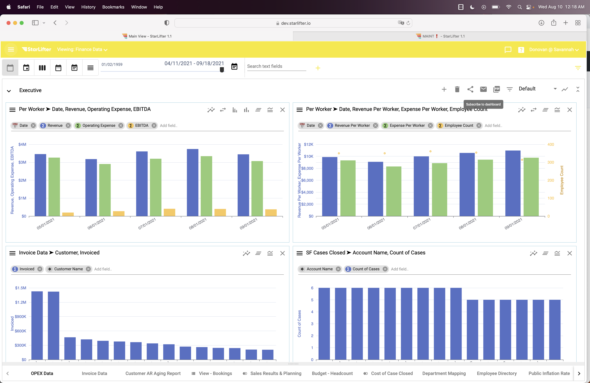
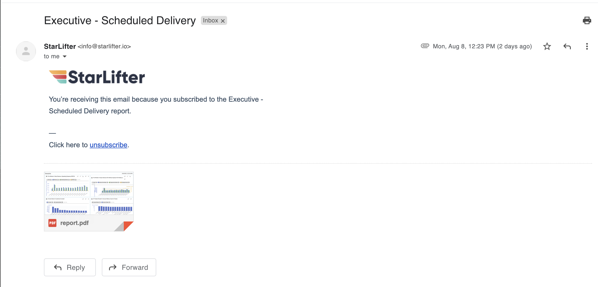

## Dashboard subscriptions
Subscribing to a dashboard ensures a user will have a PDF of their dashboard delivered to their inbox whenever they choose. For example, sales reports can be emailed out to the entire team prior to their weekly meeting. 

## Create a subscription to a dashboard
[Video tutorial](https://www.youtube.com/watch?app=desktop&v=34M9BJS9wjk)

1.	Go the the desired dashboard and click the envelope icon in the upper right hand corner.

</img>

2.  Click the + in the lower right of the dialog and input:
* User(s) email address
* Email Subject
* Body of the email

*From here, you have two options - send the dashboard immediately or set up a scheduled dellivery.*

3. To send immediately, select the Send Email button.

</img>

4. To set up a scheduled delivery, select the calendar icon next to the the email address line.
   * You then have the option to set the delivery frequency, plus the days and time of delivery.
   * Be sure to check the Active check box to ensure the subscription is live.
   * Select **OK**
   * The subscription is now saved and will be emailed at the scheduled time.

</img>
 
</img>

To learn more about how others are using this functionality, head over to the [StarLifter Community](https://community.starlifter.io).
