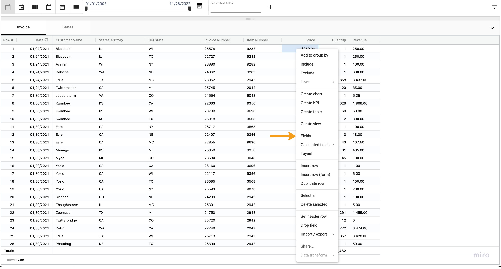
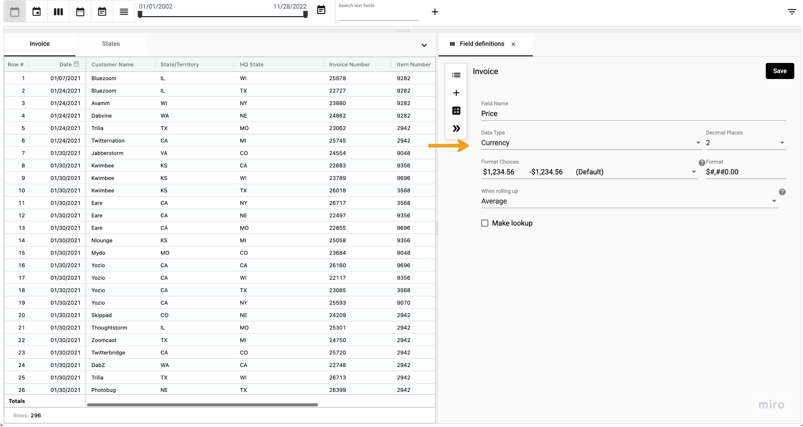
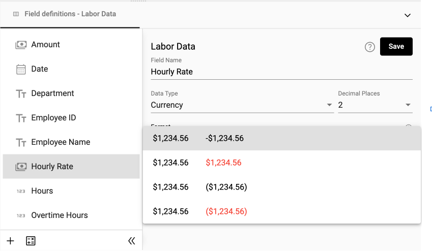
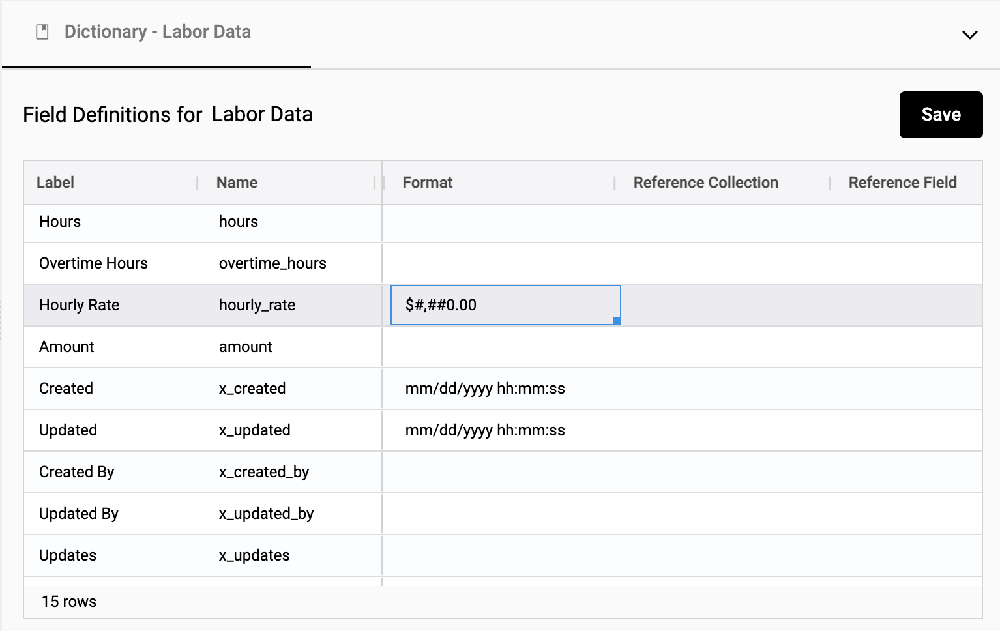
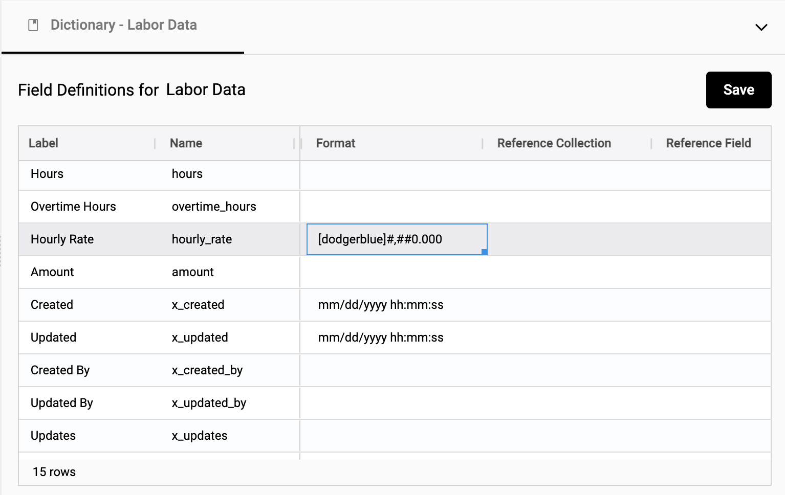
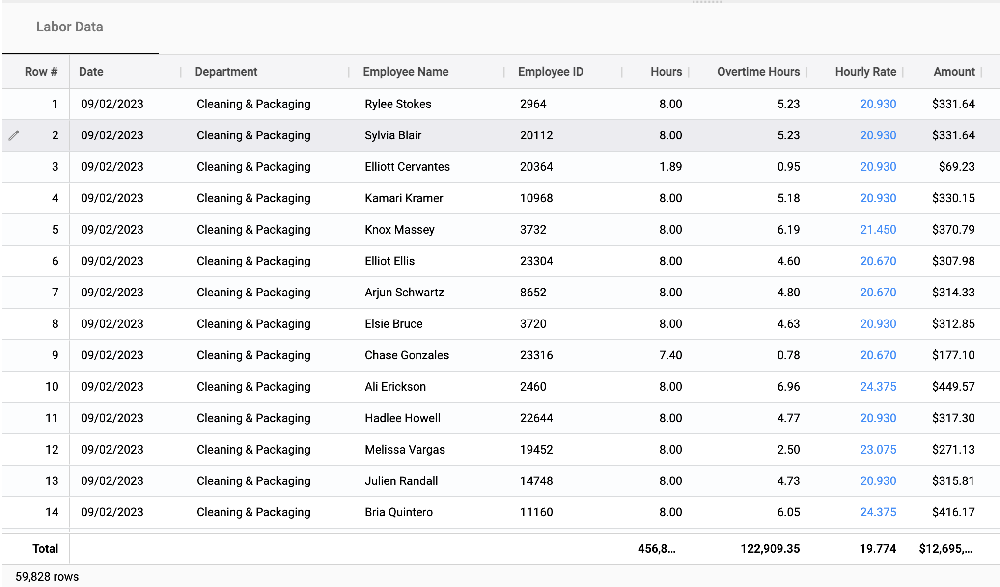
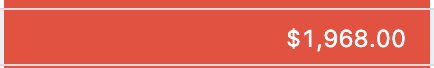

## Data types and formats
The type of data can determine how you interact with the data in the StarLifter system. For example, date types allow you to filter and roll up by date. StarLifter will attempt to match the correct data type when you import data from Microsoft Excel, CSV, or other systems. If the data type is unknown you may need to change it to ensure you are getting the correct functionality from your data.

## How to set a data type

Define the data type in each column by accessing the field definition.

To set a data type:
1. Right-click on the field you want to set, select **Fields**

</img>

2.  Select the desired type from the **Data Type** dropdown

</img> 

The data types include:
* **Characters** - A string (e.g. Hourly)
* **Currency** - A monetary value ($) (e.g. $1.99)
* **Date** - 06/01/2022
* **General** - A numeric value without a comma separator (e.g. 1536)
* **Number** - Integer or decimal (e.g. 1,536 or .129)
* **Percent** - Percentage (e.g. 92%)
* **Pick list** - Displays a list of predefined values to select
* **Reference** - A value that is referencing a field in another collection
* **Suggestion** - Displays a list of existing values or you can enter a new value
* **Time** - Displays date and time as time values (e.g. 02:25 PM)
* **True/False** - A binary value
* **ZIP Code - five digits** - A five digit ZIP Code (e.g. 46038)


### Formatting a data type
Certain field types allow you to change the formatting of the displayed value. Format options will appear in the Field Definition after you have selected an appropriate data type.

#### Format
Click the **Format** drop-down field to display the available pre-defined choices for the data type. 

</img> 

#### Custom formatting
If your desired format is not listed in the formatting choices, you have to option to customize the format using the **Format** field in the data dictionary. This field will be auto-populated with the format definition of the **Format** field from the Fields UI. You can use this value as a starting point for your custom format.

To access the data dictionary, right click on the collection header and select **Show dictionary**

</img>

Changes to the **Format** field in the dictionary will overried the **Format** value in the fields UI.

</img>

_In this example, the Hourly Rate field's font color was changed to dodgerblue and a trailing 0 was added to the end._

</img>

##### Custom formatting options
There are 3 sections of a custom number format, postive number, negative numbers, zero values.
Each of these sections must be separated by a semicolon (;).
```
[Positive Number];[Negative Number];[Zero Value]
```
The following example will:

- Positive number - Add a thousands comma separate and round to two decimal places.
- Negative number - Change the font color to red. Add a thousands comma separate and round to two decimal places.
- Zero Values - Change front color to Blue.
```
#,##0.00;[Red](#,##0.00);[Blue]
```

| Description                     | Formatting                | Original Value | Formatted Value                  |
|---------------------------------|---------------------------|----------------|----------------------------------|
| Round a number to nearest tenth | ####.#                    | 1000.62        | 1000.6                           |
| Replace decimal with fractions  | # ???/???                 | 107.5          | 107 1/2                          |
| Append text                     | $0.00" Gain";$0.00" Loss" | 100            | $100.00 Gain                     |
| Font color                      | [Red]#,##0.00;            |                | </img> |
| Cell Background Color           | [White Red]#,##0.00;      |                | </img>  |

## Data types in the dictionary
Administrators have access to the defined data types, formatting, and field definition values stored in the dictionary. For more information on changing dictionary values visit the page [The importance the Dictionary](https://docs.starlifter.io/#/how_to/dictionary?id=the-importance-of-the-dictionary).
