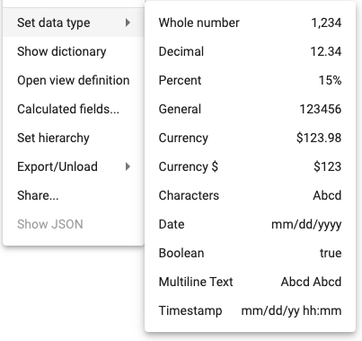

## Set a data type
How-to video link - https://youtu.be/P4LC7HkmHIc

Define the kind of data in each column by setting the data type.  

To set a data type:
1.  Right click 
2.  Set data type
3.  Select the desired type  *Note:  Additional data types are available within the Dictionary*

The data types include:

* **Whole number** - An integer (e.g. 1,536)
* **Decimal** - Two decimal places (e.g. 1.99) 
* **Percent** - A percentage (e.g. 92%)
* **General** - A numeric value without a comma separator (e.g. 1536)
* **Currency** - A monetary value ($) with two decimal places (e.g. $1.99)
* **Currency$** - A monetary value ($) rounded to the closest integer (e.g. $2)
* **Characters** - A string (e.g. Hourly)
* **Date** - 06/01/2022
* **Boolean** - A binary value (e.g. true or false)
* **Multiline** - Long blocks of text requiring wrapping within the field.
* **Timestamp** - Captures the date and time in 24 hour format (e.g. 2/28/22 03:00)

</img> 

### Date Formatting
To modify the default date formatting, change the `Date Format` value in `Show Dictionary` for the date field.  The string may contain replacements for adding the day of week to the formatted date:

* DDD - day of week (ie, Sun, Mon, ...)
* dddd - the localized date

For example, a date of `2022-04-03` will be formatted as:

```
DDD, dddd -> Sun, 04/03/2022
dddd (DDD) -> 04/03/2022 (Sun)
```
