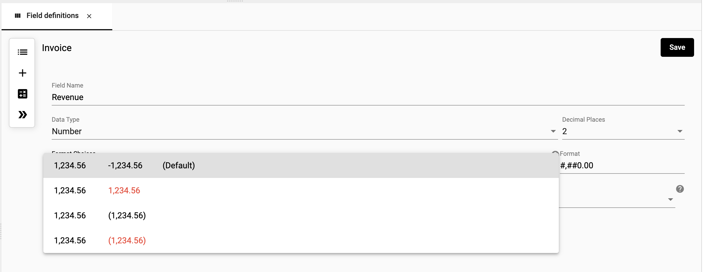
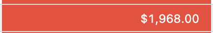

## Data types
The type of data can determine how you interact with the data in the StarLifter system. For example, date types allow you to filter and roll up by date. Setting the right data type will ensure you are getting the correct functionality from your data.

## How to set a data type
How-to video link - 

Define the data type in each column by accessing the field definition.

To set a data type:
1. Right-click on the field you want to set, select **Fields**

</img>

2.  Select the desired type from the **Data type** dropdown

</img> 

The data types include:
* **Characters** - A string (e.g. Hourly)
* **Currency** - A monetary value ($) (e.g. $1.99)
* **Date** - 06/01/2022
* **General** - A numeric value without a comma separator (e.g. 1536)
* **Number** - Integer or decimal (e.g. 1,536 or .129)
* **Percent** - Percentage (e.g. 92%)
* **Suggestion** - Displays a list of existing values or you can enter a new value
* **Time** - Displays date and time as time values (e.g. 02:25 PM)
* **True/False** - A binary true/false value

### Formatting a data type
Certain field types allow you to change the formatting of the displayed value. Format options will appear in the Field Definition after you have selected an appropriate data type.

#### Formatting choices
Fields with format options will have pre-defined format choices to select from. Click the **Format Choices** drop down field to display the available choices for the chosen data type.

</img> 

#### Custom formatting
If your desired format is not listed in the formatting choices, you have to option to customize the format using the **Format** field. This field will be auto populated with the format definition of the **Format Choices** field. You can use this value as a starting point for your custom format.

##### Custom formatting options
| Description                     | Formatting                | Original Value | Formatted Value                  |
|---------------------------------|---------------------------|----------------|----------------------------------|
| Round a number to nearest tenth | ####.#                    | 1000.62        | 1000.6                           |
| Replace decimal with fractions  | # ???/???                 | 107.5          | 107 1/2                          |
| Append text                     | $0.00" Gain";$0.00" Loss" | 100            | $100.00 Gain                     |
| Font color                      | [Red]#,##0.00;            |                | </img> |
| Cell Background Color           | [White Red]#,##0.00;      |                | </img>  |

## Data types in the dictionary
Data types, formatting, and field definition values are stored in the dictionary. For more information on changing dictionary values visit the page [Edit the Dictionary](https://docs.starlifter.io/#/getting_started/quick-start?id=edit-the-data-dictionary).
