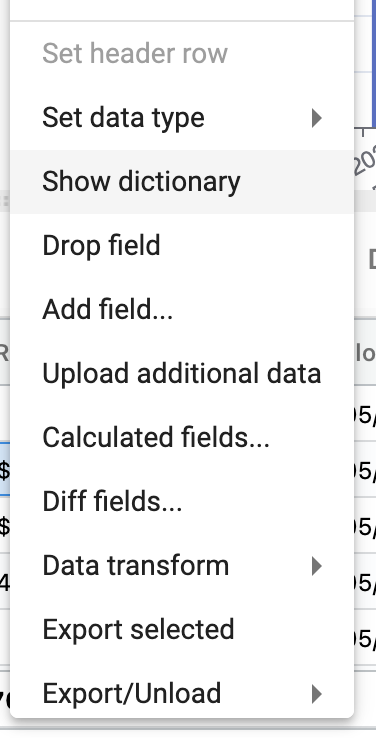
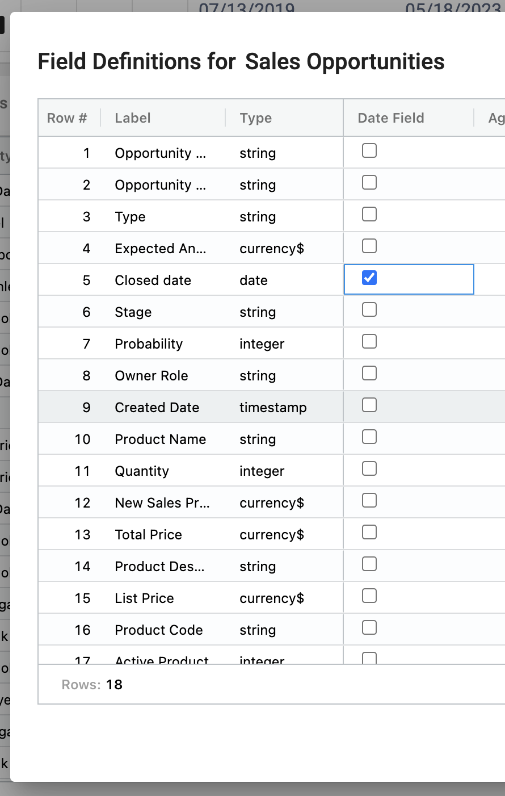

## How to set your primary date

In a collection with multiple date fields, you can set a primary date to use for roll-ups, KPIs and charts.

To set a primary date:

1.	Right click ➔ **Show dictionary**

</img>

2.  Select the **Date Field** for the primary date and click **OK**

</img>

3.  Now roll ups, charts and KPIs will respond to the primary date.

</img>

To learn more or ask additional questions, head over to the [StarLifter Community](https://community.starlifter.io).
