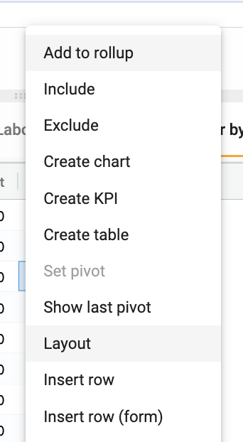
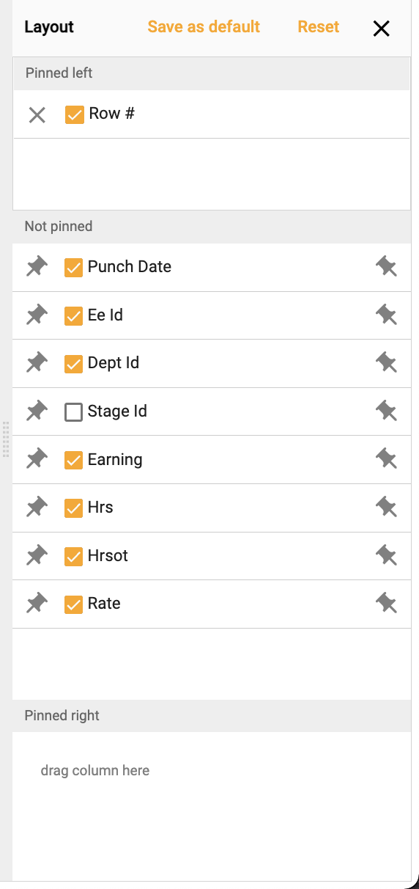
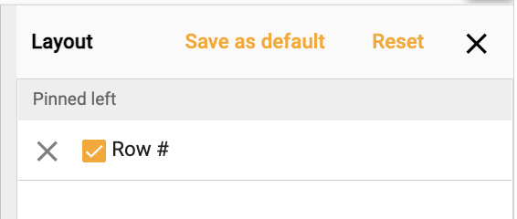

## How to set a default layout on a collection

Set a default layout on a collection by:

1.	Right click ➔ **Layout**

</img>

2.  Set desired layout by reordering, pinning and/or hiding fields

</img>

3.  Choose **Set as default**  

</img>

4.  All users will default to this layout

</img>
