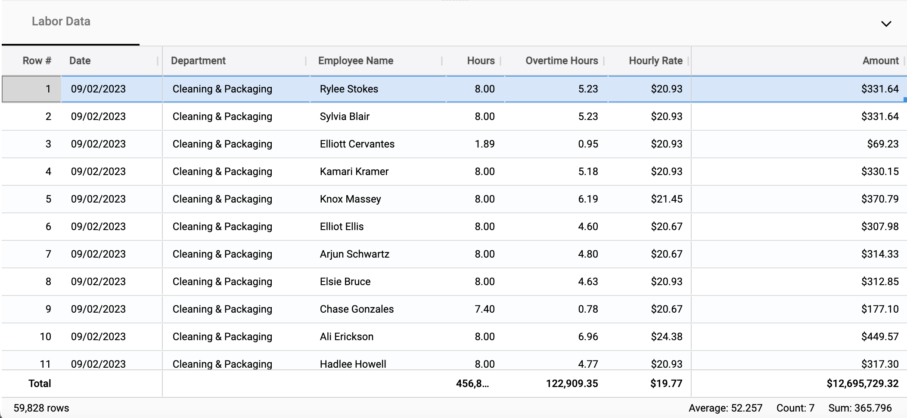

## Set the default layout 
The default layout allows you to arrange the columns of data one time for all of your users. Although users can create their own layout of the data, the default layout should be set as the starting point for all users. 

## How to set a default layout on a collection

Set a default layout on a collection by:

1.	Right click ➔ **Layout**

</img>

2.  Set desired layout by reordering, pinning and/or hiding fields

</img>

3.  Choose **Save as default**  

</img>

4.  All users will default to this layout

</img>
