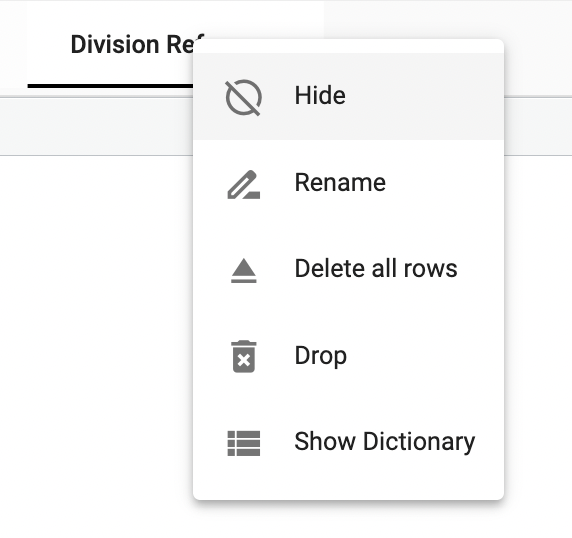
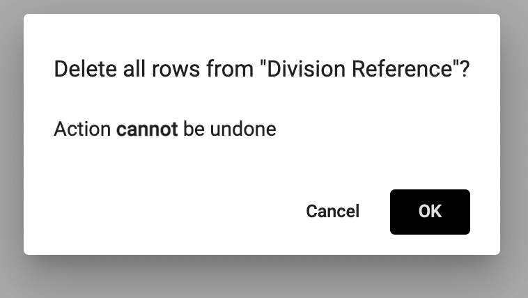
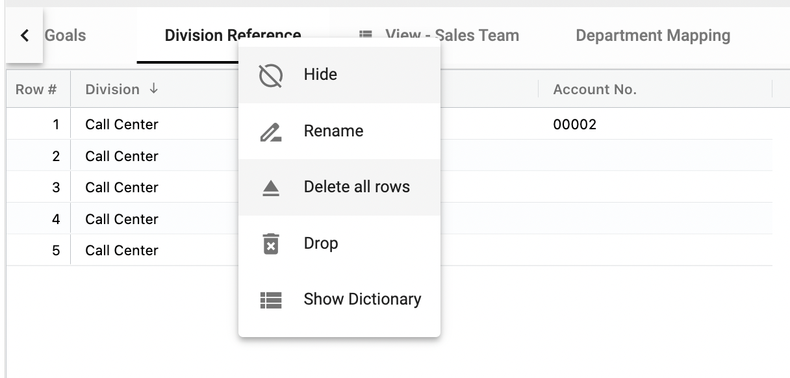
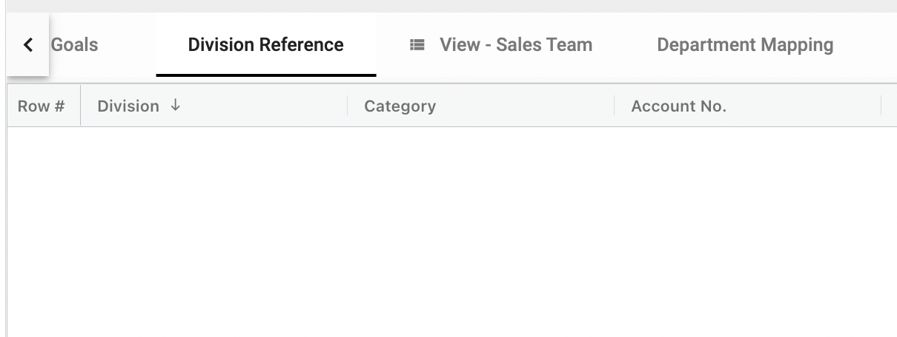

## How to delete a collection or its rows

To create delete a collection:

1.	Right click the collection title ➔ **Drop**

</img>

Note:  This action is final and cannot be undone.

</img>

To delete all of the rows in a collection:

1.  Right click the collection title ➔ **Delete all rows**

</img>

2.  All rows will be deleted

</img>

Note:  This action is final and cannot be undone.