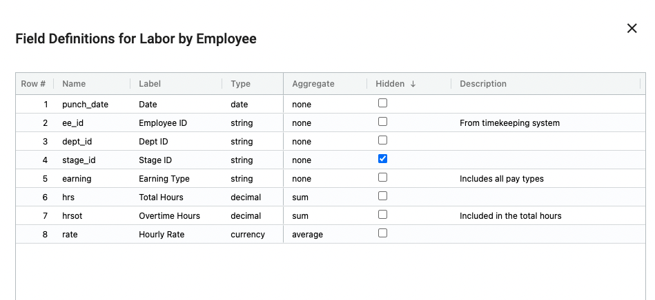
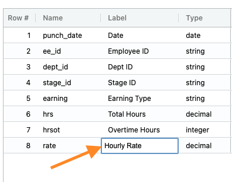
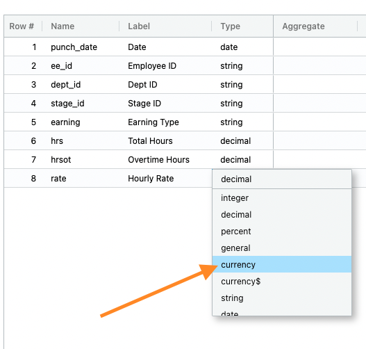
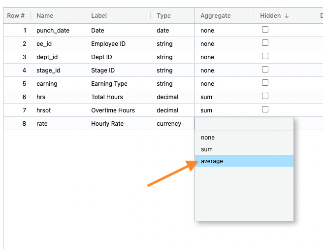
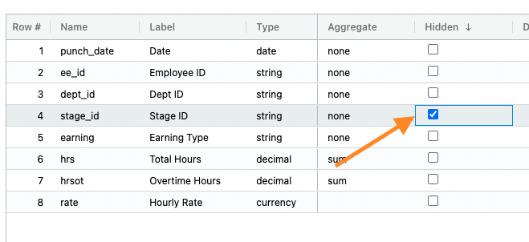
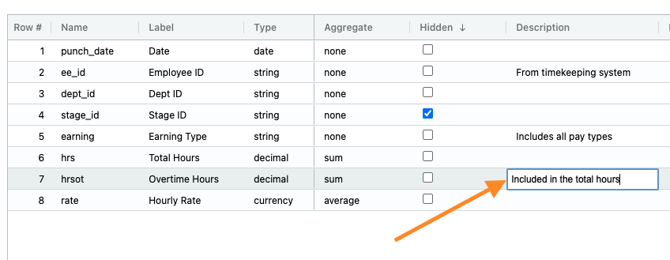

## The importance of the dictionary

There are two purposes for the dictionary:
1.  The organization's administrator can further edit the data within a collection, and 
2.  Users can quickly see what data is included and its source.

To begin editing the dictionary:
1.  Right click ➔ **View dictionary**

</img> 

### Changing the label

A label is the user-facing term for a field.  To update the label to a more familiar name:
1.  Double click the field
2.  Update the label
3.  Click outside the field

</img> 

Note:  The label is not the name.  Avoid changing the name as it is the field used in the database.  

### Changing the data type

Define the kind of data in each column by setting the data type.  The data types include:

#### Number
* **Integer** - A whole number (e.g. 1,536)
* **General** - A numeric value without a comma separator (e.g. 1536)
* **Decimal** - Two decimal places (e.g. 1.99) 
* **Currency** - A monetary value ($) with two decimal places (e.g. $1.99)
* **Currency$** - A monetary value ($) rounded to the closest integer (e.g. $2)
* **Percent** - A percentage (e.g. 92%)

#### Dates and times
* **Date** - 06/01/2022
* **hh:mm am** - Time presented in a 12 hour format (e.g. 5:00 pm)
* **hh:mm** - Time presented in a 24 hour format (e.g. 17:00)
* **Timestamp** - Captures the date and time in 24 hour format (e.g. 2/28/22 03:00)

#### MISC
* **String** - An alphanumeric value (e.g. Hourly)
* **Multiline** - Long blocks of text requiring wrapping within the field.
* **Boolean** - A binary value (e.g. true or false)
* **html** - Used to link to a URL (e.g. www.starlifter.io)
* **Suggest** - Suggests possible auto-completions based on other column values
* **Pick list** - References a pre-defined list of values for the field (e.g. Small, Medium, Large)

</img> 

### Setting the aggregation

Define how a value is treated when it is rolled up.  If no selection is made and the value is a number, the data will be aggregated.

To update the aggregation:
1.  Double click the field
2.  Choose **none**, **sum** or **average**
3.  Click outside the field

</img> 

### Hiding a field

Make a collection more navigable by hiding fields. 

To hide a field:
1.  Double click the field
2.  Click outside the field

</img> 

### Adding a description

Adding a description helps other users understand what data is included in the collection.

To add a description:
1.  Click the **Hidden** check box 
2.  Update the field
3.  Click outside the field

</img> 

### Other dictionary information

#### Join
* **Join Collection** - the data field's source collection
* **Join Field** - the key used to perform the join

#### Time Series
* **Time Series Type** - whether the time series data was input or calculated
* **Time Series Date** - the start date of the time series

#### Hierarchy
* **Hierarchy Number** - groups each hierachy together
* **Hierarchy Position** - sets the order of a hierarchy

#### Calculation
* **Calculation** - provides the equation for calculated values

#### Reference
* **Reference Collection** - the name of the collection used for the reference
* **Reference Field** - the field used to perform the reference

