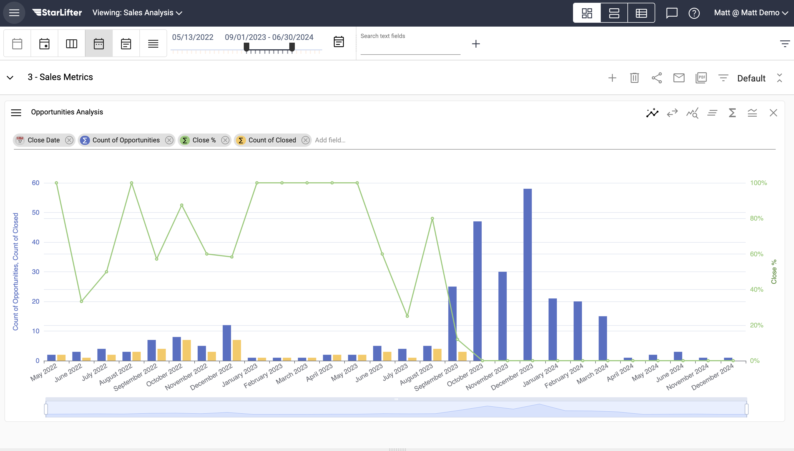
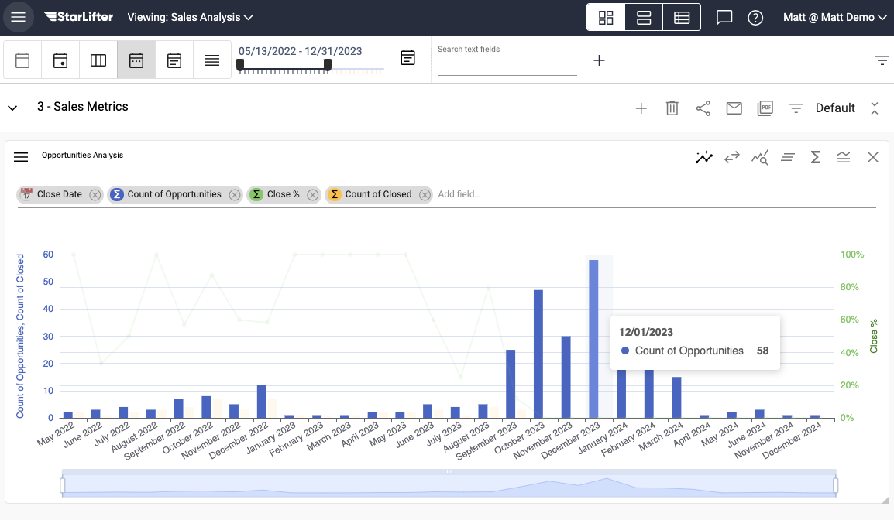
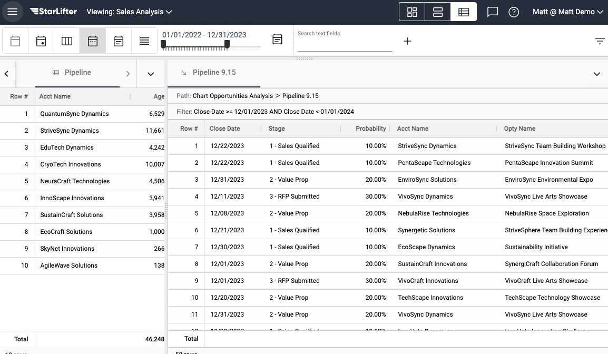

## Drill through data

[**Video Tutorial**](https://youtu.be/qFYNcpkTpJU?feature=shared)

StarLifter's drill-through capabilities make it easy to navigate from insights on your dashboard, to the raw data needed to make decisions. Every StarLifter chart allows you to drill through to the raw data that makes up each segment of the chart.

### Drill through charted data

</img>

1. Hover over the segment of the chart you wish to drill through.

</img>

2. Double-click on the segment of the chart to bring up the raw data. The raw data will appear on the bottom right of the screen. Drag up on the three dots above the grid to view the data in full.

</img>

To learn more or ask additional questions, head over to the [StarLifter Community](https://community.starlifter.io).
