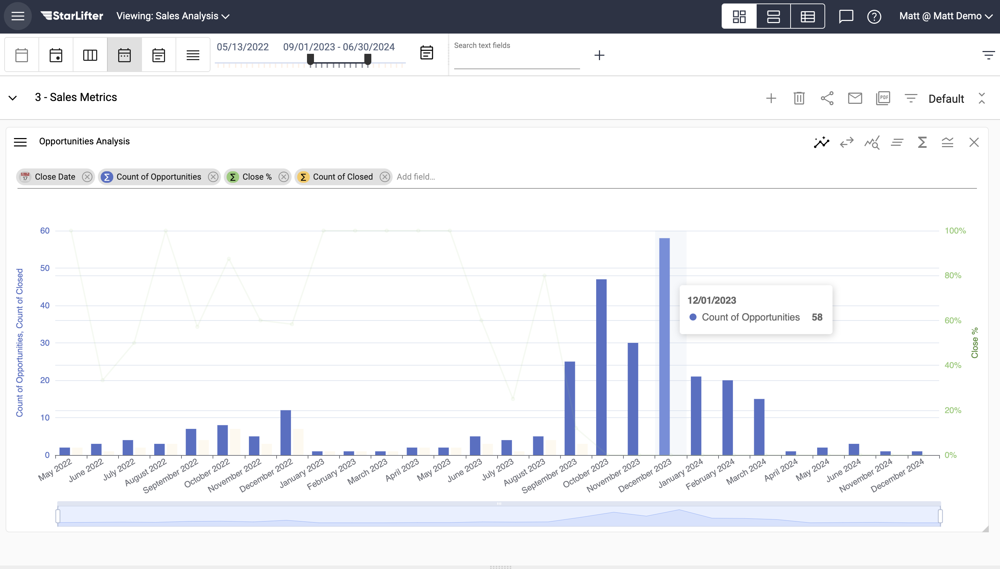
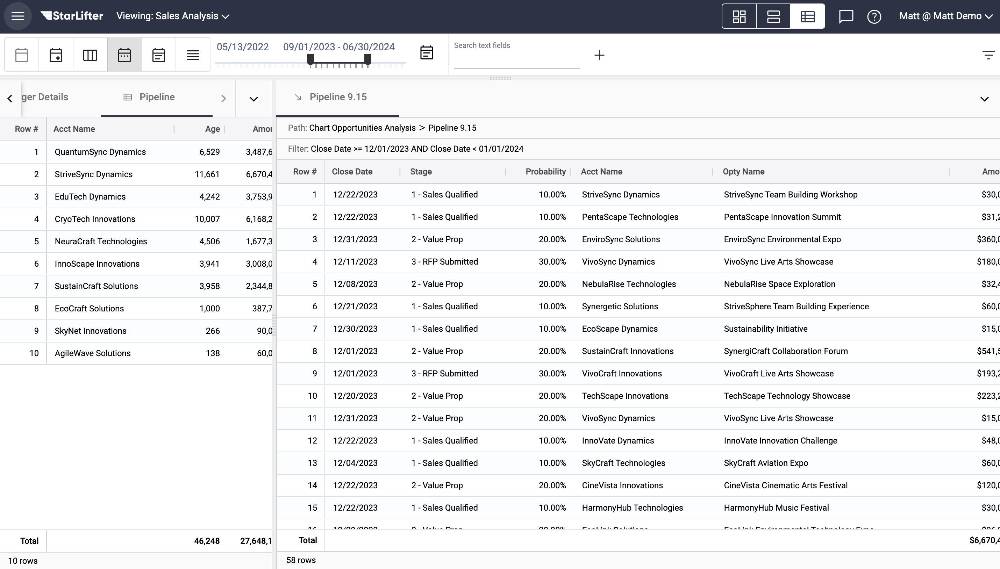

## Drill through data

[**Video Tutorial**](https://youtu.be/qFYNcpkTpJU?feature=shared)

StarLifter's drill-through capabilities make it easy to navigate from insights on your dashboard, to the raw data needed to make decisions.

### Drill through charted data
1. Every StarLifter chart allows you to drill through to the raw data that makes up each segment of the chart.

</img>

2. Hover over the segment of the chart you wish to drill through.

</img>

3. Double-click on the segment of the chart to bring up the raw data.

</img>
