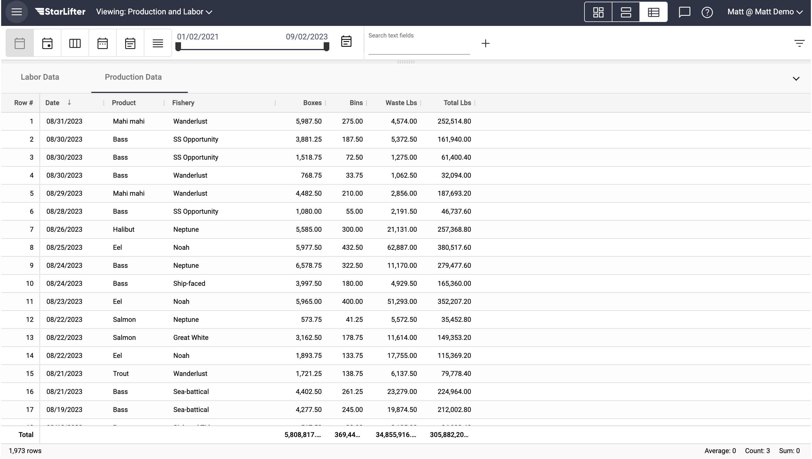
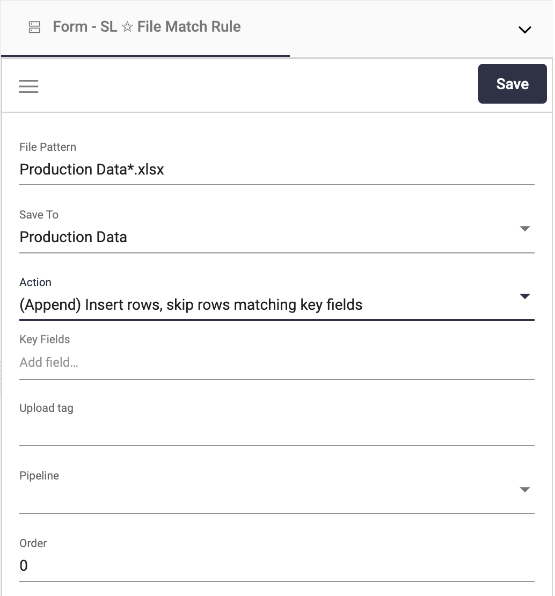
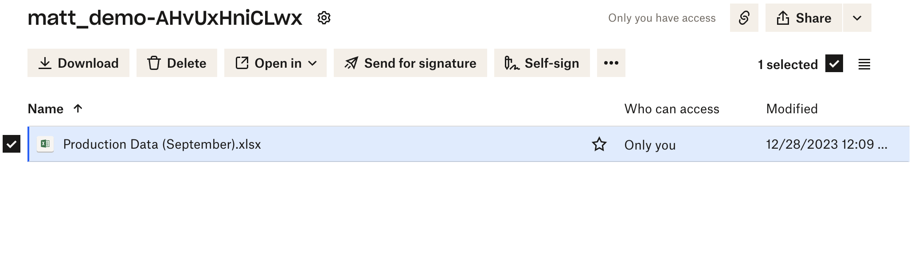
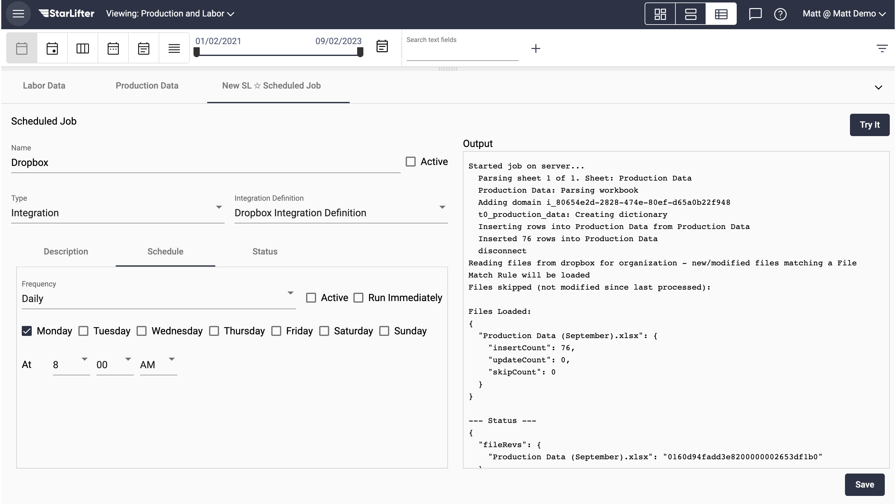
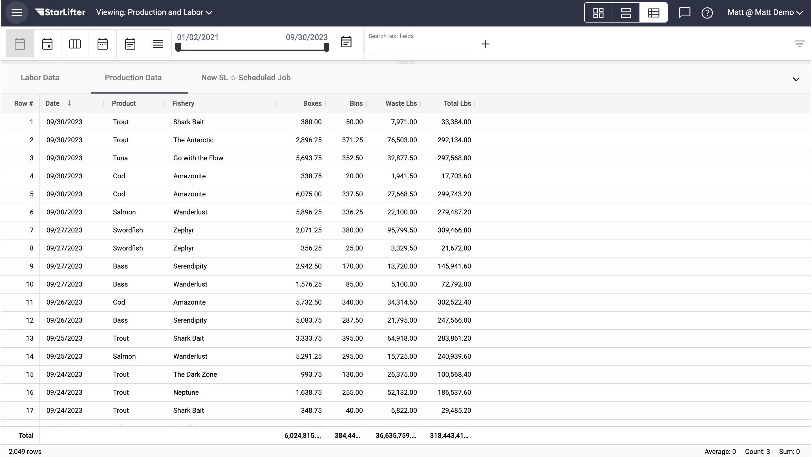

## Dropbox Integration

[**Video Tutorial**](https://youtu.be/9eMe4fgTrkI?feature=shared)

Uploading data into StarLifter can be accomplished by uploading data to a dropbox folder. Ask StarLifter to set up a dropbox folder for your org.

Once a Dropbox Integration is created, set up [**File Match Rules**](https://docs.starlifter.io/#/how_to/filematchrules) and a [**Scheduled Job**](https://docs.starlifter.io/#/how_to/scheduledintegrations) to clean and upload the data to the right collection and at the right frequency.

### Upload data using Dropbox
1. In this example, we will upload Production data for September.

</img>

2. Set up File Match Rules and Scheduled job. File Match Rules tell StarLifter where and how to upload the data. Scheduled jobs determine the frequency with which data is uploaded.

</img>

3. Upload an Excel or .csv file to the Dropbox folder.

</img>

4. The next time your Scheduled Job for your Dropbox Integration runs, your data will be uploaded into StarLifter as determined by the File Match Rules. You can run the Scheduled Job manually by clicking **Try it**.

</img>

5. September data is now uploaded to the collection.

</img>

**A few tips:**
* Before data can be upload through Dropbox StarLifter, a base collection must exist that contains the fields you wish to upload. Best practice is to begin by uploading a base collection into StarLifter manually.
* For a hands-free experience, consider automating uploads from your source system to your Dropbox folder!
