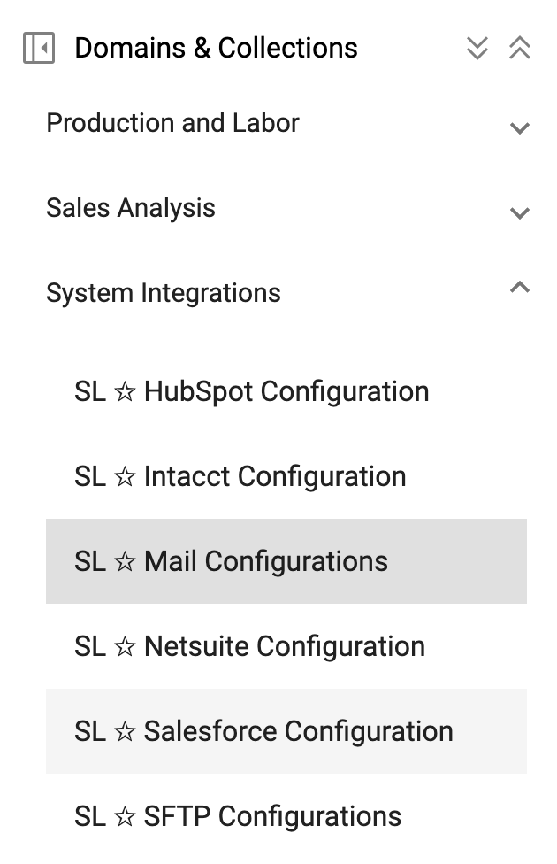

## Email Integration

[**Video Tutorial**](https://youtu.be/ZB8QuqRyBHs?feature=shared)

Uploading data into StarLifter is as easy as emailing a spreadsheet. Just ask StarLifter to set up an email address for your org.

Once an Email Integration is created, set up [**File Match Rules**](https://docs.starlifter.io/#/how_to/filematchrules) and a [**Scheduled Job**](https://docs.starlifter.io/#/how_to/scheduledintegrations) to clean and upload the data to the right collection and at the right frequency.

### Upload data using Email
1. In this example, we will upload General Ledger data for July.

</img>

2. Set up [**File Match Rules**](https://docs.starlifter.io/#/how_to/filematchrules) and a [**Scheduled Job**](https://docs.starlifter.io/#/how_to/scheduledintegrations). File Match Rules tell StarLifter where and how to upload the data. Scheduled jobs determine the frequency with which data is uploaded.

</img>

3. Send an email to the address for your StarLifter org containing the attached data in an Excel or .csv file.

</img>

4. The next time your Scheduled Job for your Email Integration runs, your data will be uploaded into StarLifter as determined by the File Match Rules. You can run the Scheduled Job manually by clicking **Try it**.

</img>

5. July data is now uploaded to the collection.

</img>

**A few tips:**
* Before data can be emailed into StarLifter, a base collection must exist that contains the fields you wish to upload. Best practice is to begin by uploading a base collection into StarLifter manually.
* For a hands-free experience, consider automating emailed reports from your source system to your StarLifter email!

### Creating your own email integration
You also have the option of creating your own Email Integration.

1.  Acquire the following for your email account:
* User - Email address
* Password - The **app** password ([Instructions to find for Gmail account](https://support.google.com/mail/answer/185833?hl=en#:~:text=Go%20to%20your%20Google%20Account,the%20page%2C%20select%20App%20passwords))
* Host - Host for incoming mail server (IMAP)
* Port - Typically 993 or 143

2. Under **System Integrations**, select **SL ☆ Mail Configurations**.

</img>

3. Double-click, or right-click and select **Insert row** to insert a new Email Integration. You can either edit the fields in the row, or right-click on the pencil to open up a form.

</img>

4. Fill in the details for the Email Integration. Click **Save**.

</img>
