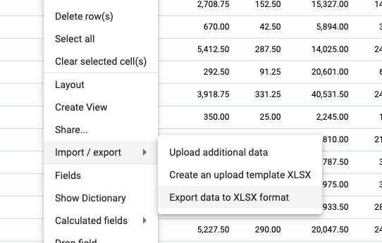
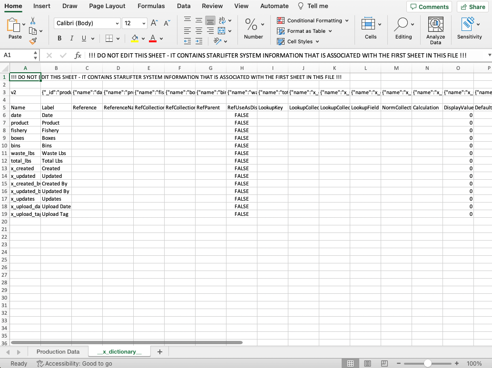

## Export data to XLSX format

1. Right click in the collection ➔ **Import/export** ➔ **Export data to XLSX format**.

</img>

2. Data from the collection appears an XLSX file in your downlaods folder.

</img>

3. StarLifter also stores the collection dictionary so your field settings are captured when you upload the data back into StarLifter. To access the dictionary, unhide the **__x_dictionary__** sheet.

</img>

4. You can also export data that is filtered and rolled up.

</img>
