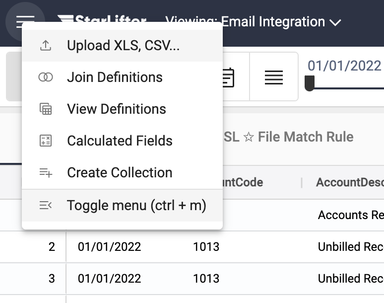

## File Match Rules

[**Video Tutorial**](https://youtu.be/JhwCRTesdJ8?feature=shared)

File Match rules tell StarLifter what to do with data uploaded using SFTP, Dropbox, and Email integrations.

### Create a File Match Rule
1. From the menu at the upper left of the screen, select **Toggle menu**.

</img>

2. Select **SL ☆ File Match Rules**.

</img>

3. Double-click, or right-click and select **Insert row** to insert a new File Match Rule. You can either edit the fields in the row, or right-click on the pencil to open up a form.

</img>

4. Fill in the details for the File Match Rule. Click **Save**.

**File Pattern:** The naming convention of the file being uploaded to StarLifter. Use * as a wild card (for example, if the file has a different date for each upload).

**Save To:** The name of the collection data from the file is being uploaded to.

**Action:** The type of upload. Options include
* Append - Insert new rows, except for the rows where key fields match the collection
* Overwrite - Insert new rows, and update rows where key fields match the collection
* Replace - Replace the entire collection with data from the file

**Key Fields (optional):** A field, or group of fields, which identifies unique rows in the collection.

**Upload Tag (optional):** A character field added to the data when it is uploaded.

**Pipeline (optional):** Select the pipeline used to clean data in the file before it is uploaded to the collection.

**Order:** If multiple file matches upload to the same collection, specify the order in which they need to be uploaded. The lower number in the sequence is uploaded first.

</img>
