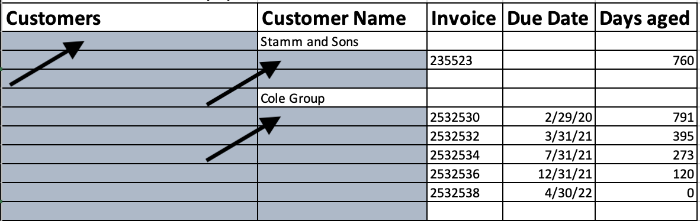
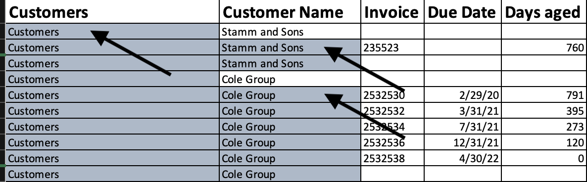
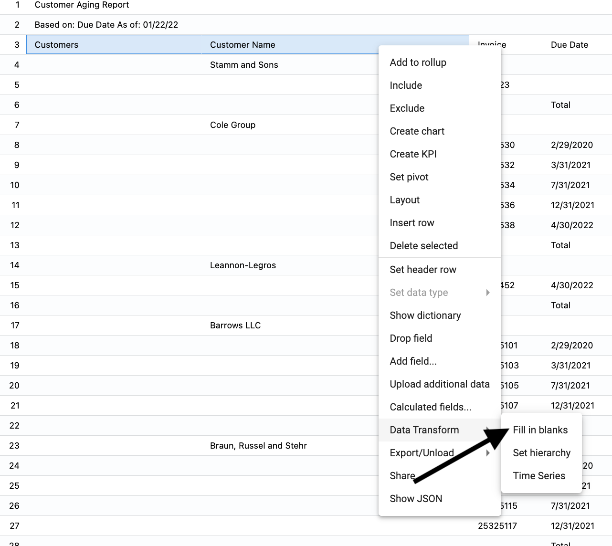
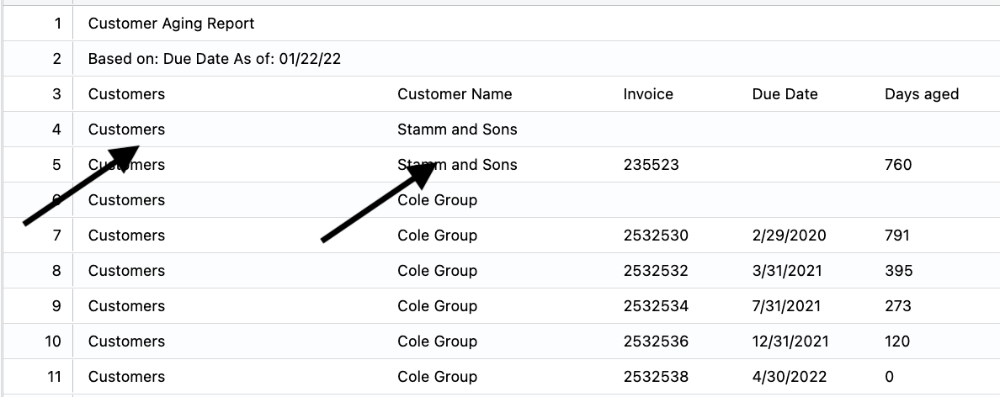

## How to use fill in blanks

For a hierarchy to work across a dataset, each field in the column needs to be populated.

</img> 

Now, the data set will properly chart, filter and group by the hierarchy.

</img>

To fill in blanks:  
1.  Select the hierarchy columns   
2.  Right click ➔ **Data Transform** ➔ **Fill in blanks** 

</img>

The columns are filled in:

</img>

Note:  The data will need a header row.

To set a header row:
1.  Select the row
2.  Right click ➔ **Set header row*

</img>

The data is ready for analysis:

</img>
