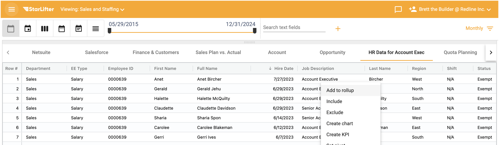
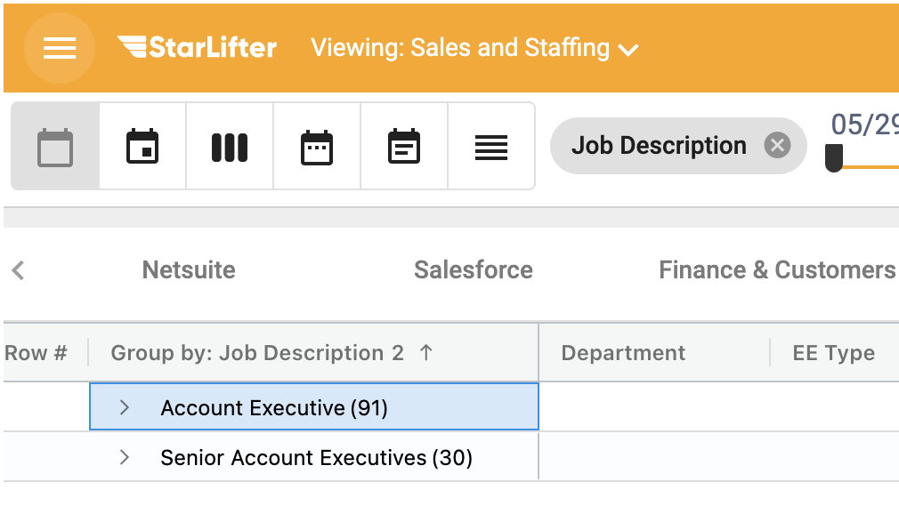
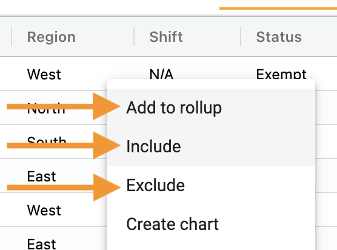
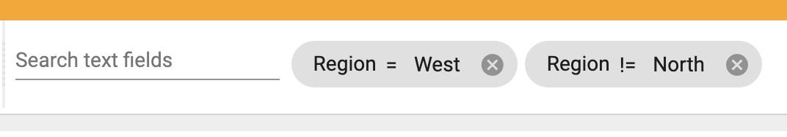
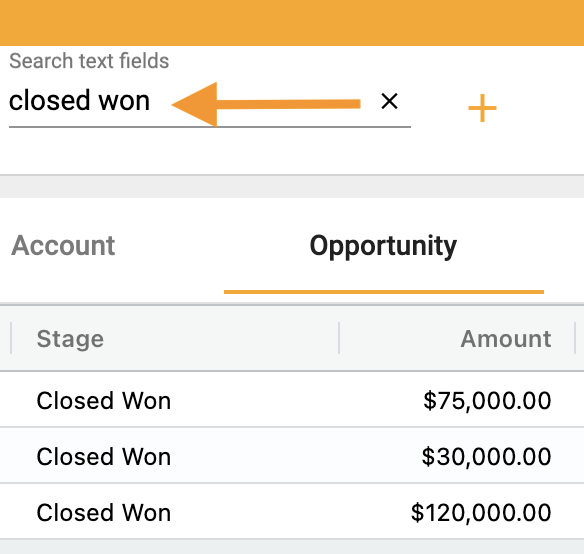
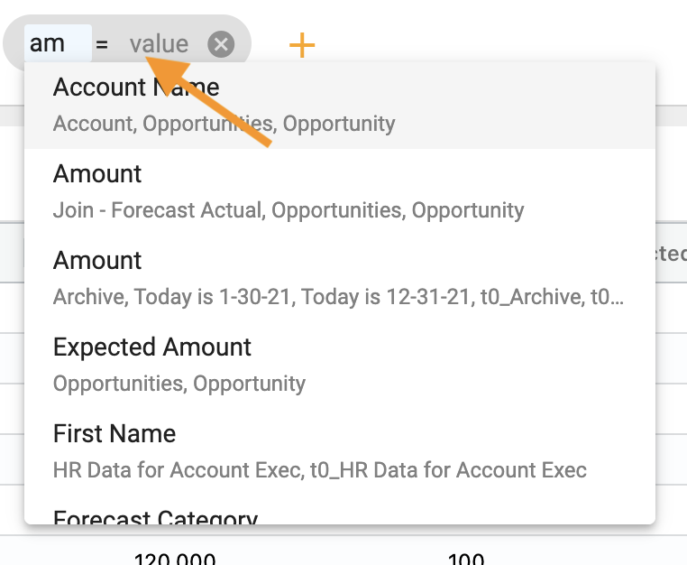
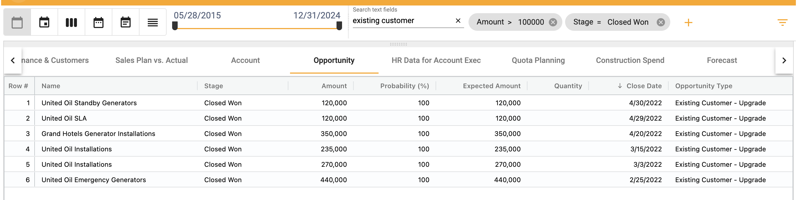

## How to rollup and filter 

Rolling up groups values together.  

To roll up:
1.  Right click **Add to rollup

</img>

Data is grouped by the rolled up field

</img>

To filter by including or excluding:
1.  Right click 
2.  Select from the dropbown

</img>

</img>

To filter using text field:
1. Type text in search box

</img>

For more advanced filtering:
1.  Add filters with the **+**
2.  Choose the field

</img>

3.  Define the operator

</img>

4.  Add in values

</img>

5.  Add additional filters with the **+**

</img>
