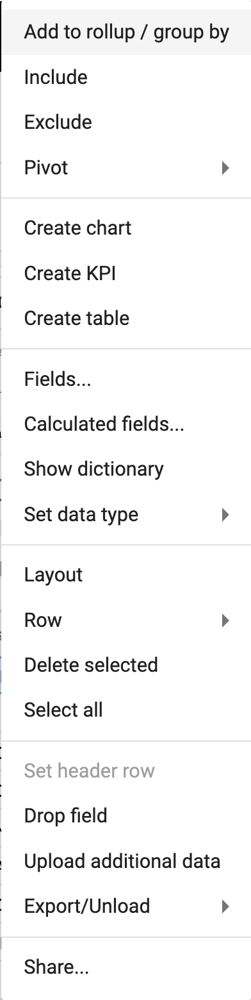

## How to group by (rollup) and filter 
How-to video link - https://youtu.be/EBZi2hHNLtw

Further explore data by grouping data together (e.g. rolling up) or filtering (e.g. including or excluding data).

To group by:
1.  Right click a column and select **Add to rollup/group by**

</img>

Data is grouped by the rolled up field

</img>

To filter by including or excluding:
1.  Right click 
2.  Select from the dropbown

</img>

</img>

To filter using text field:
1. Type text in search box

</img>

For more advanced filtering:
1.  Add filters with the **+**
2.  Choose the field

</img>

3.  Define the operator

</img>

4.  Add in values

</img>

5.  Add additional filters with the **+**

</img>
