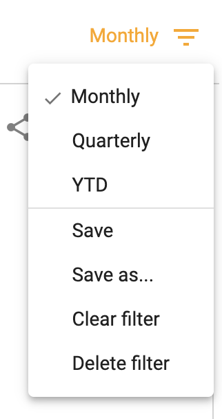
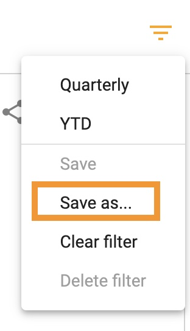
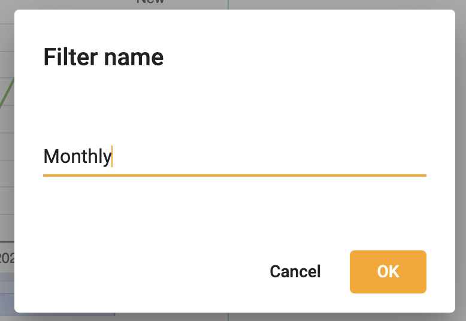
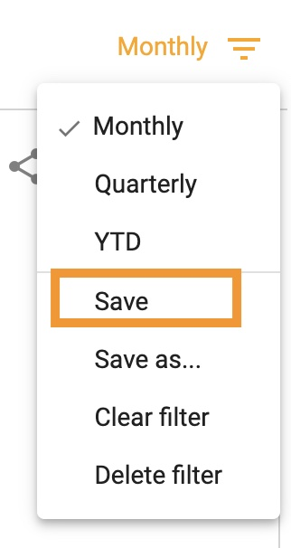
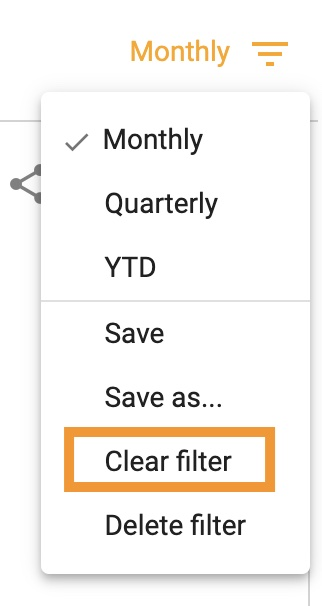
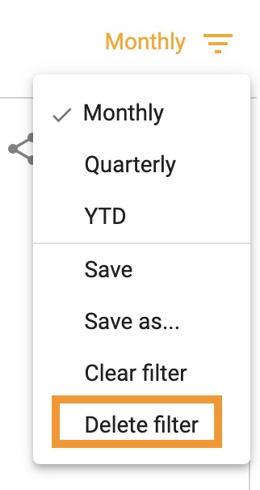

## How to save, edit and delete filters
How-to video link - https://youtu.be/EBZi2hHNLtw

Save filters to easily reference a view of data that is valuable to you. 

To apply an existing filter, choose from the dropdown:  

</img>

Select **Save as...** to save a new filter:

</img>

</img>

Select **Save** to make an edit to an existing filter

</img>

Select **Clear filter** to discard the appplied filter:

</img>

Select **Delete filter** to remove a filter

</img>

