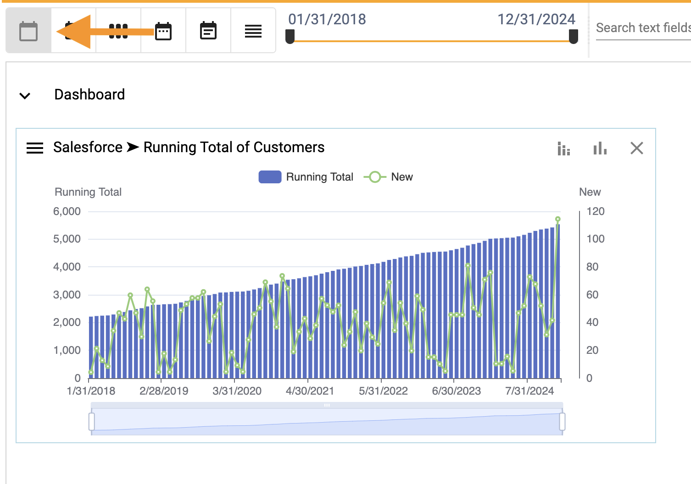
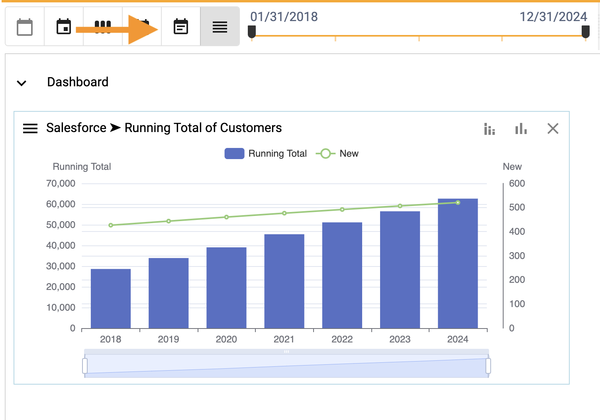
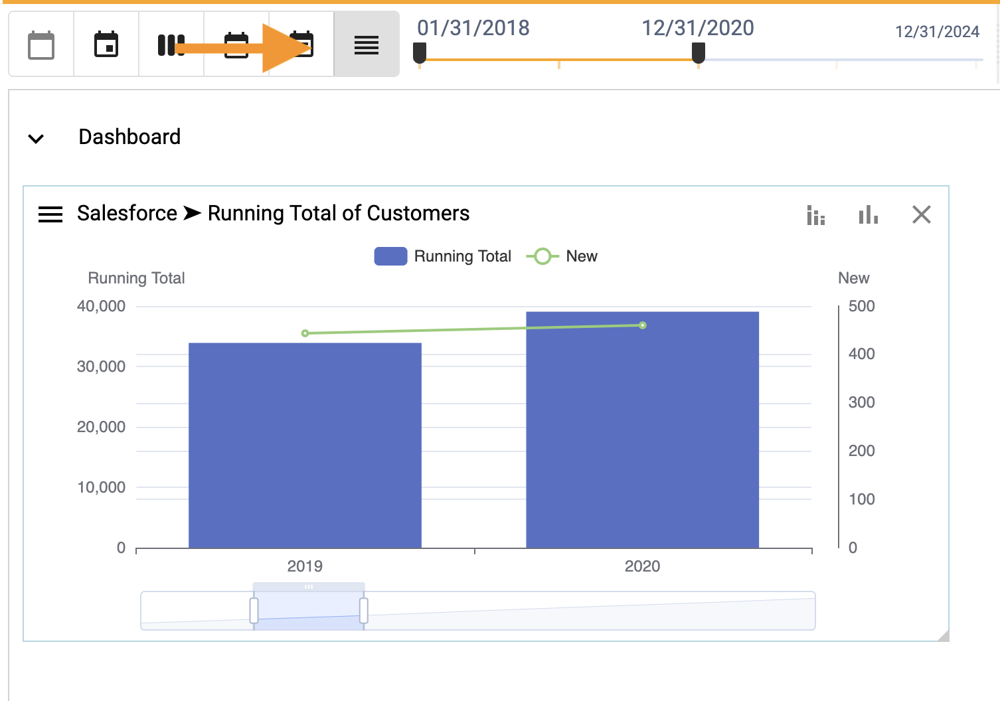
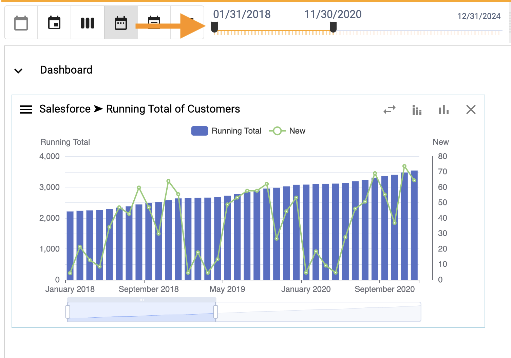
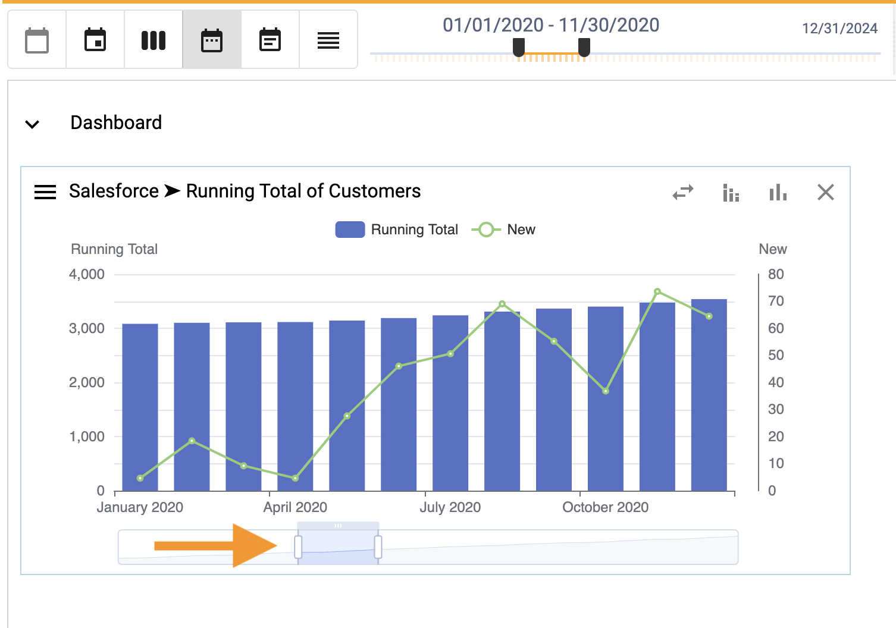

## How to save, edit and delete filters

Rolling up groups values together.  To roll up data and charts by date:
1.  Select the **Day**, **Week**, **Month**, **Quarter** or **Year**.

### None

</img>

### Quarter

</img>

### Year

</img>

To filter dates on a dashboard:
1.  Move the end points of the slider to the left and right

</img>

To filter dates on a chart:
1.  Move the end points of the zoomer to the left and right

</img>

