## Functions
Functions are predefined formulas that are used in [calculated fields.](https://docs.starlifter.io/#/how_to/calculate)

To access the available functions for a calcuated field, click the left icon of the chip and select function.

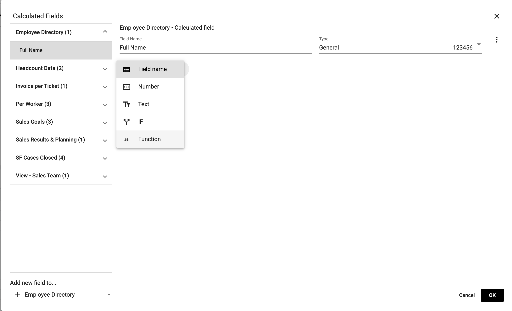</img>    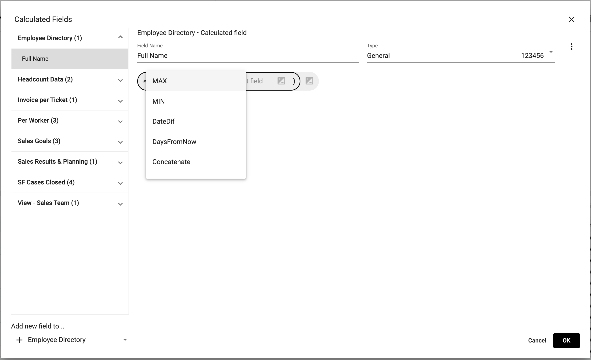</img>

## List of Functions

### Mid
MID returns a specific number of characters from a text string, starting at the position you specify, based on the number of characters you specify.

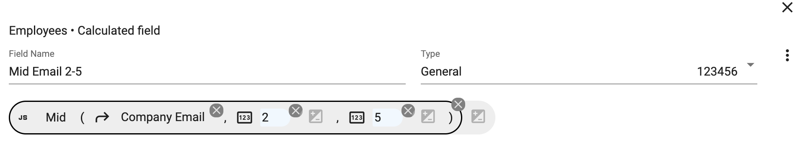

Results:

</img> 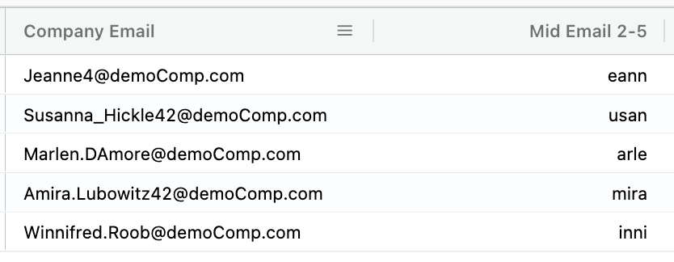</img> 

### Min
MIN returns the smallest numeric value in the data provided.

### Max
MAX returns the largest numeric value in the data provided.

### DateDif
DateDif calculates the number of days, months, or years between two dates.

The example below uses an IF Statement to check for a value in the *Departure date* field and the calculates the number of days between *Departure date* and *Start date* 

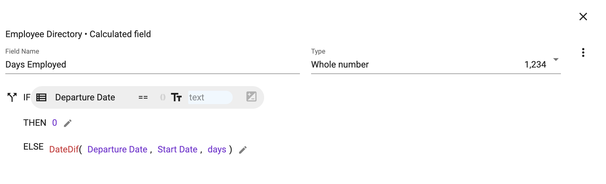</img> 

Results:

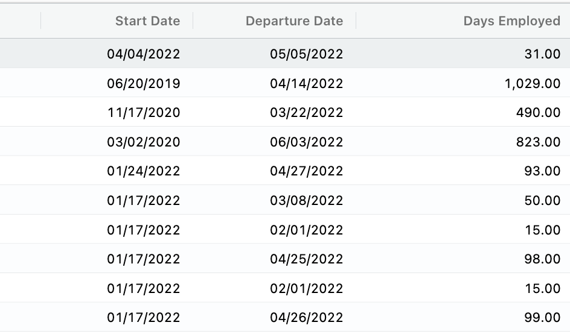</img> 

### DaysFromNow
DaysFromNow calculates the number of days from a given date until the current date.

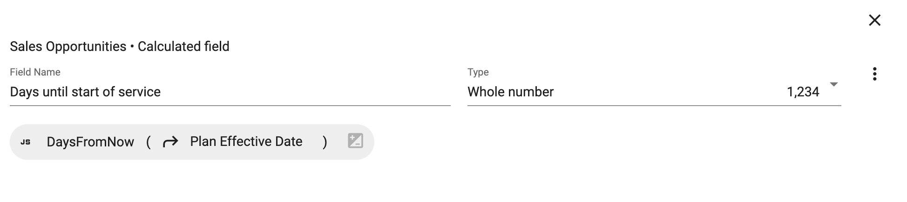</img> 

Results:

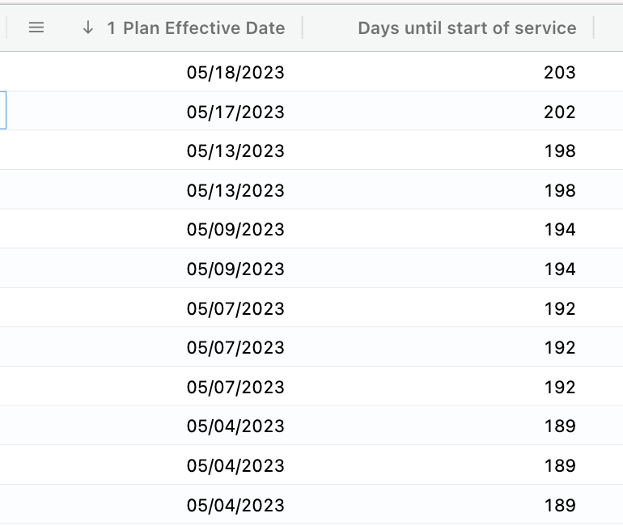</img> 

### Concatenate
Concatenate joins values together and returns the result as a string.

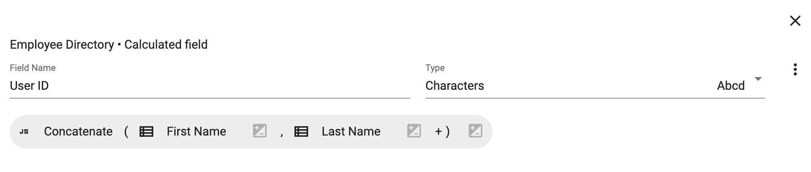</img> 

Results:

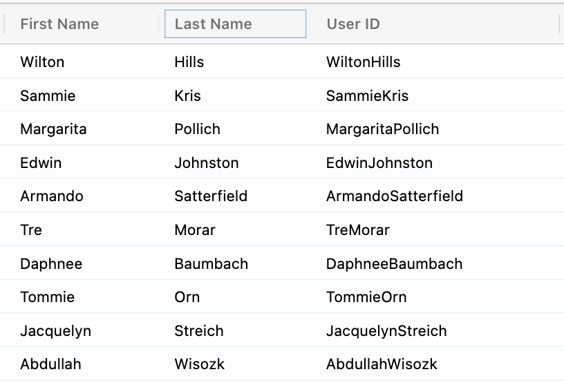</img> 

### Concatenate with Spaces
Concatenate joins values together and returns the result as a string separated by spaces.

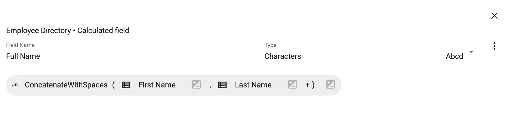</img> 

Results:

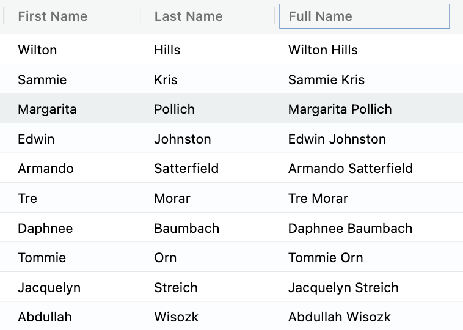</img> 

### RemoveNumbers
RemoveNumbers will remove the first grouping of numbers and return the string.

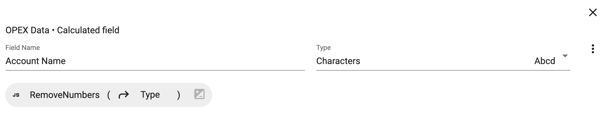</img> 

Results:

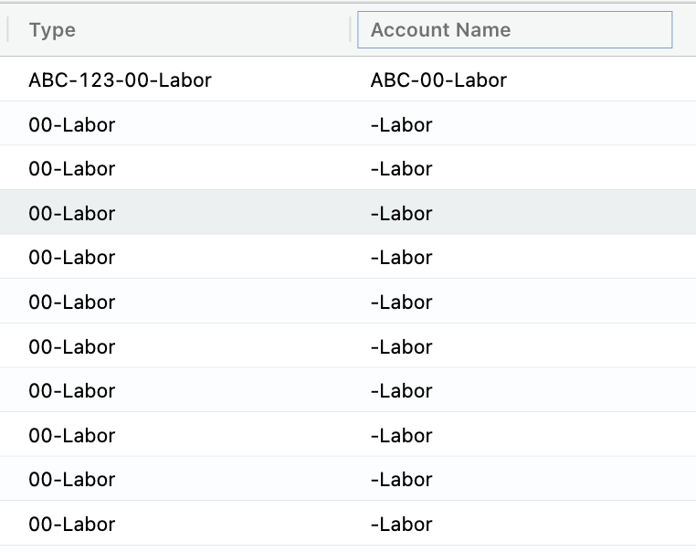</img> 

### DayOfWeek
DayOfWeek function takes a date and returns a number between 0-6 representing the day of week. 0 for Sunday and 6 for Saturday.

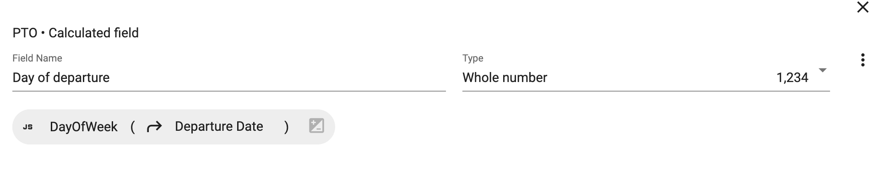</img> 

Results:

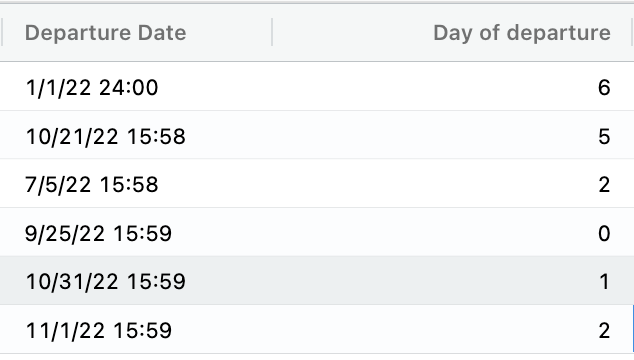</img> 

### DayName
DayName function takes a date and returns value of the day of the week in a string value, either long or short (Monday vs Mon).

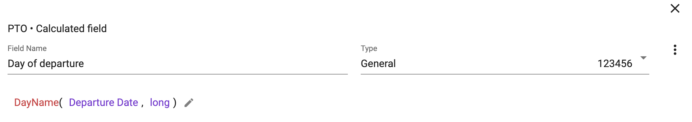</img> 

Results:

  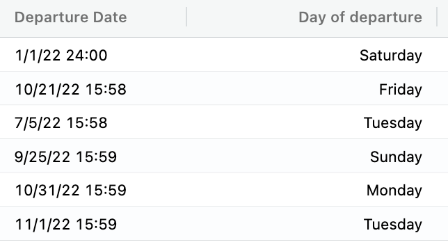</img> 

### WeekNumber
WeekNumber function takes a date and returns a week number (1-54) that corresponds to the week of year.

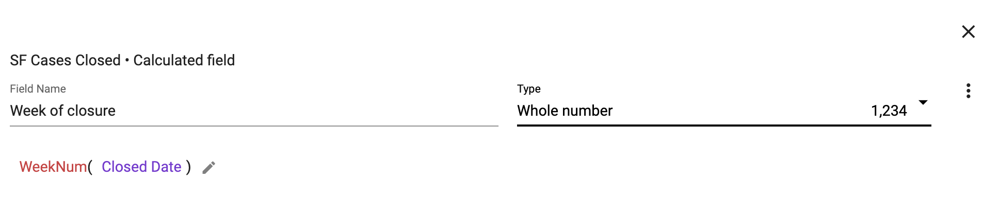</img>

Results:

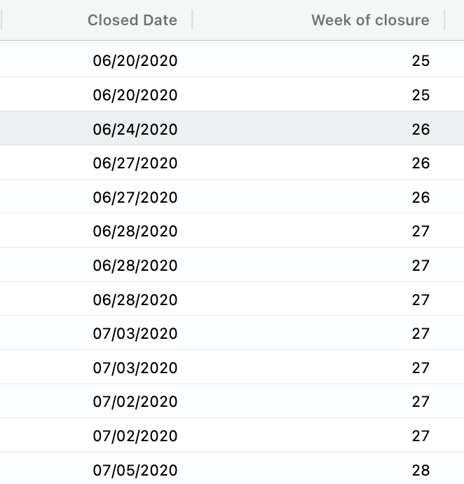</img>

### Left
Left function extracts a given number of characters from the left side of a string.

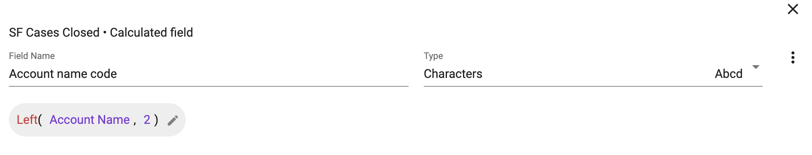</img>

Results:

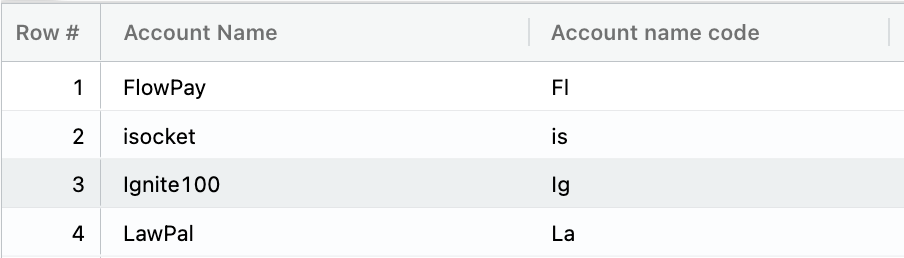</img>

### Right
Right function extracts a given number of characters from the right side of a string.

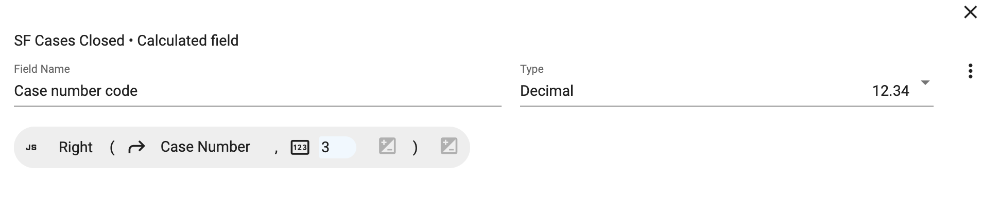</img>

Results:

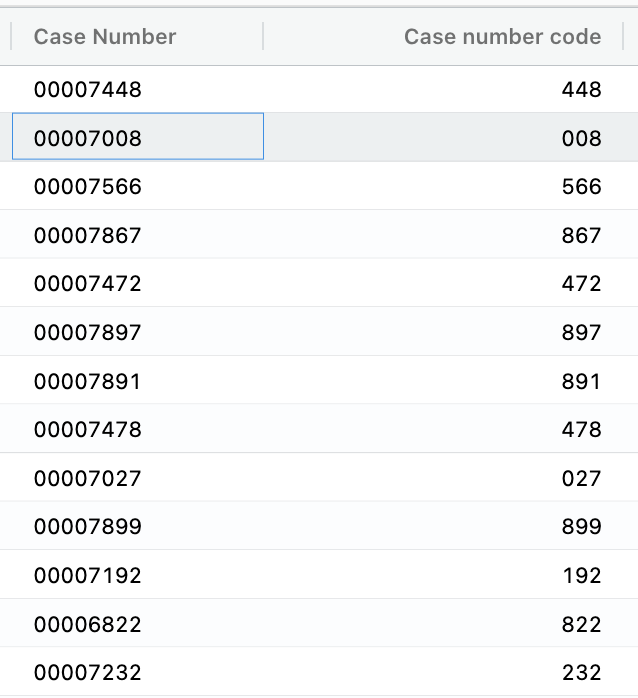</img>

### Split
Split function splits a string into multiple strings given the delimiter that separates them.

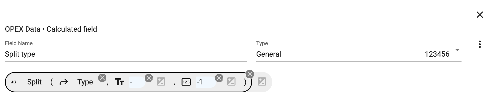</img>

Results:

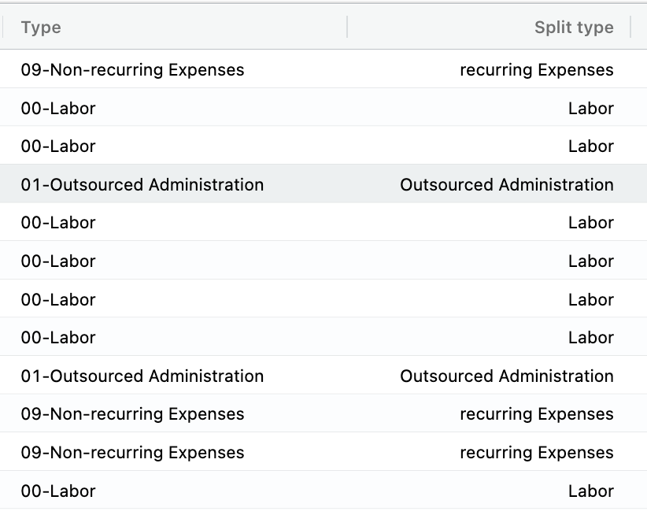</img>

### SumChildren
SumChildren function will sum the value of any child records.

In order to utilize the SumChildren function you will need a parent/child reference relationship between collections.

For more information on reference fields - [Reference Fields](https://docs.starlifter.io/#/how_to/reference_field?id=how-create-a-reference-field)

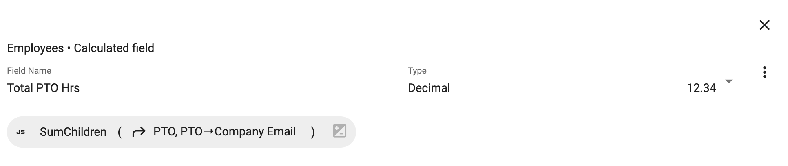</img>

<figcaption>Child Collection</figcaption>

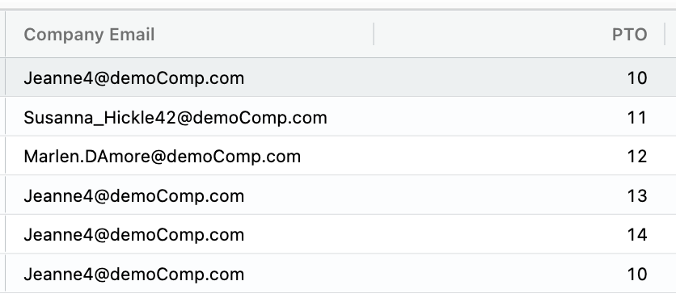</img>

<figcaption>Parent Collection</figcaption>

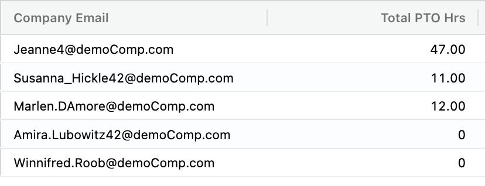</img>

### AvgChildren
SumChildren function will calculate an average value of any child records.

In order to utilize the AvgChildren function you will need a parent/child reference relationship between collections.

For more information on reference fields - [Reference Fields](https://docs.starlifter.io/#/how_to/reference_field?id=how-create-a-reference-field)

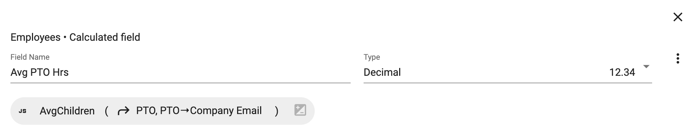</img>

<figcaption>Child Collection</figcaption>

</img>

<figcaption>Parent Collection</figcaption>

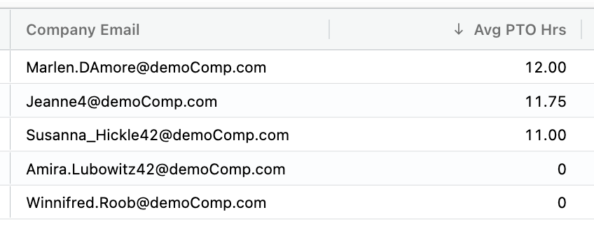</img>

### CountChildren
SumChildren function will count the number of any child records.

In order to utilize the CountChildren function you will need a parent/child reference relationship between collections.

For more information on reference fields - [Reference Fields](https://docs.starlifter.io/#/how_to/reference_field?id=how-create-a-reference-field)

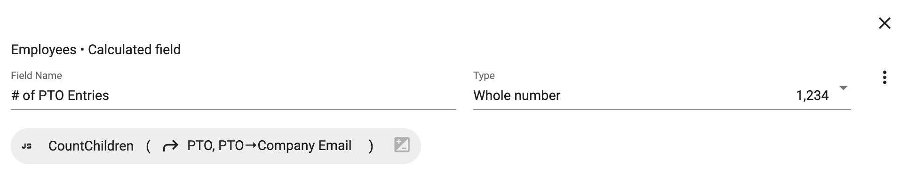</img>

<figcaption>Child Collection</figcaption>

</img>

<figcaption>Parent Collection</figcaption>

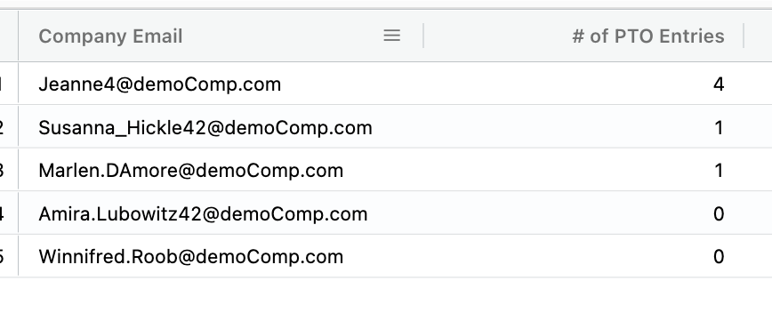</img>

To learn more or ask additional questions, head over to the [StarLifter Community](https://community.starlifter.io).
