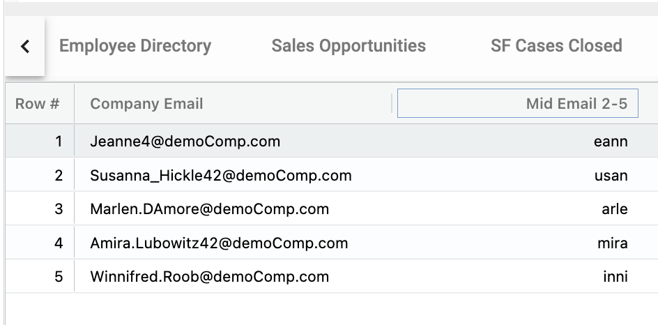

## Functions
Functions are predefined formulas that are used in calculated fields.

To access the available functions for a calcuated field, click the left icon of the chip and select function.

</img>    </img>

## List of Functions
### Mid
MID returns a specific number of characters from a text string, starting at the position you specify, based on the number of characters you specify.

</img> </img> 

### Min
MIN returns the smallest numeric value in the data provided.

### Max
MAX returns the largest numeric value in the data provided.
### DateDiff
Calculates the number of days, months, or years between two dates.

The example below uses an IF Statement to check for a value in the *Departure date* field and the calculates the number of days between *Departure date* and *Start date* 

</img> 
### Days from Now
### Concatenate
### Concatenate with Spaces
### Remove #s
### Day of the Week
### Day Name
### Week Number
### Left
### Right
### Split
### Sum Children
### Average Children
### Count Children
</img>
