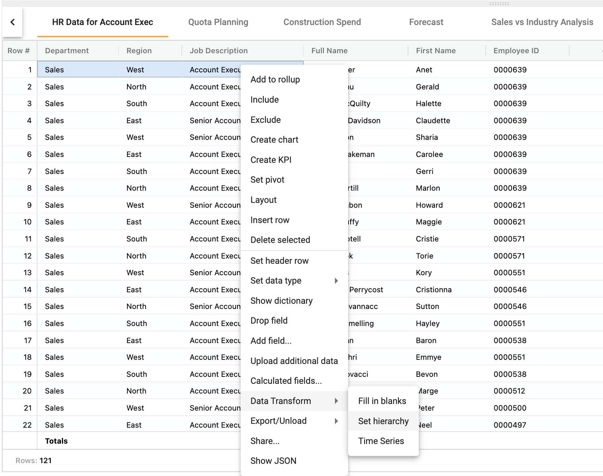

## How to set a hierarchy for a tree map
How-to video link - https://youtu.be/gQZiO9LDOQY

Hierarchies are used to create a relationship amongst categories.  Hierarchies are used to drill through data.

To define a hierarchy:
1.  Position columns in the desired order
2.  Highlight the columns
3.	Right click ➔ **Data Transform** ➔ **Set hierarchy**

</img>

To view a hierarchy:
1.	Right click ➔ **View dictionary**
2.	Note the **Hierarchy Number** and **Hierarchy Position** 

</img>

To create a chart using a hierarchy:
1.	Right click on a value ➔ **Create chart**
2.	Select **TreeMap**

</img>

</img>

Right click ➔ **Edit chart definition** to view Hierarchy #1 and select/deselect the fields.

</img>
