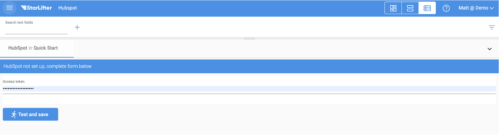

## Integrate with Hubspot

To access your Hubspot data in StarLifter, you must first create a Private App in Hubspot to generate your unique Access Token. This may require you to contact your Hubspot administrator, as only super admins are able to create Private Apps..

To create a Private App, follow the instructions below, or link directly to [**Hubspot's documentation**](https://developers.hubspot.com/docs/api/private-apps).

### Log in to Hubspot
1. Log in to your HubSpot account where you have the necessary permissions to create integrations.

### Navigate to Private Apps
1. Go to Settings by clicking the gear icon in the top right corner.

2. In the left sidebar, scroll down to **Integrations** and click on **Private Apps**.

### Create a New Private App
1. Click on **Create a private app**.
   
2. Provide a name (ex: StarLifter) and description for your app. This is just for internal reference.
   
3. Select the necessary scopes (permissions) that your integration requires. These scopes define what data your app can access. It is considered best practice to select **Read** access for all scopes. StarLifter is a read-only platform, so data will only be read from your source system, not modified.

### Generate the Access Token
1. After selecting the scopes, click **Create app**.
   
2. HubSpot will generate an **Access Token** for you. This is the token you will enter into the StarLifter Hubspot Setup page.

### Enter your Access Token into StarLifter

1. Navigate back to Hubspot Quick Start in StarLifter

2. Enter the Access token from your Hubspot Private App.

</img>

3. Click **Test and save**.

4. To finish setting up your Hubspot data in StarLifter, return to [**Quick Start Integration Setup**](https://docs.starlifter.io/#/how_to/quick_start_integrations).

