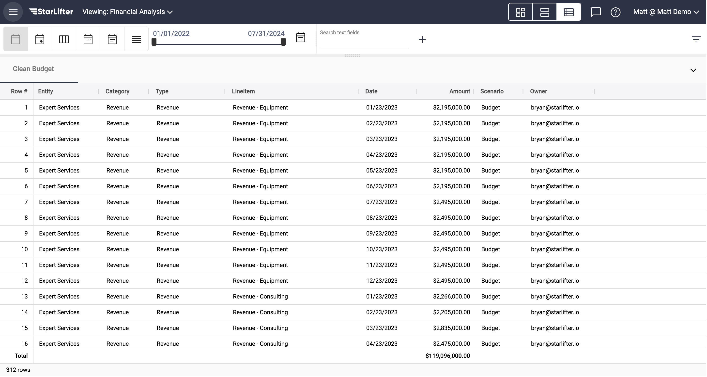
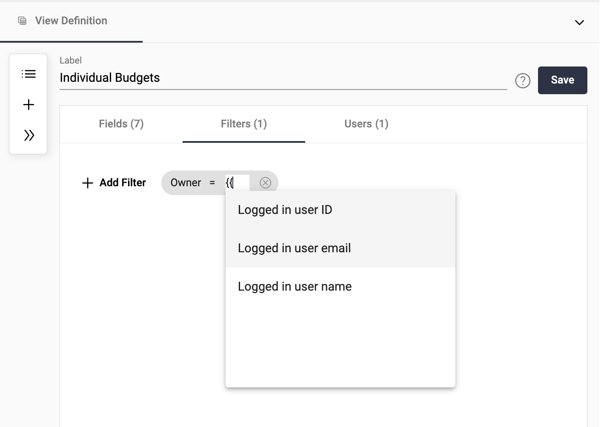

## Using a view for data input

[**Video Tutorial**](https://youtu.be/IUkEAK2Cqyo?feature=shared)

Views can be used to control which users can view and edit data.

### Create a view:  
In this example, we will create a view where the budget owner can only edit the amount field for the line items they are responsible for.

</img>

1. Right-click in the collection and select **Create View**.

</img>

2.  Name the view. Select the fields you'd like included in the view, and choose which fields should not be editable by checking **Read only**.

</img>

3.  Select Filters to give access to the appropriate budget owner, determined by the owner field. Type "{{" and select how the budget owner will be identified: by the logged in user ID, user email, or user name, depending in the information contained in the owner field. This is most often the user name used to log into StarLifter.

</img>

4.  Select Users to set the specific edit permissions:
   * **Update:** Update editable fields
   * **Insert:** Insert new rows
   * **Delete:** Delete rows
   * **Config:** Change data types, formats, or add new fields.

</img>

5.  Share the view with the user by right-clicking in the collection and selecting **Share**.

</img>

6.  Set permissions to the appropriate level, and click Invite to send an invite email. By selecting Editor, you are giving the budget owner the permission to edit the fields they have access to. See
   [**Sharing data**](how_to/sharing_access.md) for more information.

</img>

### Impersonate a user to test the view:  
1. In the administration menu, select **Impersonate User**.

</img>

2. In the example below, only Bryan's budget items are displayed in the view, and Amount is the only editable field.

</img>

