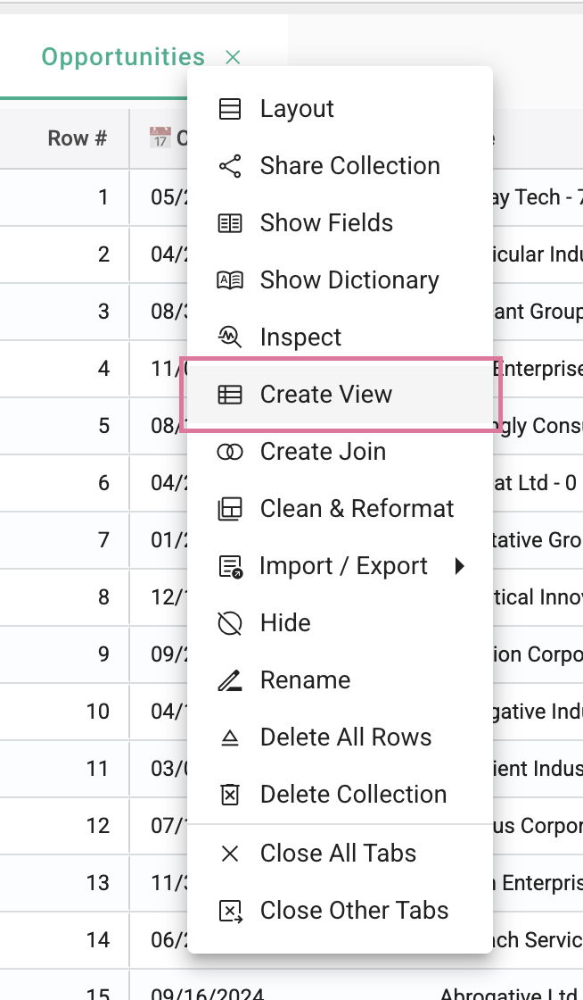
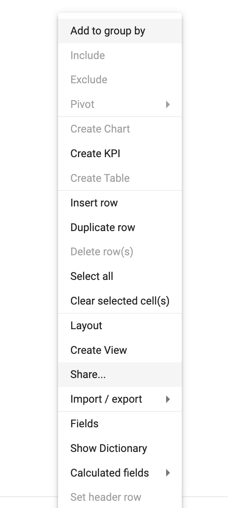

## Using a view for data input

[**Video Tutorial**](https://youtu.be/IUkEAK2Cqyo?feature=shared)

Views can be used to control which users can view and edit data.

### Create a view:  
1.	In this example, we will create a view where the budget owner can only edit the amount field for the line items they are responsible for.

</img>

2.  Right-click in the collection and select **Create View**.

</img>

3.  Name the view. Select the fields, and choose which fields are editable by unchecking **Read only**.

</img>

4.  Filter the owner field. Type "{{" and select Logged in user ID, user email, or user name, depending in the information contained in the owner field.

</img>

5.  Set the user permissions. You have the options to control each user's ability to edit the view:
   * **Update:** Update editable fields
   * **Insert:** Insert new rows
   * **Delete:** Delete rows
   * **Config:** Change data types, formats, or add new fields.

</img>

6.  Share the view with the user by right-clicking in the collection and selecting **Share**.

</img>

7.  Invite the user to access the view, or change their permissions to the appropriate level. See [**Sharing data**](how_to/sharing_access.md) for more infomration.

</img>

### Impersonate a user to test the view:  
1. In the administration menu, select **Impersonate User**.

</img>

2. In the example below, only Bryan's budget items are displayed in the view, and Amount is the only editable field.

</img>
