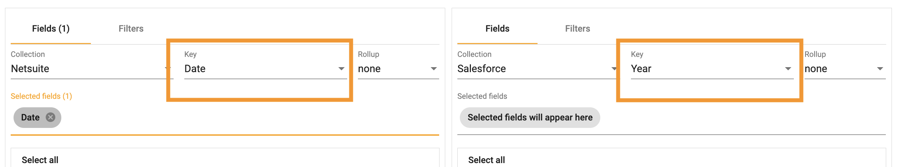

## How to create a join
How-to video links:
Part 1 - https://youtu.be/i9q6_quxxq8 
Part 2 - https://youtu.be/wTQMEDzP8HA

A join is used to connect multiple collections together using a common key. StarLifter uses a Left Join when creating a Join. This type of join will return all records from the left table, and the matching records from the right table. 

</img>

To create a join:  
1.	Right click ➔ **Join Definitions**

</img>

2.  Select **New Join Definition** from the drop down

</img>

3.  Select the collection names to connect

</img>

4.  Select the key.  Note:  The name of the key does not need to match.  In the example below **Year** and **Date** are fields whose format match (e.g. MM/DD/YYYY)

</img>

5.  Select a **Rollup** if applicable.  

</img>

Rollups are necessary when the rows of data are not aligned.  A weekly rollup would be required to join these two datasets together.

</img>

6.  Select the fields desired in the join
7.  Add additional collections with the **+**
8.  If necessary, add a filter to one or both collections
9.  Select **OK**

</img>

10.  The join is added as a collection.

</img>

