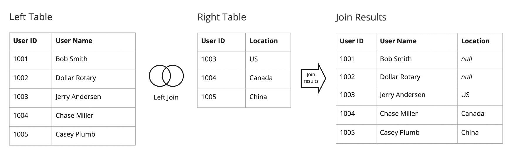
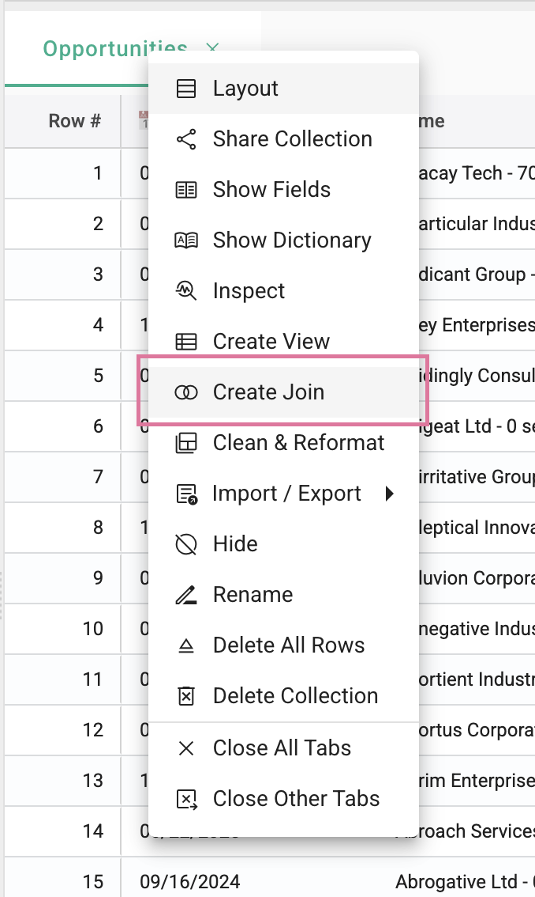

## How to create a join
<!-- [**Video Tutorial**](https://youtu.be/7uHRGDvdT6c?feature=shared) -->

A join is used to connect multiple collections together using a common key. StarLifter uses a Left Join when creating a Join. This type of join will return all records from the left table, and the matching records from the right table. 

</img>

To create a join:  

1.  Right click the collection tab, select **Create Join**.

</img>

3.  Select the collection names. The left side of the join should be the collection on the left.

4.  Select the join key. Note that the field name of the key does not need to match.  It is only necessary that the date type matches.

</img>

5.  Select a Rollup if applicable.  

</img>

Rollups are necessary when the rows of data are not aligned.  A weekly rollup would be required to join these two datasets together.

</img>

6.  Select the fields desired in the join.

7.  If necessary, add a filter to one or both collections.

</img>

8.  Click **Save**. The join is now available as a new StarLifter collection.

</img>

9.  To edit the join, right click on the join header and select **Show join definition**.

</img>

