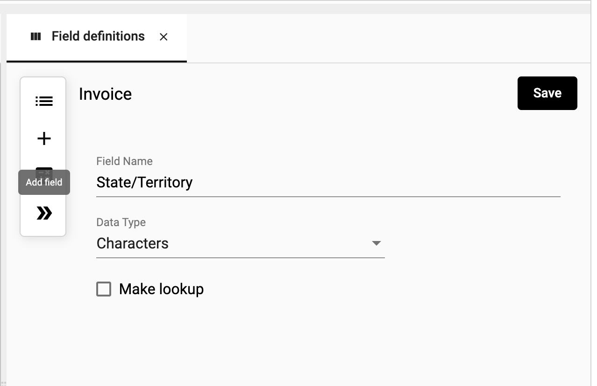
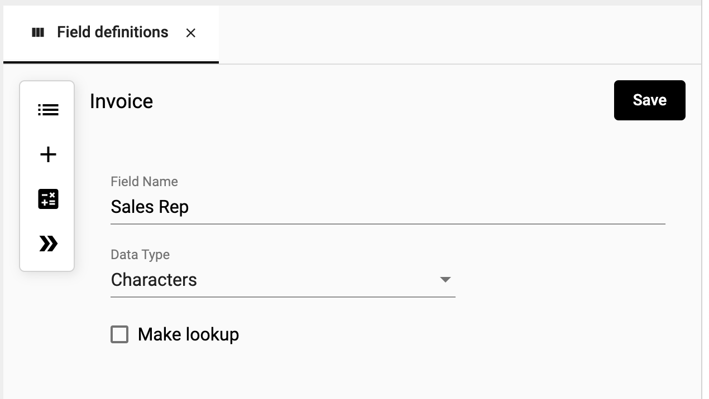
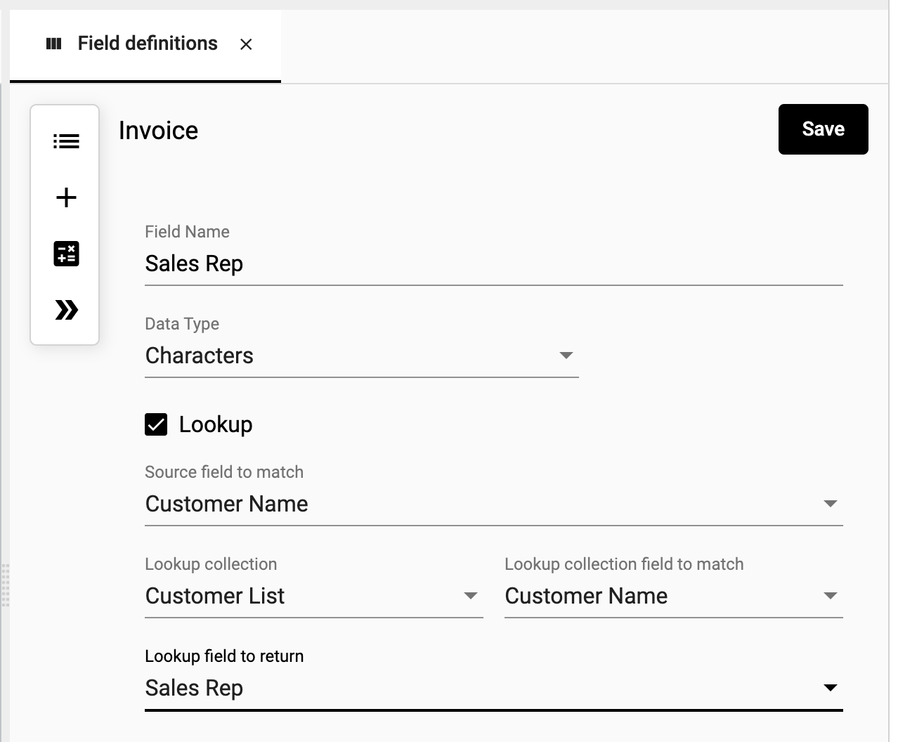
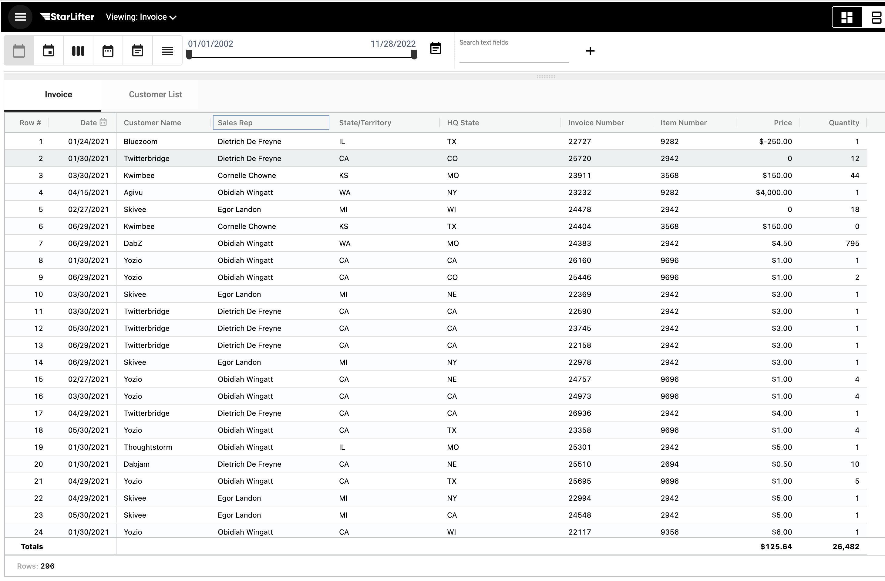

## Lookup Field
A lookup field allows you to return a value from a row in a collection that matches a value on your current record. Similar to a VLOOKUP in Excel, it will take a value from your row and attempt to match that value to a column in another collection. The first match it finds, it will return a chosen value from the matching row.

The following example adds a **Sales Rep** field on the invoice collection where the invoice's **Company Name** matches the **Company Name** on the Customer List collection and returns the **Sales Rep** value.

### Create a lookup field
1. Right-click the grid and select **Fields**.

</img>

2. Click the + symbol to create a new field.

</img>

3. Check the **Make Lookup** box to expose the lookup fields.

</img>

4. Populate the following fields:
- **Source field to match** - The value you want to lookup.
- **Lookup collection** - The collection you want to search.
- **Lookup field to match** - The matching value in the lookup collection.
- **Lookup field to return** - The value you want to return to your field.

</img>

5. The new lookup field is added to your collection.

</img>
