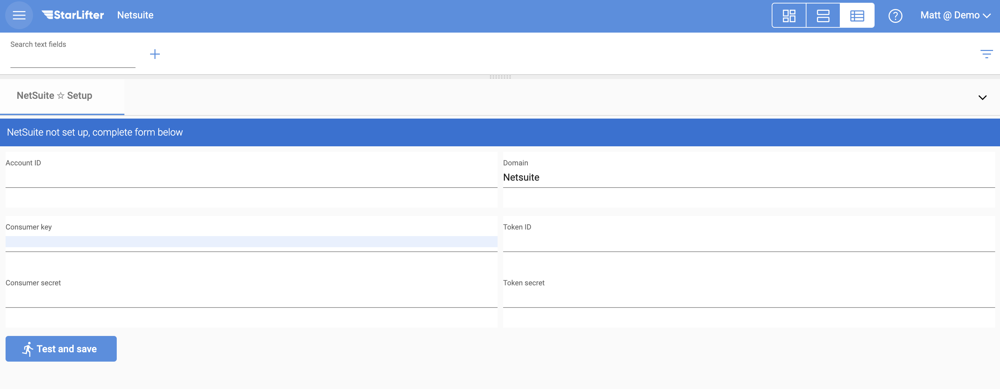

## Accessing your NetSuite Data

To access your NetSuite data in StarLifter, you must first set up Token-based Authentication in NetSuite to retreive the credentials below. This may require you to contact your NetSuite administrator to ensure your account has the credentials required to set up Token-based Authentication.

* Account ID (the unique ID for you Netsuite Account)
* Consumer Key
* Consumer Secret
* Token ID
* Token Secret

### Set up Toekn-based Authentication
To set up Token-based Authentication, follow the instructions in [**NetSuite's documentation**]([https://developers.hubspot.com/docs/api/private-apps](https://docs.oracle.com/en/cloud/saas/netsuite/ns-online-help/section_161942084079.html#procedure_1127120639).

### Enter your NetSuite credentials into StarLifter:

1. Navigate back to NetSuite Setup in StarLifter

2. Enter the NetSuite credentials

</img>

3. Click **Test and save**.

To learn more or ask additional questions, head over to the [StarLifter Community](https://community.starlifter.io).
