## Normalization
Data entered or retrieved from external systems may be in different formats. Normalization converts these different values into a single standardized value.
For example, a state name may be 'CA' 'Ca.' or 'California'.

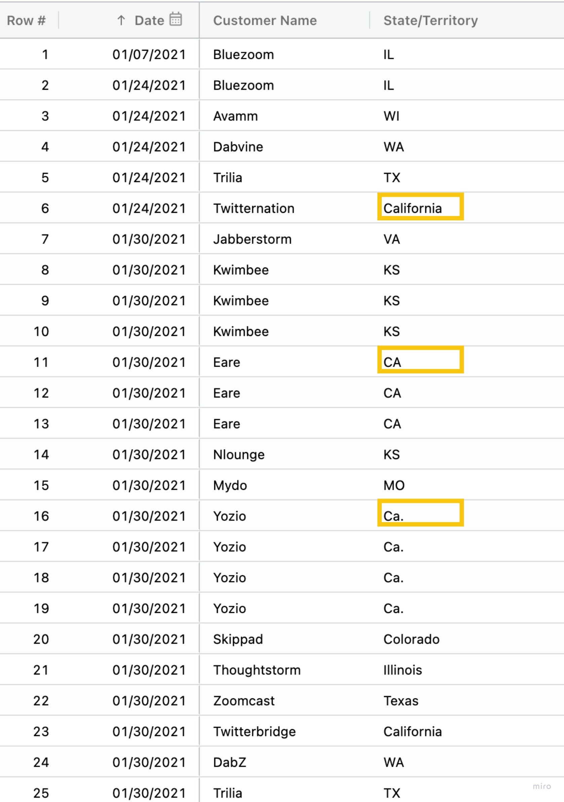</img>

Normalization converts aliases to names ensuring that each state is represented by only one name.

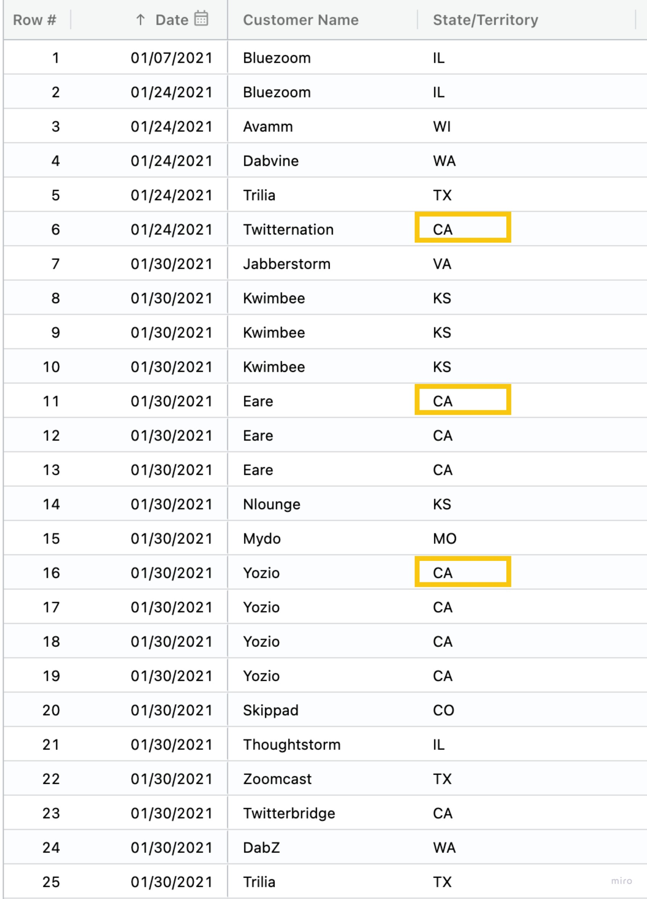</img>

Normalizations are represented in a normalization collection using **Alias** and **Name** fields.
When a value is entered that matches an **Alias**, it is converted to the **Name** value.

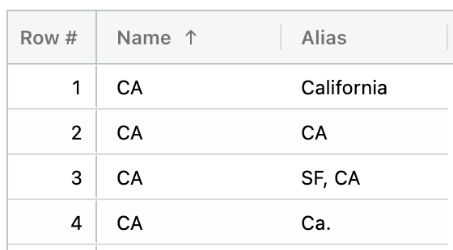</img>

'CA' is the Name, and the Aliases are 'California', 'SF, CA', and 'Ca.'

### How to create a new normalization
1. Right-click on the field you want to normalize and select **Normalize field**, **New**.

</img>

2. Name the new normalization collection.

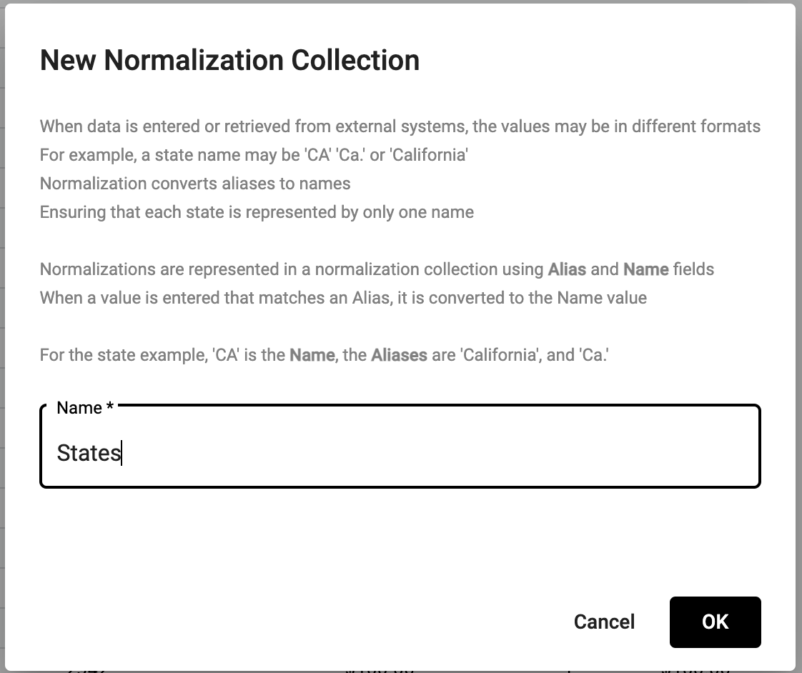</img>

3. A new Normalization collection is created with a record for each unique value found in the normalized field.

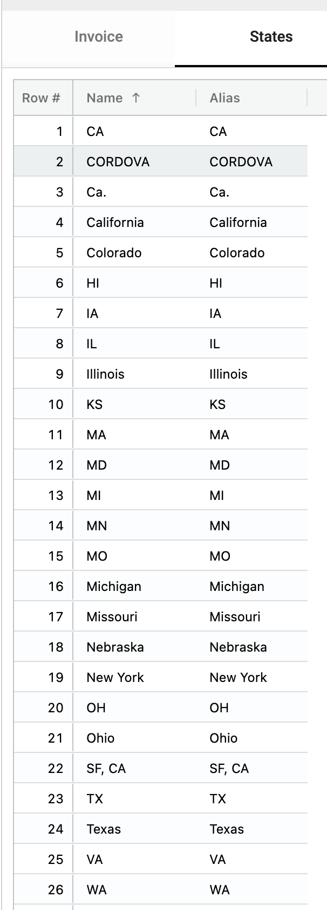</img>

4. For each **Alias** value, change the matching **Name** value to your desired normalized value.

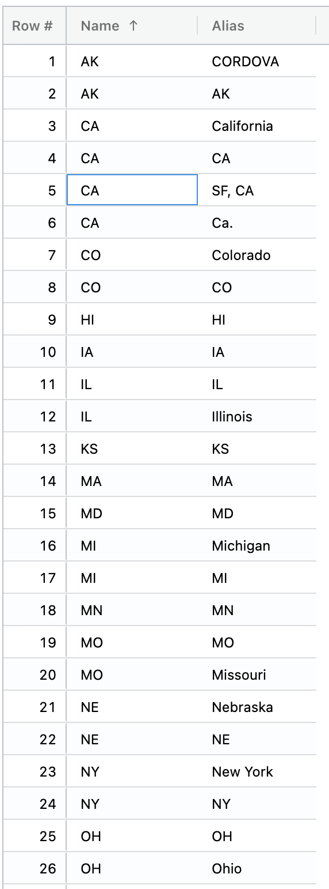</img>

5. In your original collection, right-click in the grid that contains the **Alias** value you would like to change and select Fields. 

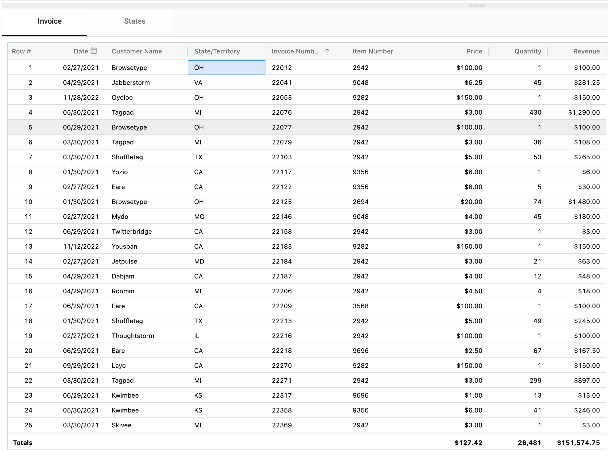</img>

6. Click on the **Name** (State/Territory) field, and change the data type to [Reference](https://docs.starlifter.io/#/how_to/references?id=create-a-reference).
7. Set the following fields:
   * Reference Collection: Name of the Normalization Collection (State)
   * Reference Collection Field to Match: the Alias field (State/Territory)
   * Check "Use *Field Name* as a display value"
   * Additional Reference fields: Select the normalization collection. Name (State.Name) as an additional referenced field.
8. Click Save

   Your field should now be normalized. 

### Adding data to a normalization collection

Any new data entered into your normalized field will be automatically added to the normalization collection.

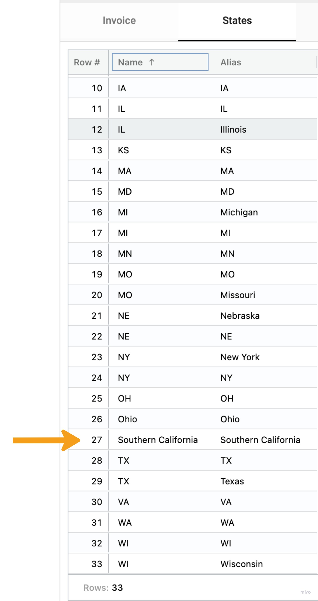</img>

Update the **Name** value to your desired normalized value.

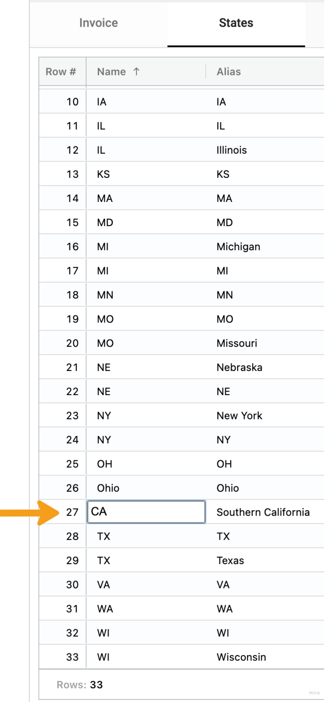</img>

### Apply an existing normalization to a field 

You can apply a pre-existing normalization to another field. 

Right-click on the field your want to normalize and select **Normalize field** and select the pre-existing normalization.

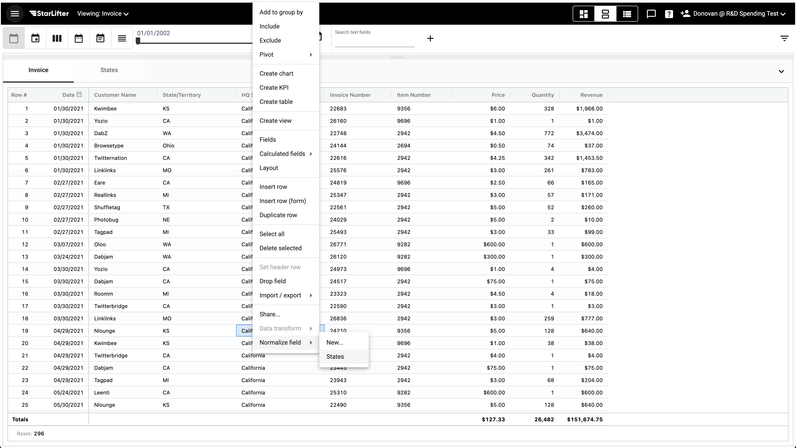</img>

The normalization will change the values of your field to the normalized values

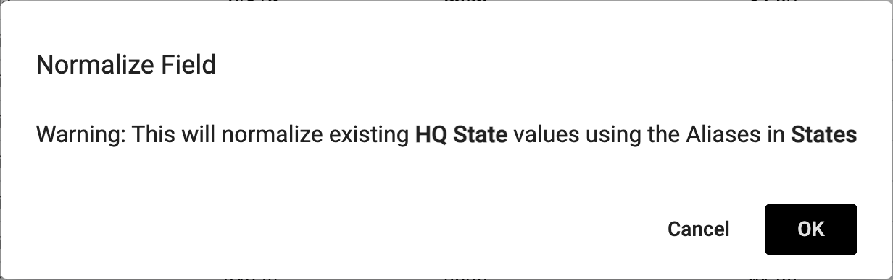</img>

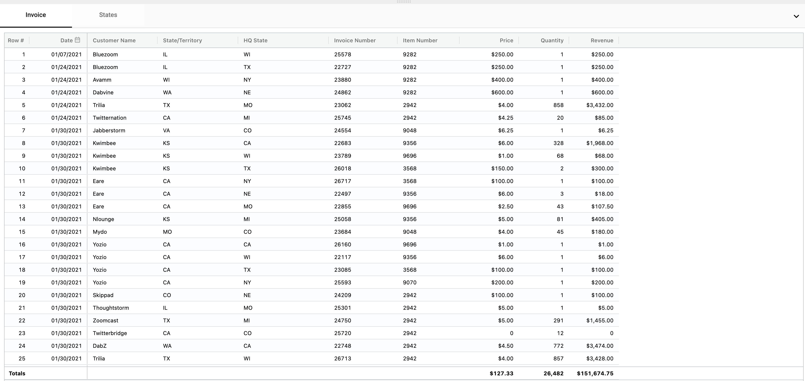</img>

To learn more or ask additional questions, head over to the [StarLifter Community](https://community.starlifter.io).
