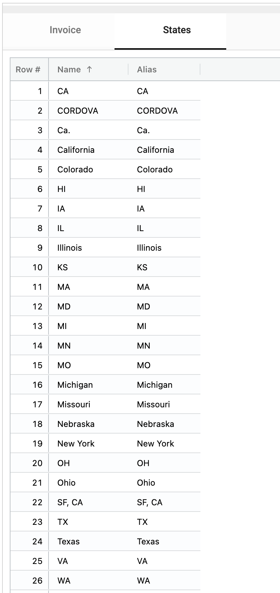
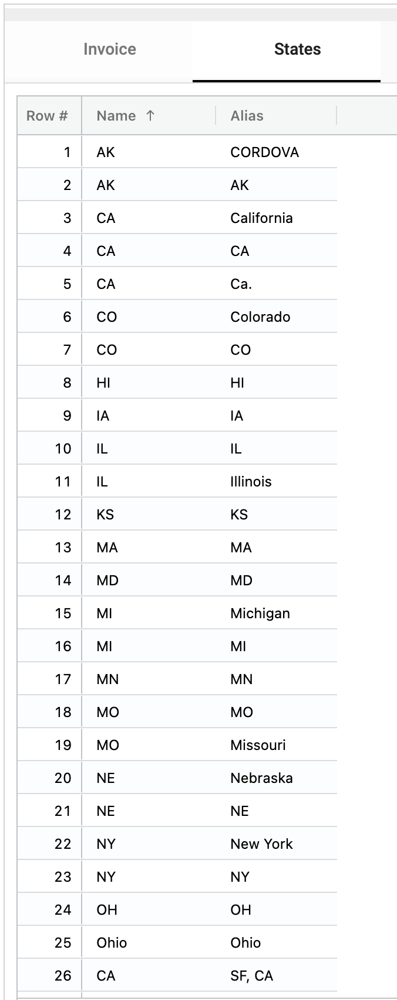
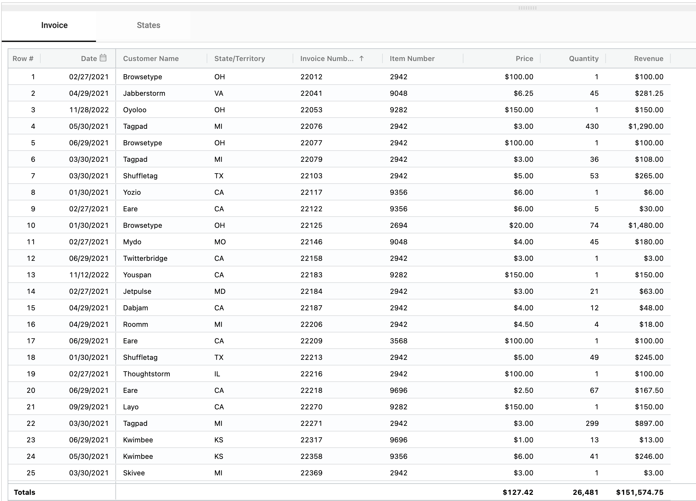
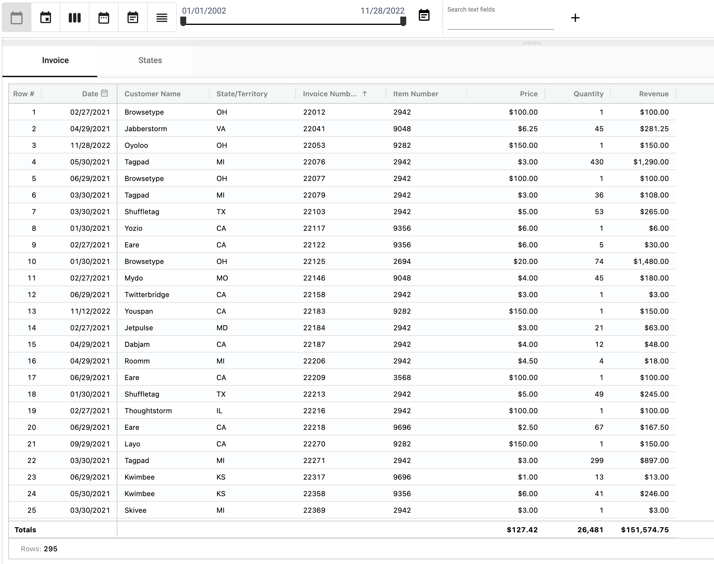

## Normalization
Data entered or retrieved from external systems may be in different formats. Normalization converts these different values into a single standardized value.
For example, a state name may be 'CA' 'Ca.' or 'California'.

</img>

Normalization converts aliases to names ensuring that each state is represented by only one name

</img>

Normalizations are represented in a normalization collection using **Alias** and **Name** fields.
When a value is entered that matches an **Alias**, it is converted to the **Name** value.

</img>

'CA' is the Name, the Aliases are 'California', 'SF, CA' and 'Ca.'

### How to create a new normalization
1. Right-click on the field you want to normalize and select **Normalize field**, **New**.

</img>

2. Name the new normalization collection

</img>

</img>
</img>

</img>
</img>

</img>
</img>
</img>
</img>

### Normalization
* Normalization
* Normalization
    * Normalization
      * Normalization
      * Normalization

* For more information on Normalization visit: [Normalization](/docs/how_to/Normalization.md)
