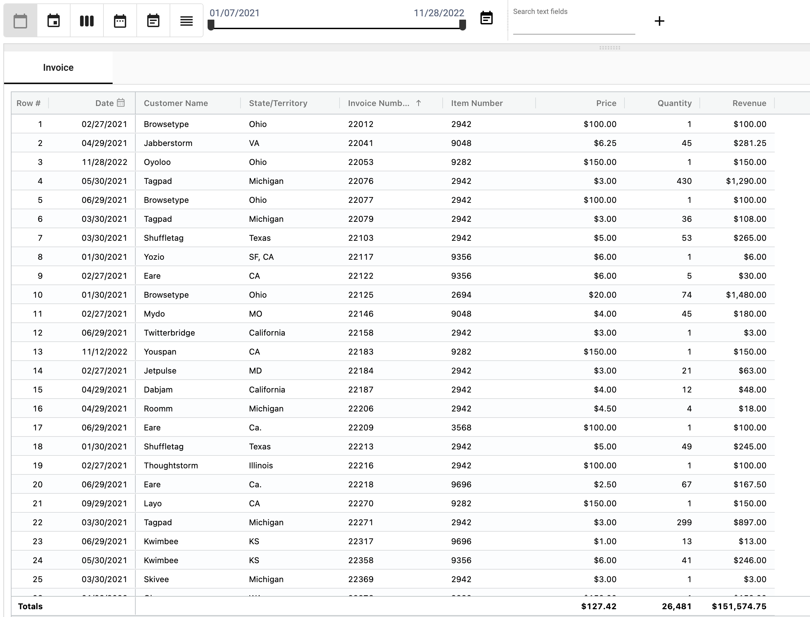

## Normalization
Data entered or retrieved from external systems may be in different formats. Normalization converts these different values into a single standardized value.
For example, a state name may be 'CA' 'Ca.' or 'California'.

</img>

Normalization converts aliases to names ensuring that each state is represented by only one name

Normalizations are represented in a normalization collection using Alias and Name fields
When a value is entered that matches an Alias, it is converted to the Name value

For the state example, 'CA' is the Name, the Aliases are 'California', and 'Ca.'

### How to normalize data
1. Normalization

</img>

### Normalization
* Normalization
* Normalization
    * Normalization
      * Normalization
      * Normalization

* For more information on Normalization visit: [Normalization](/docs/how_to/Normalization.md)
