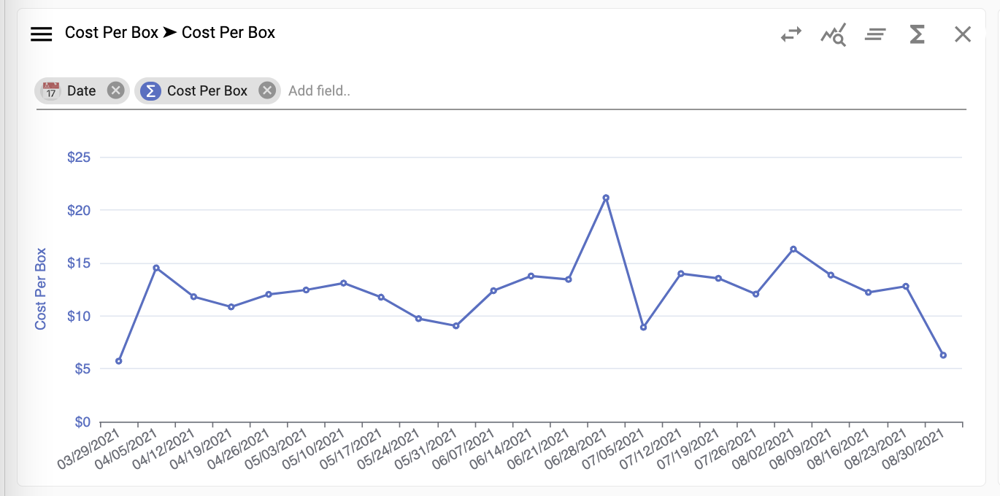
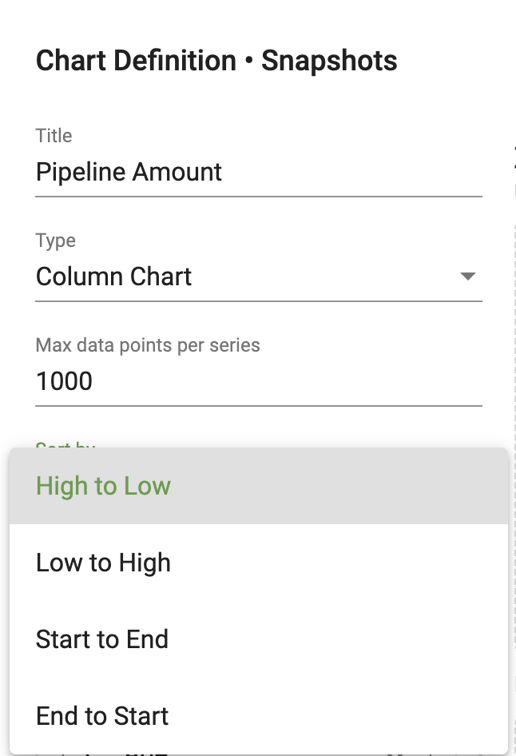

## How to reorder values on a chart

To reorder values on the X-axis of a chart:

1.	Select the menu on a chart 

</img>

2.  Select **Chart Options**, **Sort by**, and choose **High to Low**, **Low to High**, **Start to End**, or **End to Start**.

</img>

Note:  If the field type is string, **A to Z** and **Z to A** will become options.

3.  Values on the chart will respond accordingly.

</img>
