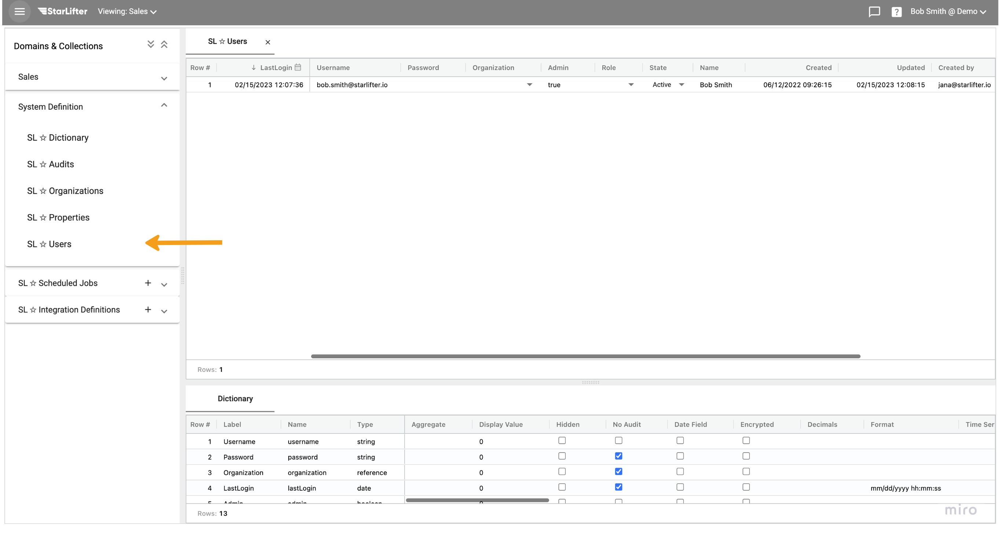

## Password Reset

### User initiated password reset

You can reset your password via the login screen. 

Click the **Forgot your password?** link from the login screen

</img> 

Enter your email address to have password reset instructions emailed to you. 

</img> 

### Administrator initiated password reset
As an administrator you can reset a user's password via the user table.

Click the user profile menu in the upper right corner and select **Administration**

</img> 

Expand the **System Definition** menu and select **SL ✩ Users**.

</img> 

Double-click the user's password field and enter the new password and press enter.

</img> 

*Note – For security purposed the password will not be visible.
