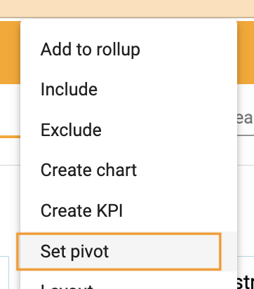
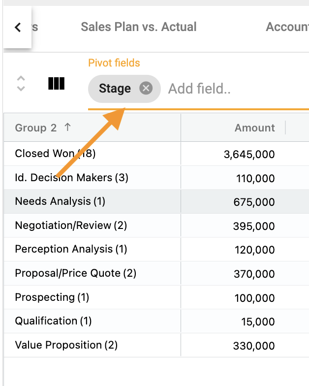
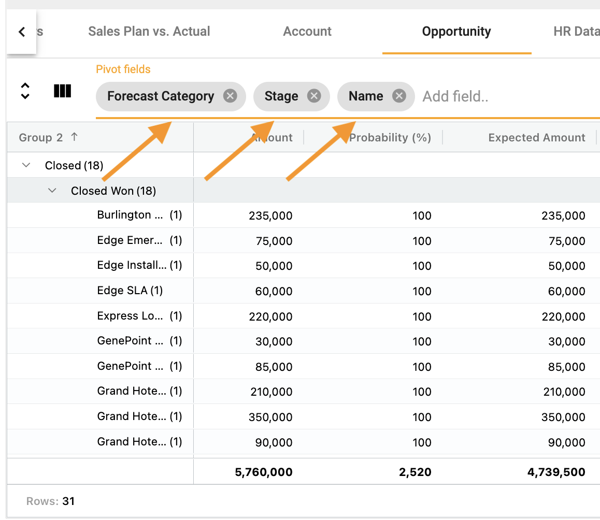
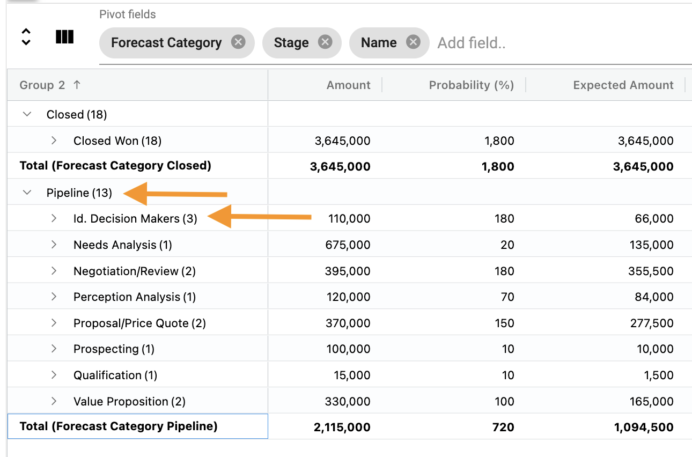
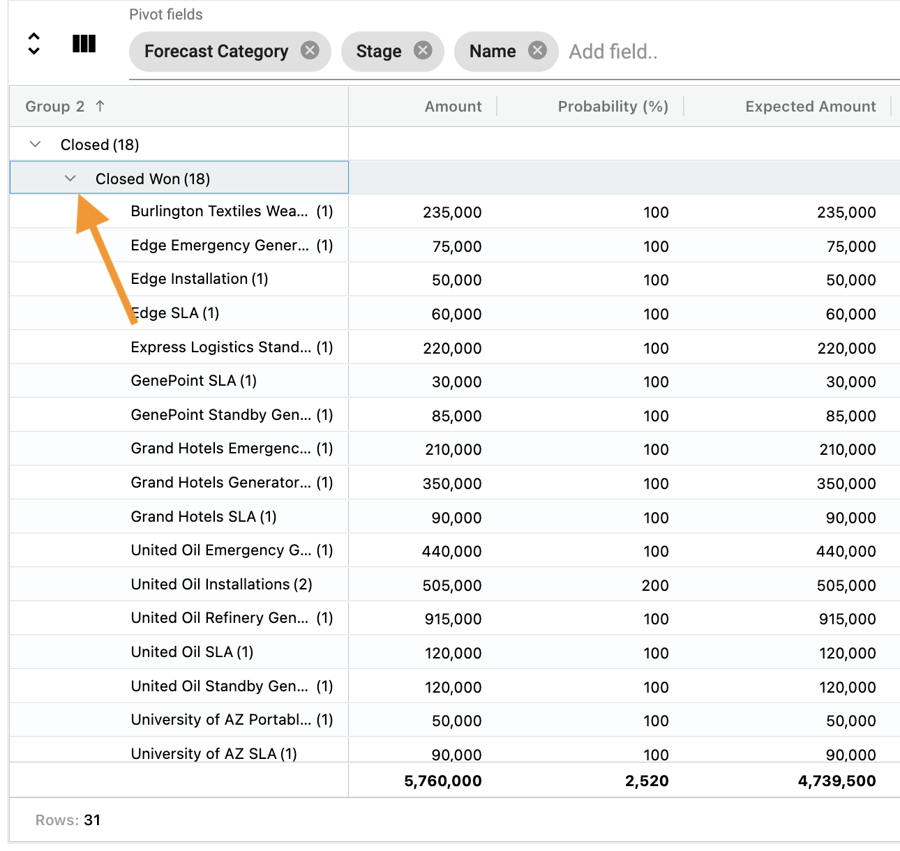
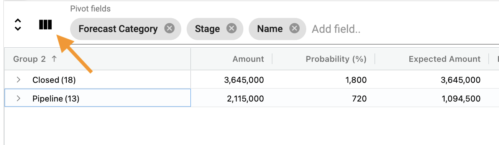
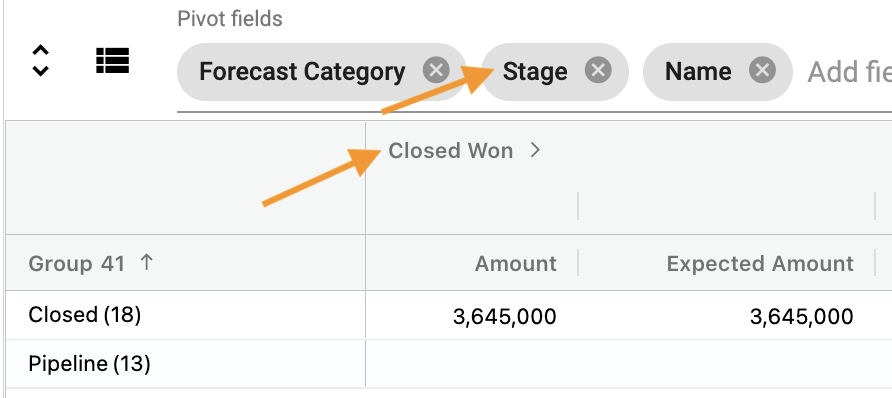
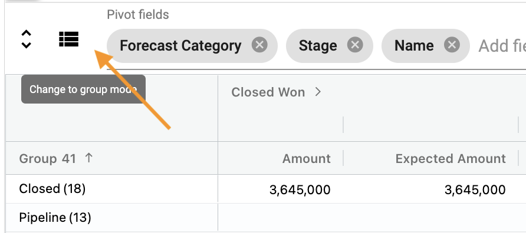

## How create a pivot
How-to video link - https://youtu.be/wkYBb-xqabo

Use a pivot to aggregate and group values by categories.

To create a pivot:

1.	Right click ➔ **Set pivot**

</img>

2.  The pivot inserts category field as a **Pivot field** 

</img>

3.  Add, change and re-order **Pivot fields** by dragging

</img>

4.  The data defaults to **Group mode**.  This mode shows the groups.

</img>

5.  Expanding the **arrows** shows the granular detail.

</img>

6.  To change from **Group mode** to **Pivot mode**, select this icon:

</img>

7.  In **Pivot mode**, the second **Pivot field** is used as a column category.  See example below:

</img>

8.  To change back to **Group mode**, select the icon again:

</img>

