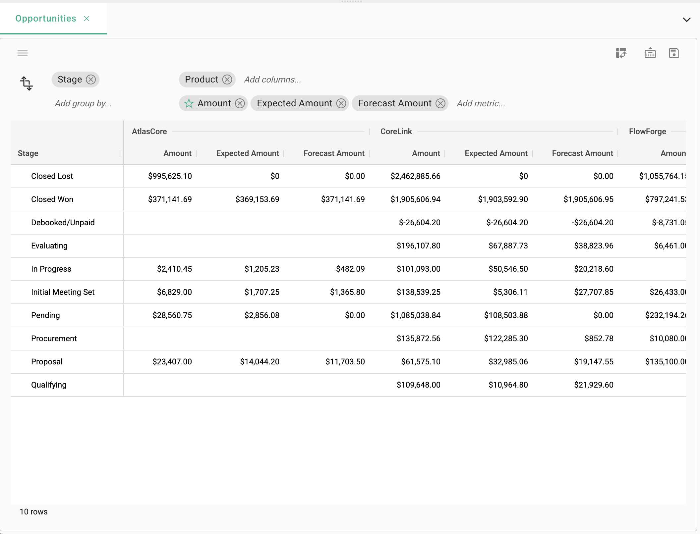
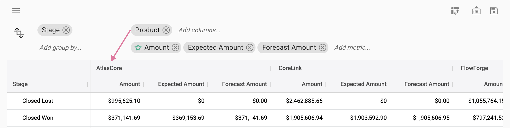
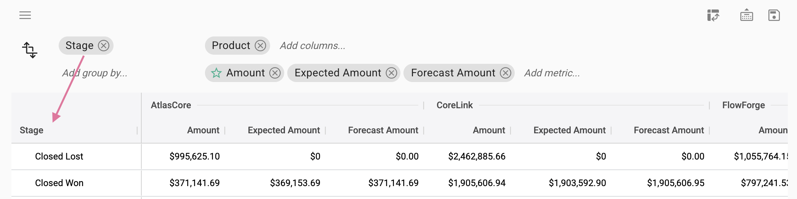
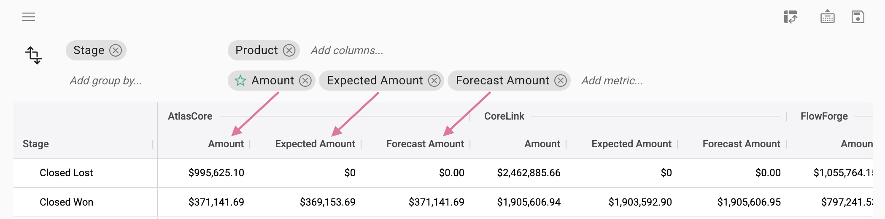
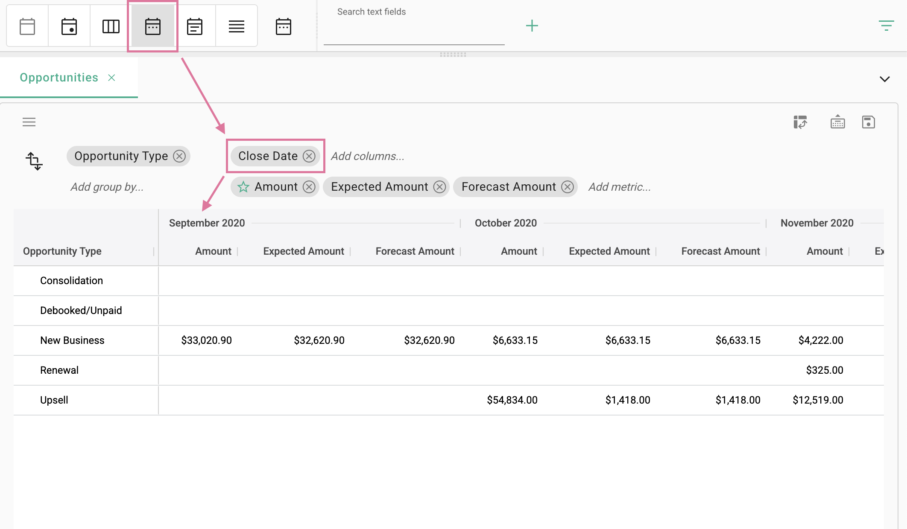
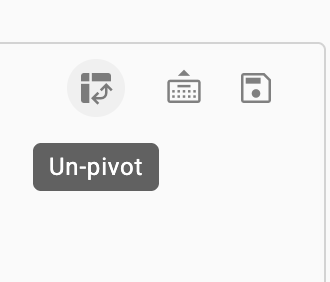
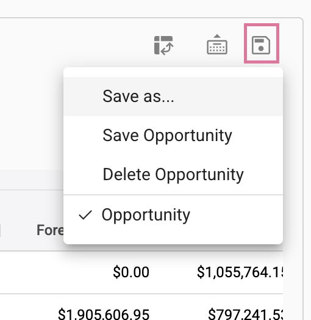
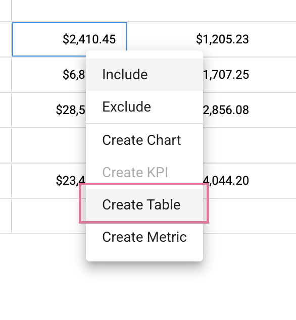

## How create a pivot

Use a pivot to aggregate and group values by categories. Pivots can be created directly in the UI or saved to a dashboard.

### Create a pivot

Right click in the collection ➔ **Pivot** ➔ **Set pivot**.

</img>

</img>

Columns

</img>

Group By

</img>

Metrics

</img>

Use the date rollup buttons to change the date rollups in the pivot.

</img>

To unpivot, click the unpivot icon.

</img>

 

### Save a pivot

Click the save icon and select **Save as** to save a new pivot or **Save** for an existing pivot.

</img>

You can also access and load previously saved pivots from the save menu.

 

### Add a pivot to a dashboard

Right click in pivot ➔ **Add table**.

</img>

