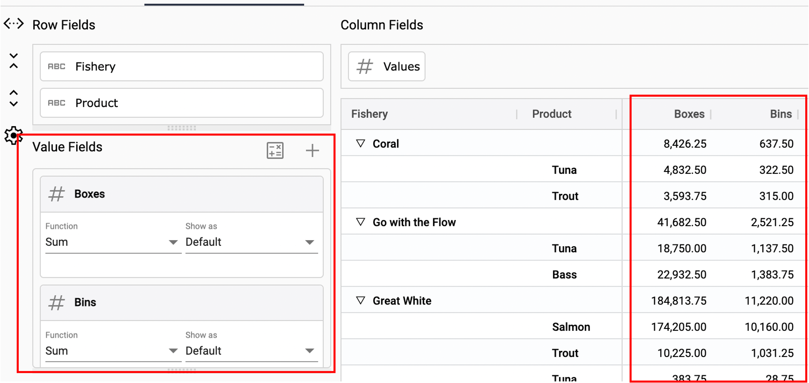
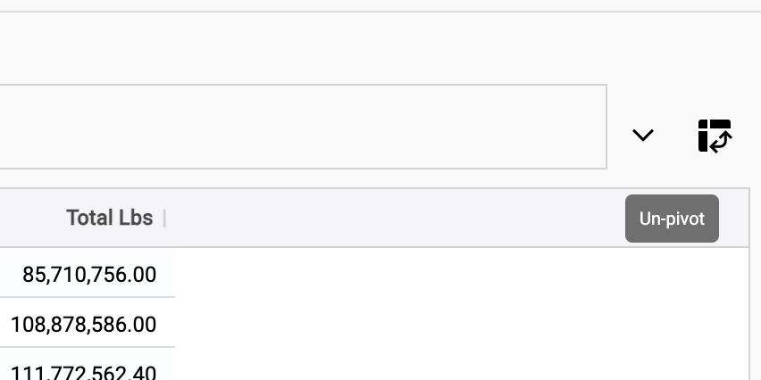
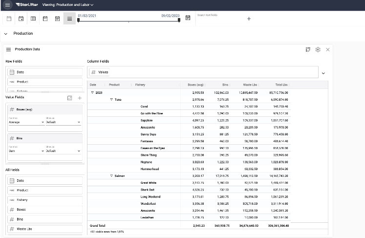

## How create a pivot
How-to video link - https://youtu.be/wkYBb-xqabo

Use a pivot to aggregate and group values by categories. Pivots can be created directly in the UI or saved to a dashboard.

### Create a pivot

1.	Right click in the collection ➔ **Pivot** ➔ **Set pivot**.

</img>

2.  To add row fields, drag the fields from **All Fields** to **Row Fields**. Row fields will appear as levels of the hierarchy in the pivot.

</img>

3.  To add value fields, drag the fields from **All Fields** to **Value Fields**. Value fields will appear as columns in the pivot.

</img>

4.  Reorder fields by dragging and dropping.

**Before**

</img>

**After**

</img>

5.  Use the date rollup buttons to change the date rollups in the pivot.

</img>

6.  To unpivot, click the unpivot icon on the right of the screen.

</img>

 

### Creating a calculation
1.  To create a calculation, click the calculation icon next to **Value Fields**

</img>

2.  Edit the calculation definitions.

</img>

3.  In the example below, Boxes per Bin is added as a calculated column to the pivot.

</img>

 

### Editing data views
1.  Edit the way value fields aggregate using the **Function** drop down in **Value Fields**.

</img>

2.  Edit the way value fields are viewed using the **Show as** drop down in **Value Fields**.

</img>

3.  You have the option of changing the value field title to something more descriptive.

</img>

4.  In the example below, the difference value calculates the difference between boxes in the current year and the previous year.

</img>

 

### Save a pivot

1.	Click the drop down on the right side of the screen, and select **Save as**.

</img>

2.  Name the pivot, and click **OK**.

</img>

3.  To access a saved pivot, click the same drop down on the right side of the screen.

</img>

 

### Add a pivot to a dashboard

1.	Right click in pivot ➔ **Add to dashboard**.

</img>

2.  The pivot is now saved to the dashboard.

</img>
