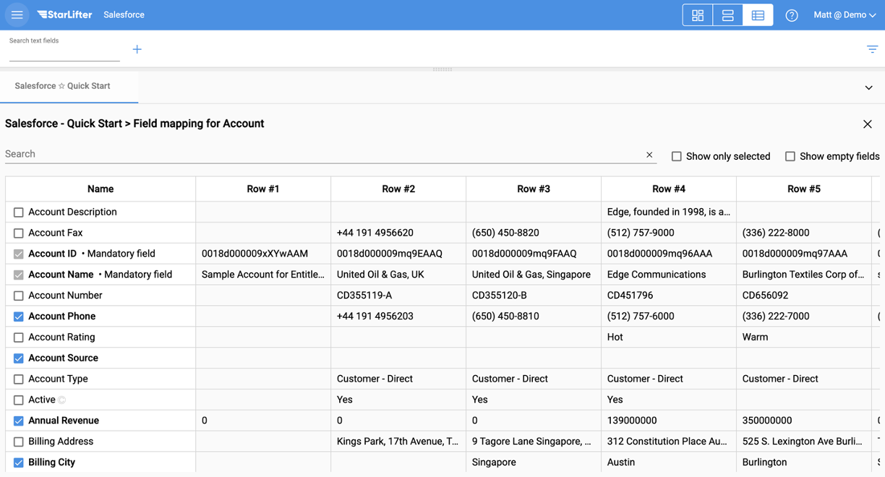

## Quick Start Integration Setup
[**Video Tutorial**](https://youtu.be/RA0sLW_FuU8?feature=shared)

For many of our API integrations, use StarLifter's Quick Start setup to create collections of your source system data in minutes.

### Access the Integration Quick Start Menu
1. 

</img>

2. 

</img>

3. 

</img>

### Enter your API Credentials
1. 

</img>
   

### Select the Objects and Fields you wish to pull into StarLifter

1. 

</img>

2. 

</img>

3. 

</img>

4. 

</img>

5. 

</img>

6. 

</img>

To learn more or ask additional questions, head over to the [StarLifter Community](https://community.starlifter.io).
