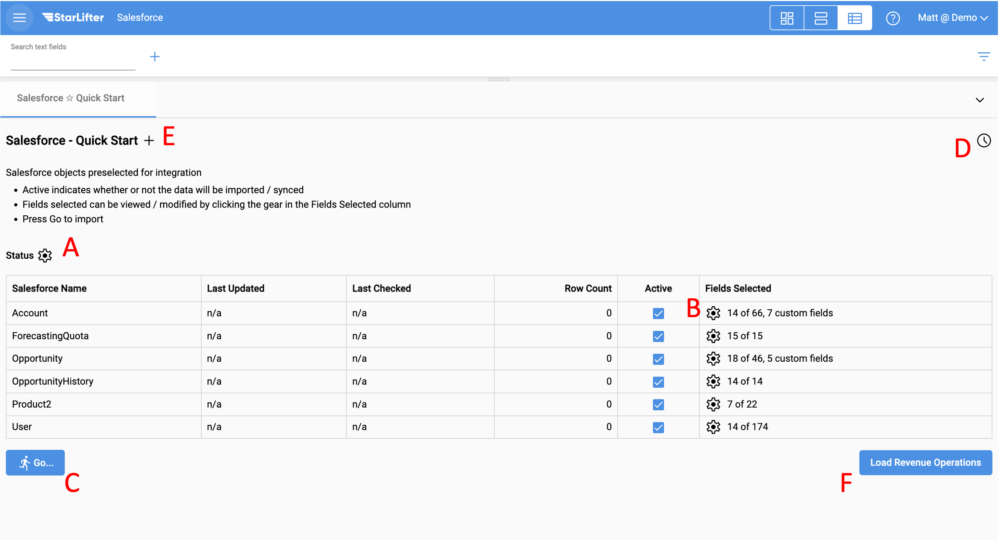

## Quick Start Integration Setup

For many of our API integrations, use StarLifter's Quick Start setup to create collections of your source system data in minutes.

### Access the Integration Quick Start Menu
1. If you are starting a StarLifter org from scratch, click **Connect** on the source system you wish to integrate with.

</img>

2. Enter a domain name for your collections and dashboards

</img>

3. If you are using an existing StarLifter org, select **Toggle menu** from the menu at the upper left of the screen.

</img>

4. Select Salesforce Integration under the Additional Links dropdown.

</img>

### Enter your API Credentials
1. Enter the API credentials for your source system.

</img>

2. For more information on entering API credentials for your specific source system, access the documentation below:

* [**Salesforce**](https://docs.starlifter.io/#/how_to/salesforce_api)

* [**Hubspot**](https://docs.starlifter.io/#/how_to/hubspot_api)

* [**NetSuite**](https://docs.starlifter.io/#/how_to/netsuite_api)

   

### Select the Objects and Fields you wish to pull into StarLifter

1. The Quick Start menu gives you several options for setting up data in StarLifter.

  **A:** Select the Objects
  
  **B:** Select your Fields for each Object
  
  **C:** Pull the entire dataset
  
  **D:** Schedule the data refresh frequency
  
  **E:** Add another instance of the same source system

  **F:** Load Revenue Operations Dashboards Templates

</img>

2. Select the Objects of data you wish to pull into StarLifter, and click **OK**.

</img>

3. Select the fields of data you wish to pull into StarLifter. StarLifter will preview the first 20 records of data to help you determine which fields are relevant for your analysis. Once you have selected your fields, click the **X** in the upper-right corner of the screen.

</img>

4. Click **Go...** to pull data from your source system into StarLifter.

</img>

5. A collection of data will be created for each Active Object on the Quick Start screen.

</img>

To learn more or ask additional questions, head over to the [StarLifter Community](https://community.starlifter.io).
