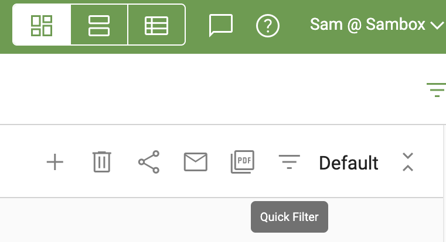
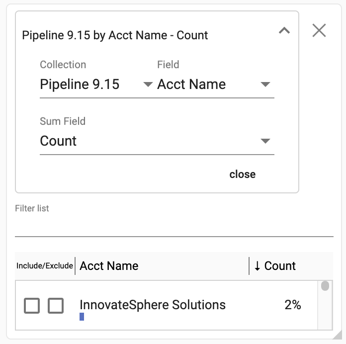
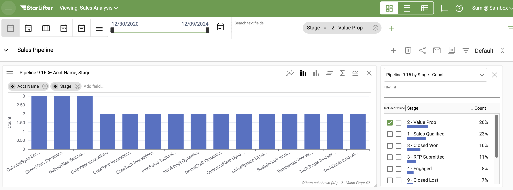

## How to use a Quick filter on a dashboard

As the name implies, Quick filters provide a fast and simple way to filter data on a dashboard. In addition, Quick filters themselves provide valuable insight into the filtered data.

To create a Quick filter:

1.	Go to the desired dashboard and click the filtered list icon in the upper right hand corner. (Be aware that you must have at least one chart on a dashboard before you can add a quick filter.)

</img>

2.  Scroll to the bottom of the dashboard and the new Quick filter will be visible 

3.  The Quick filter will automatically populate the Collection, Field, and Sum Field based on the charts on the dashboard. However, these sections can be adjusted in the dropdown menu at the top of the filter.

</img>

4.  To filter, select the values you want to include or exclude by checking the corresponding box.

</img>

5.  The charts that utilize the filtered collection will react to the filter selections.

