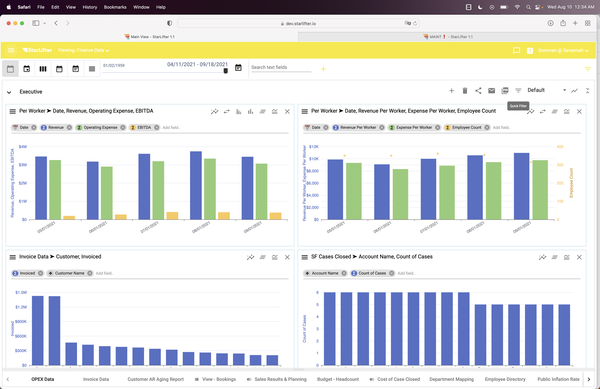
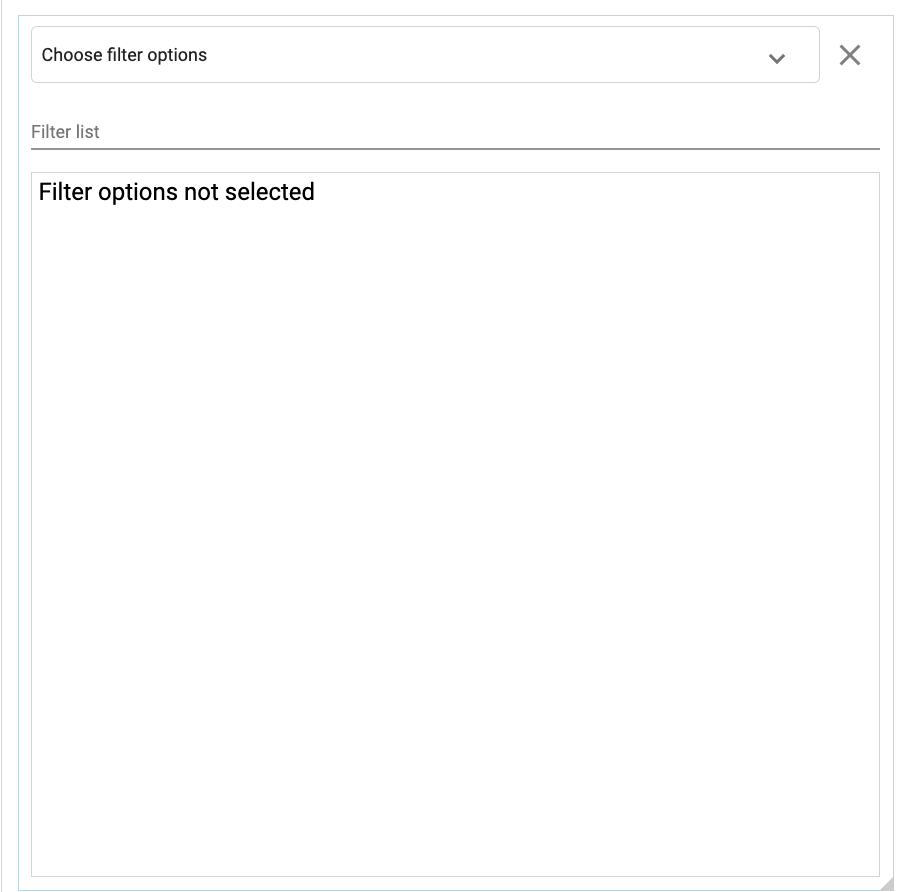
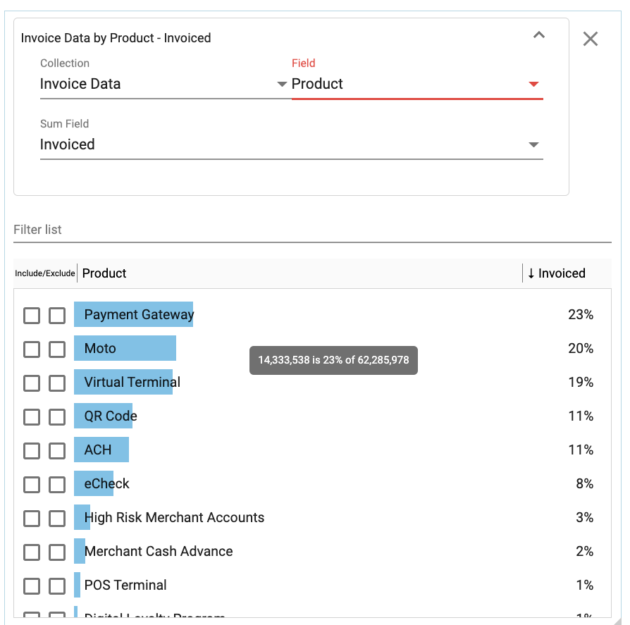
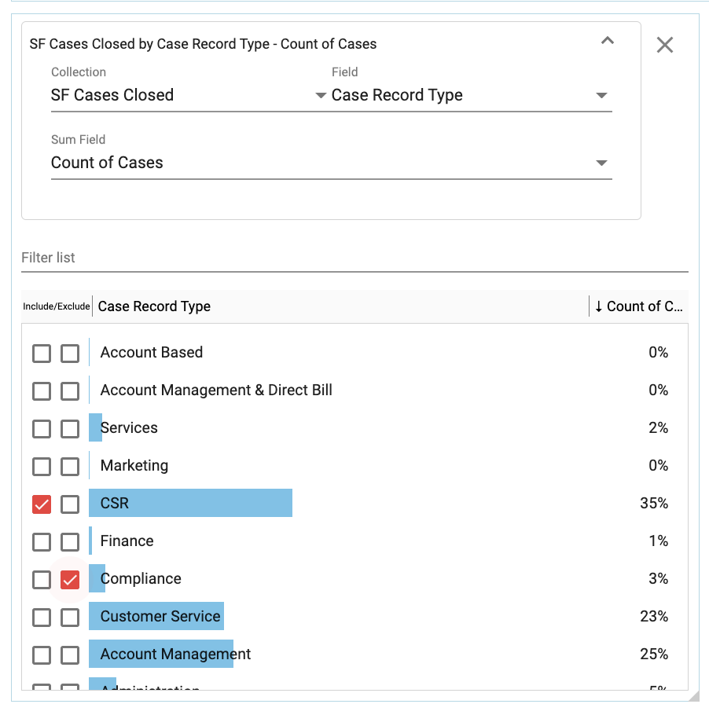

## How to use a Qwik filter on a dashboard
How-to video link - https://youtu.be/6eDvDwlstac

As the name implies, Qwik filters provide a fast and simple way to filter data on a dashboard. In addition, Qwik filters themselves provide valuable insight into the filtered data.

To create a Qwik filter:

1.	Go to the desired dashboard and click the filtered list icon in the upper right hand corner.

</img>

2.  Scroll to the bottom of the dashboard and the new Qwik filter will be visible 

</img>

3.  Input the following data points to filter:
* Collection
* Field
* Sum Field 

</img>

4.  To filter, select the values you want to include or exclude by checking the corresponding box.

</img>

5.  The charts that utilize the filtered collection will react to the filter selections.

