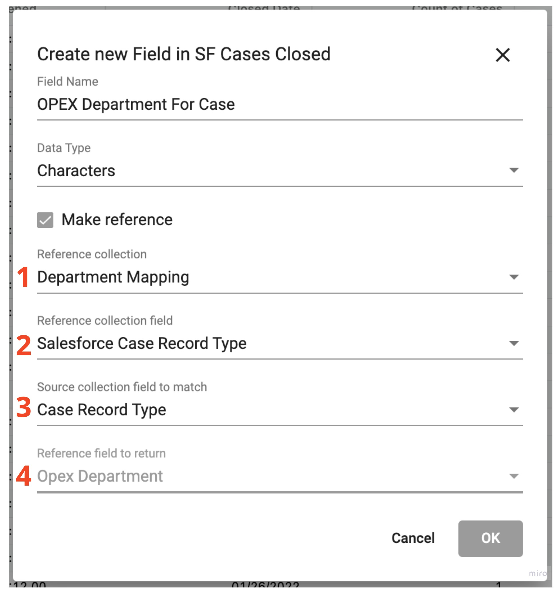
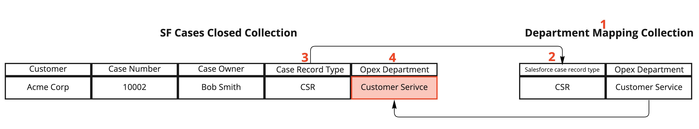
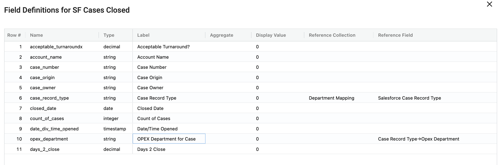

## How create a reference field

Reference fields allow you to map a value from one collection to another. Simlar to a VLOOKUP in Excel it will take a value from your row and attempt to match that value to a column in another collection. The first match it finds, it will return a chosen value from the matching row.

</img>

To create a reference field:

1. Right-click the grid and select  **Add field...** to add a field for the returned value of the reference.

</img>

2. In the add field Dialog populate the following fields:

  - **Field Name** - the name your field
  - **Data Type** - the appropriate data type for the refenced data that is returned
  - **Make Reference** - enables the new field to be a reference field
  - **Reference Collection** - the collection where your mapping values exist
  - **Reference Collection Field** - the field you are referencing in the collection Reference Collection
  - **Source Collection Field to Match** - the field on the current collection that should match the Reference Collection Field
  - **Reference Field to Return** - the field in the matching row do you want to return when a match occurs

</img>

</img>

3. Inspect the dictionary to view the changes to the **Source Collection Field to Match** along with the newly created field

</img>

