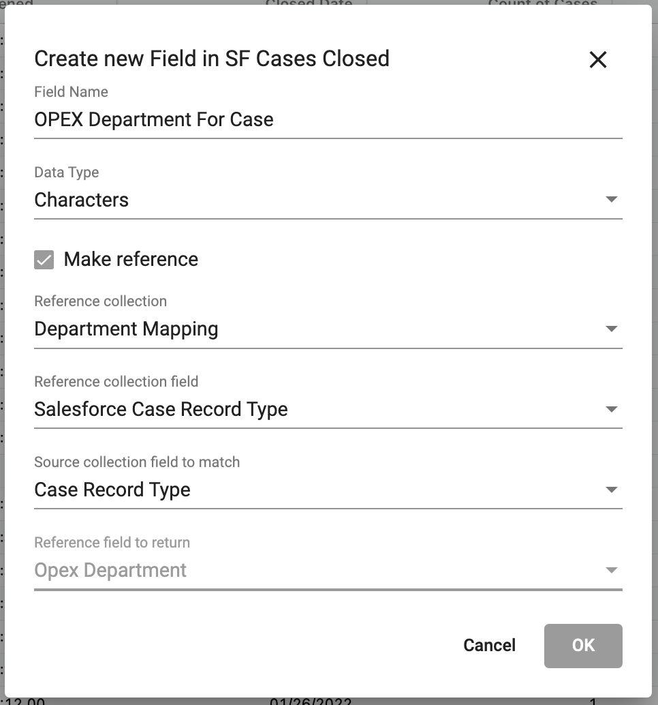

## How create a reference field

Reference fields allow you to map a value from one collection to another.

</img>

To create a reference field:

1. Right-click the grid and select  **Add field...** to add a field for the returned value of the reference.

</img>

2. In the add field Dialog populate the folloing fields:
  - **Field Name** - Name your field
  - **Data Type** - Choose the appropriate data type for the refenced data that is returned
  - Check the **Make Reference** box
  - **Reference Collection** is the collection where your mapping values exist
  - **Reference Collection Field** is the field you are referencing in the collection Reference Collection
  - **Source Collection Field to Match** the field on the current collection that should match the Reference Collection Field
  - **Reference Field to Return** when a match occurs, which field in the matching row do you want to return

</img>

3. Inspect the dictionary to view the changes to the **Source Collection Field to Match** along with the newly created field

</img>

