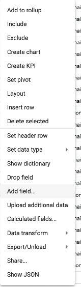

## How create a reference field

Reference fields allow you to map a value from one collection to another.

</img>

To create a reference field:

1. Right-click the grid and select  **Add field...** to add a field for the returned value of the reference.

</img>

2. Right-click the grid and select **Show Dictionary**

</img>

3. In the row of the field that contains your search value, add the collection you wish to search prefixed with the domain [domain.collection] to the **Reference Collection** field.

</img>

4. In the same row you added **Reference Collection** add the field from the collection you wish to search to the **Reference Field** field.

</img>

5. In the row of the newly created field from Step 1 add the field that contains the reference value wish to return to the **Reference Field** field.

</img>

