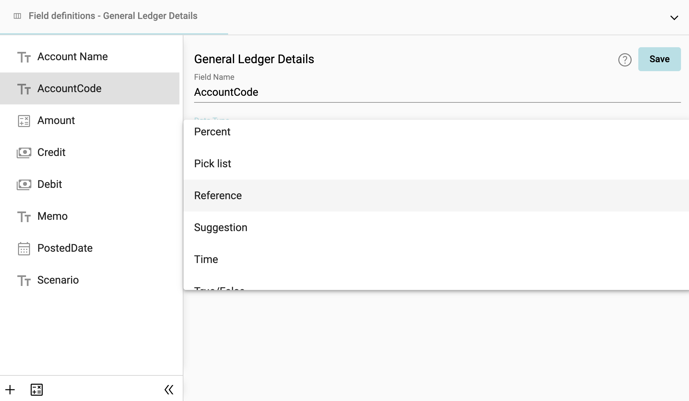
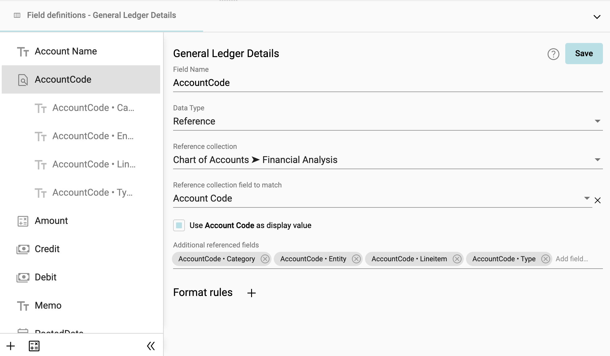
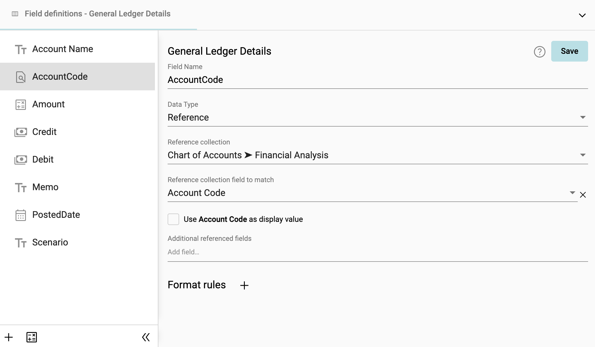
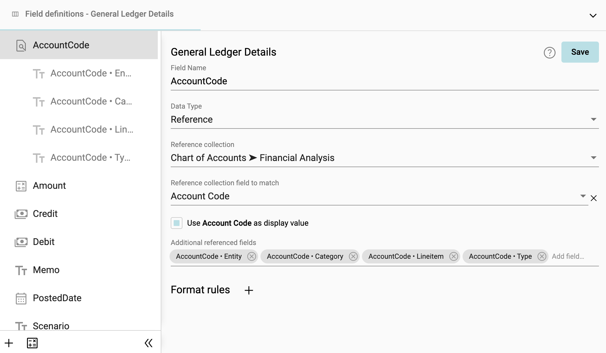
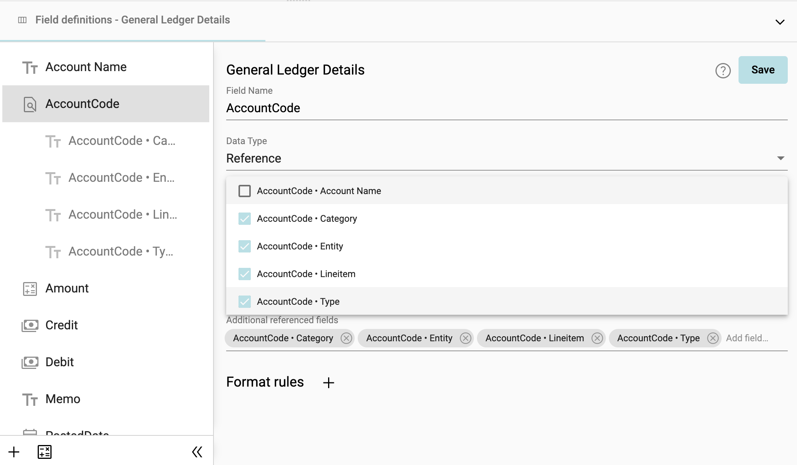

## Create a Reference
A reference field stores a reference to a field in another collection. For example, the Account field in a General Ledger collection is a reference to the Chart of Accounts collection.

When you define a reference field, the system creates a relationship between the two collections. Adding a reference field to a form makes the other fields in the referenced collection available as well.

### Set up reference field
1. Right click on the field to reference to another collection ➔ **Fields**

2. Change **Data Type** to Reference

</img>

3. Select the **Reference collection** and **Reference collection field to match**

</img>

4. To use the field to match as the display value, check **Use as display value**

</img>

5. Click **Save**

### Adding fields from a referenced collection
1. You also have the option of adding fields from the referenced collection. Select Add field from **Additional referenced fields**, and check the fields to add

</img>

2. Click **Save**

3. The added fields are now available in the collection

</img>

**Note:** The added fields are not editable in the collection. They update dynamically as changes are made to the referenced collection.
