## Creating a report

<!-- [**Video Tutorial**](https://youtu.be/fLLjW7BHojw?feature=shared) -->

The basics of setting up a table report in StarLifter involves choosing category fields, the date rollup, and numeric fields. These reports can then be saved for future use.

### Category fields
1. In this example, we're going to build out a Production Analysis for the current year.

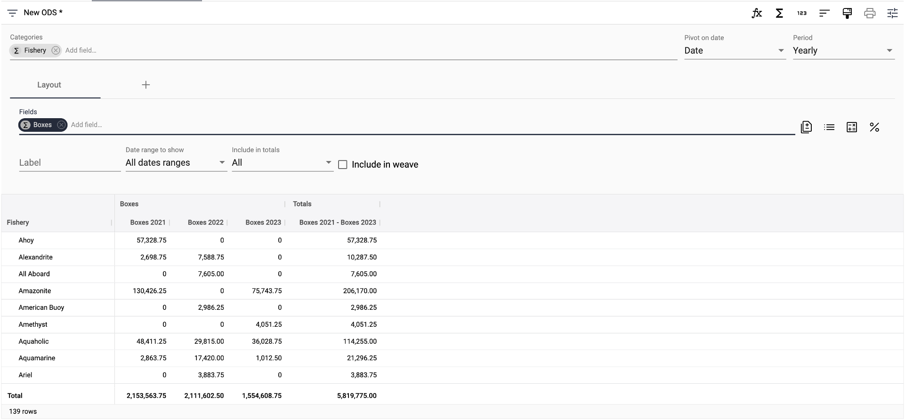</img>

2. Any character field in the collection can be added as a category field, but clicking *Add field* under **Categories**.

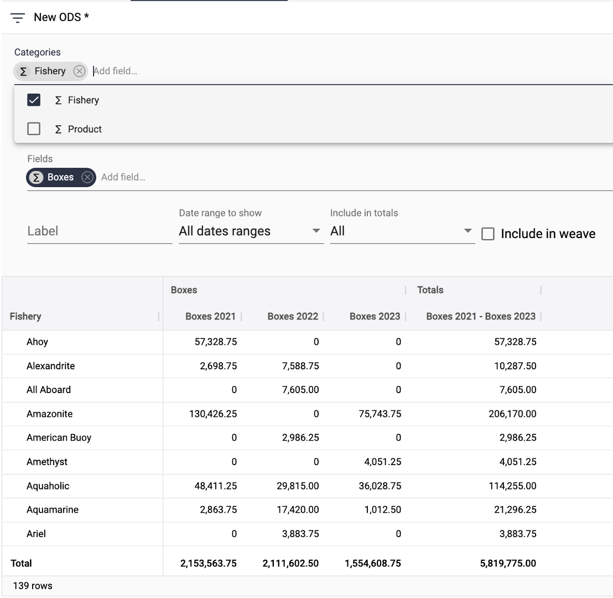</img>

3. In the example below, Product falls below Fisheries on the hierarchy.

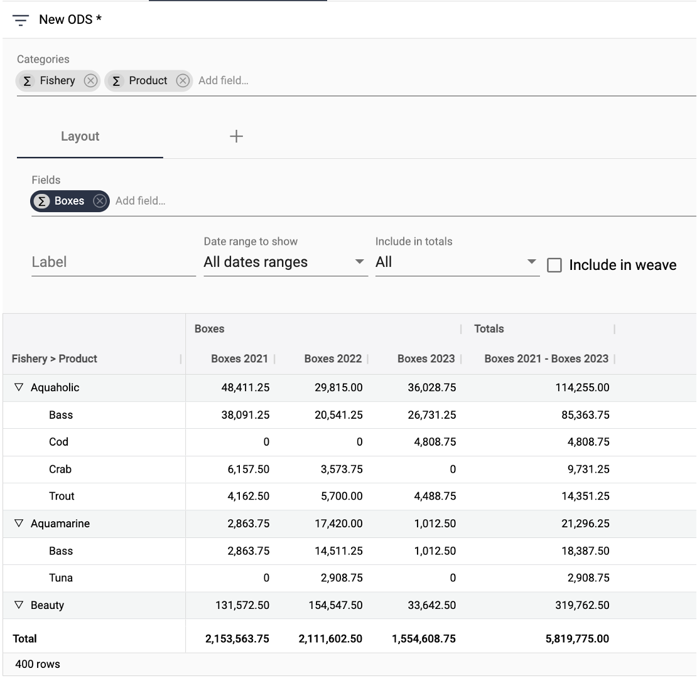</img>

4. To change the order of the hierarchy, simply drag and drop.

</img>

5. To open or close all fields in a hierarchy, Shift-Click on the drop-down arrow.

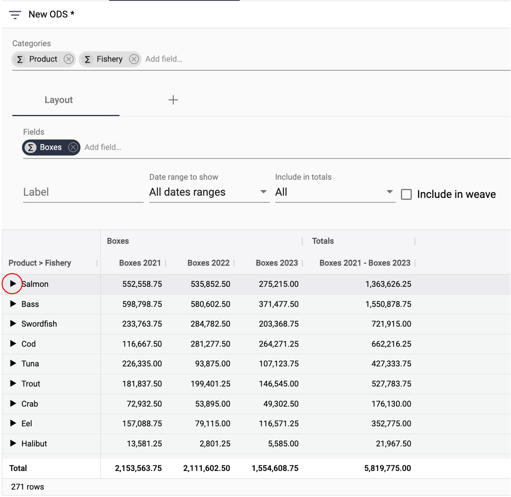</img>

### Date rollups

1. If there are multiple date fields in the collection, select the one you wish to use for the report. Then choose the pivot period.

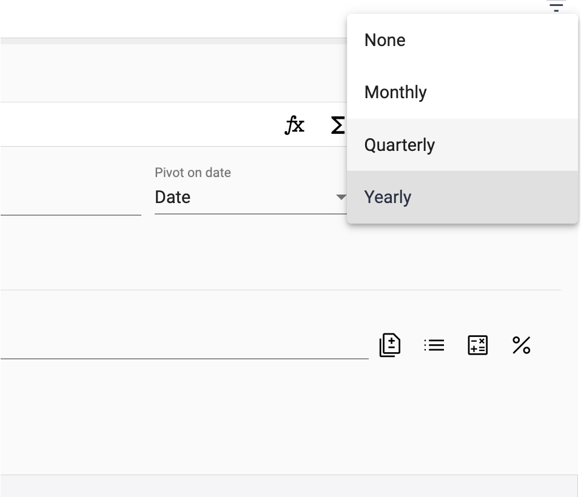</img>

2. In the image below, Boxes is now pivoted on quarters instead of years.

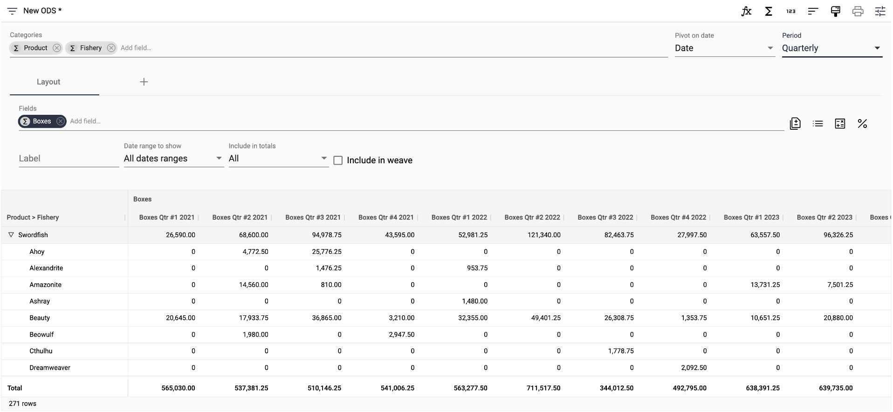</img>

### Numeric fields

1. Each numeric field will be rolled up by the category and date selected. For each field, select the date range to roll up.

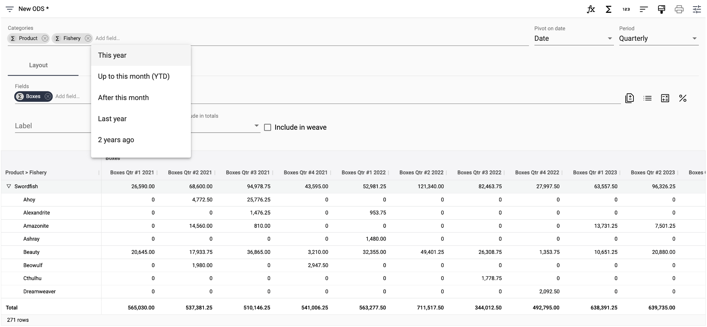</img>

2. Select the date range to include in the total.

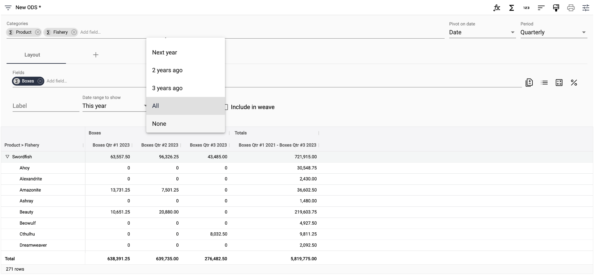</img>

3. Any numeric field in the collection can be added as a field, but clicking *Add field* under **Fields**.

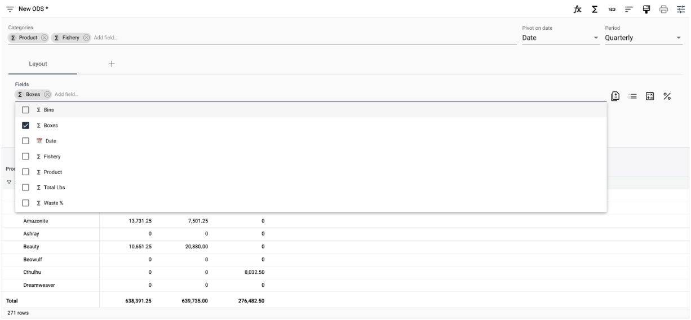</img>

4. By default, the fields appear unweaved. In the example below, Bins and Boxes appear as separate groups.

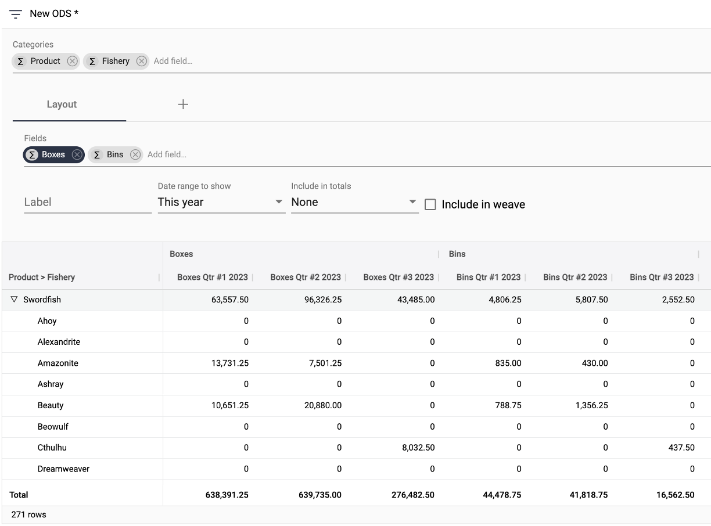</img>

5. To weave the fields so cells from the same time period are grouped, check **Include in weave**.

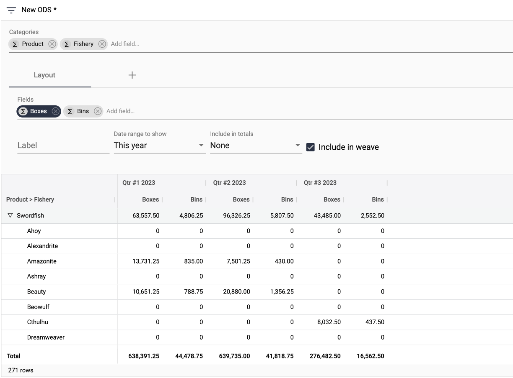</img>

### Saving a report

1. Select **Save as** from the dropdown in the upper-left.

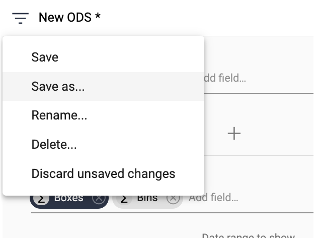</img>

2. Name the report.

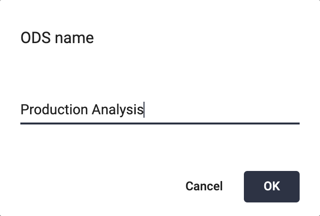</img>

3. The report is now accessable by clicking the icon on the collection header.

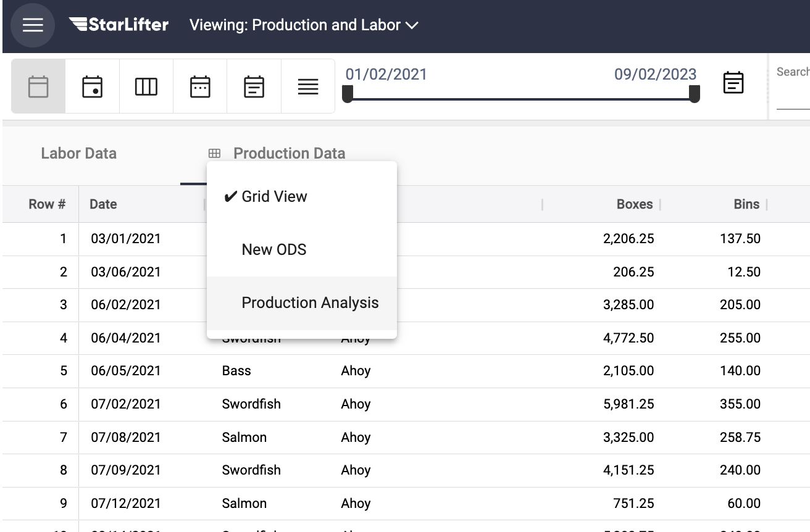</img>

