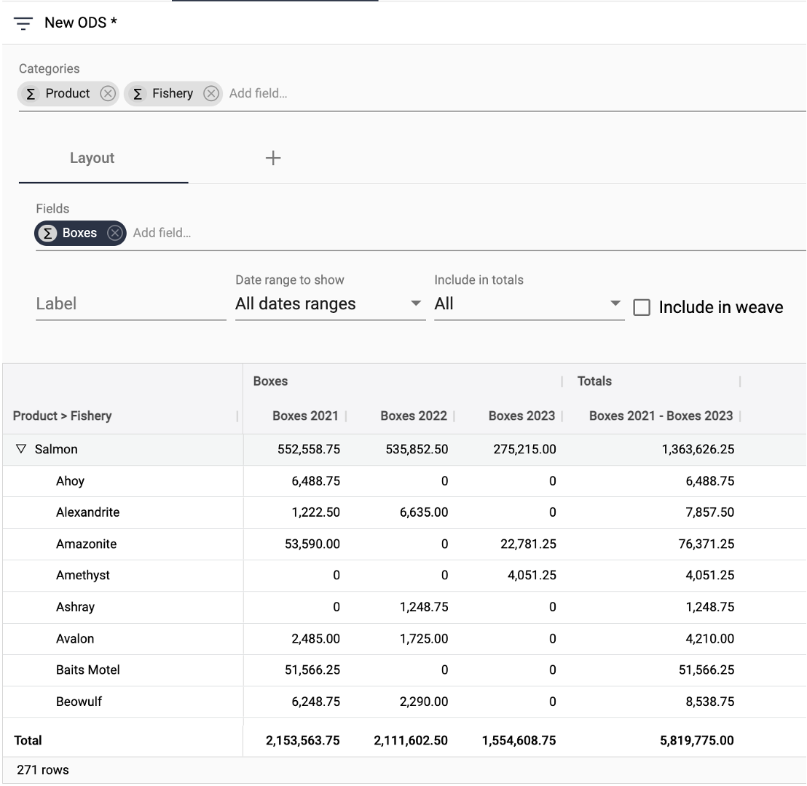

## Creating a report

[**Video Tutorial**](https://youtu.be/fLLjW7BHojw?feature=shared)

The basics of setting up a table report in StarLifter involve choosing category fields, the date rollup, and numeric fields. These reports can also be saved for future use.

### Category fields
1. 

</img>

2. 

</img>

3. 

</img>

4. 

</img>

5. 

</img>

### Date rollups

1. 

</img>

2. 

</img>

### Numeric fields

1. 

</img>

2. 

</img>

3. 

</img>

4. 

</img>

5. 

</img>

6. 

</img>

7. 

</img>

### Saving a report

1. 

</img>

2. 

</img>

3. 

</img>
