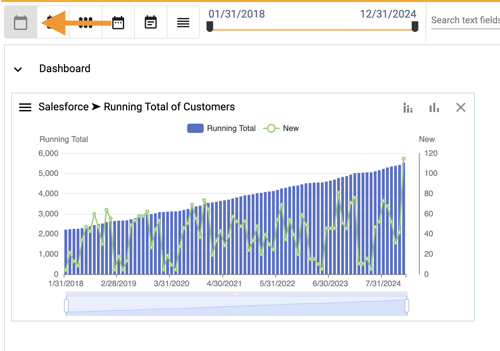
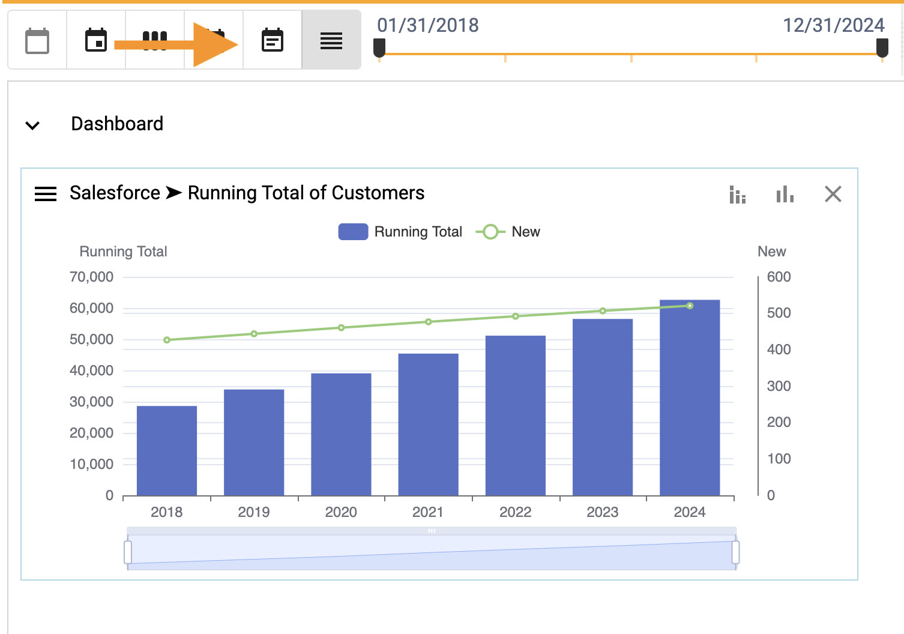
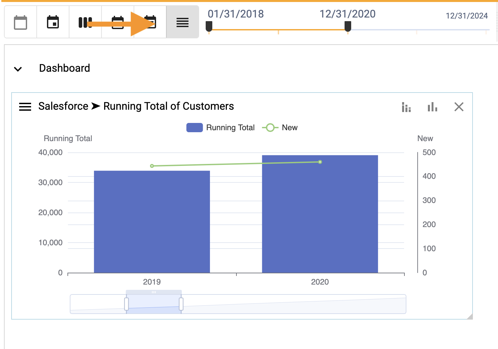
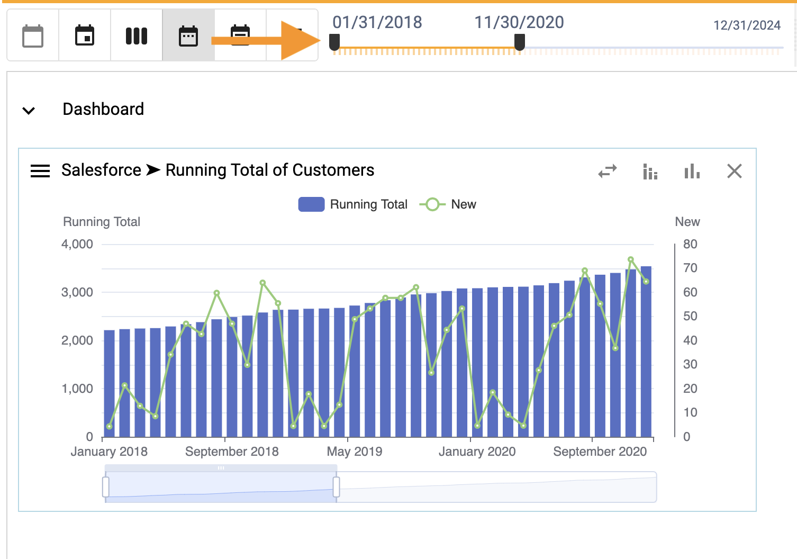
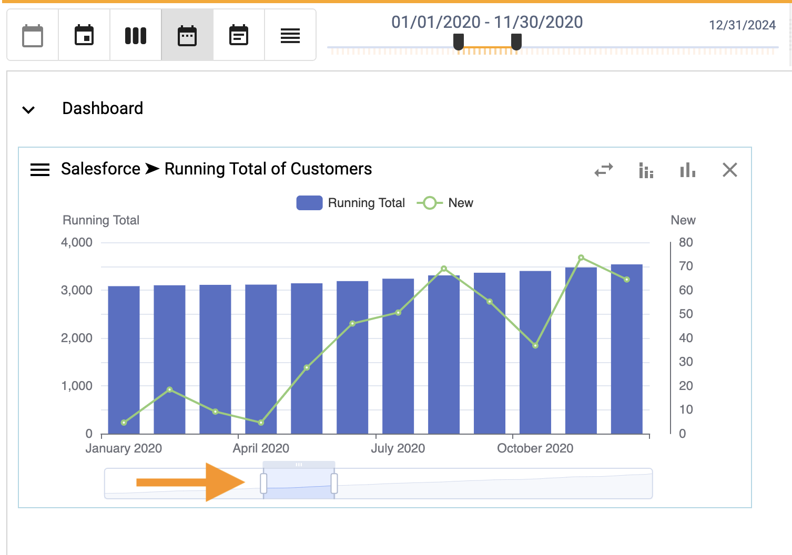

## How to roll up and filter by date
How-to video link - https://youtu.be/Bfs9N2WiNYc

Explore data by rolling up (e.g. grouping data together by date) or filtering (e.g. including or excluding dates).

To roll up data and charts by date:
1.  Select the **Day**, **Week**, **Month**, **Quarter** or **Year**.

### None

</img>

### Quarter

</img>

### Year

</img>

To filter dates on a dashboard:
1.  Move the end points of the slider to the left and right

</img>

To filter dates on a chart:
1.  Move the end points of the zoomer to the left and right

</img>

