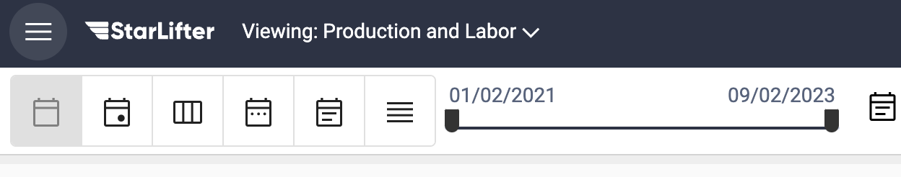
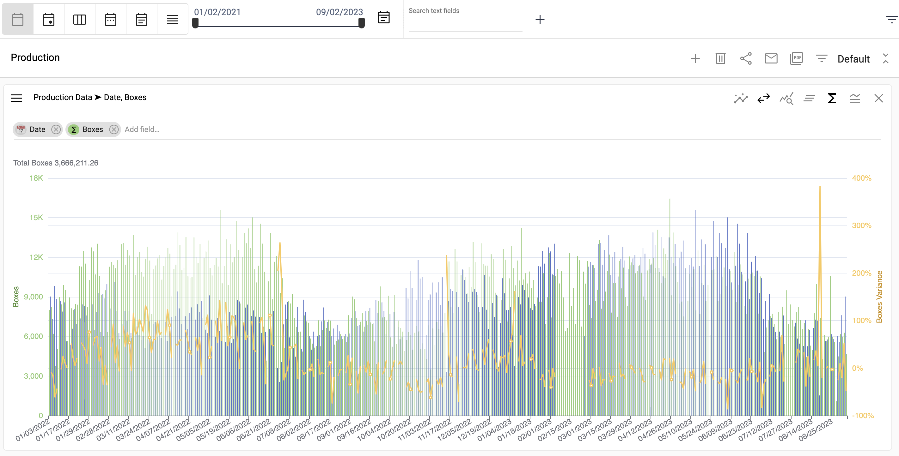
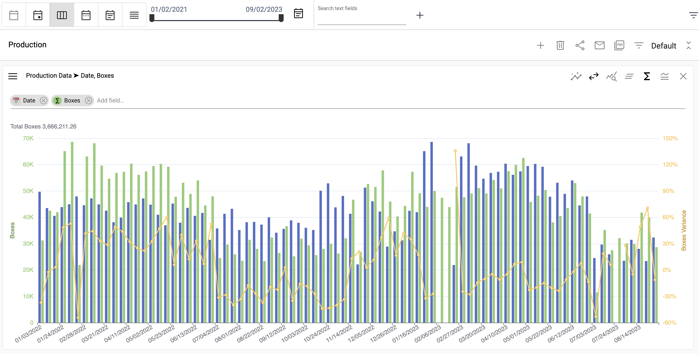
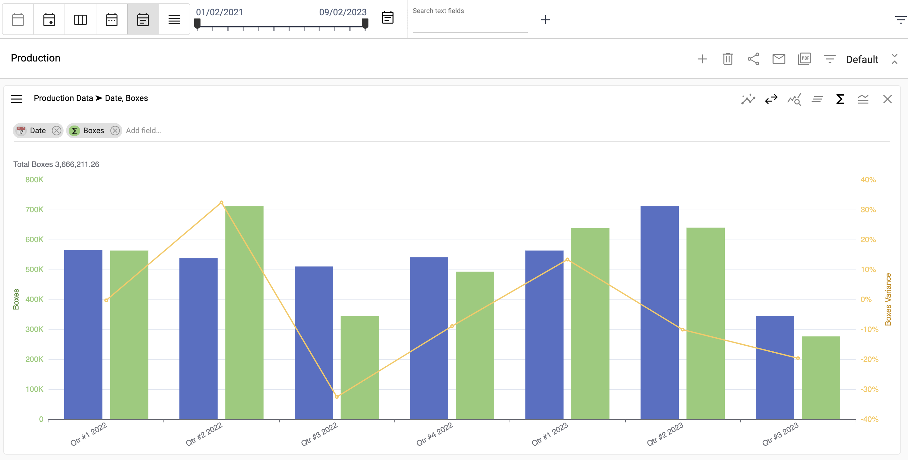
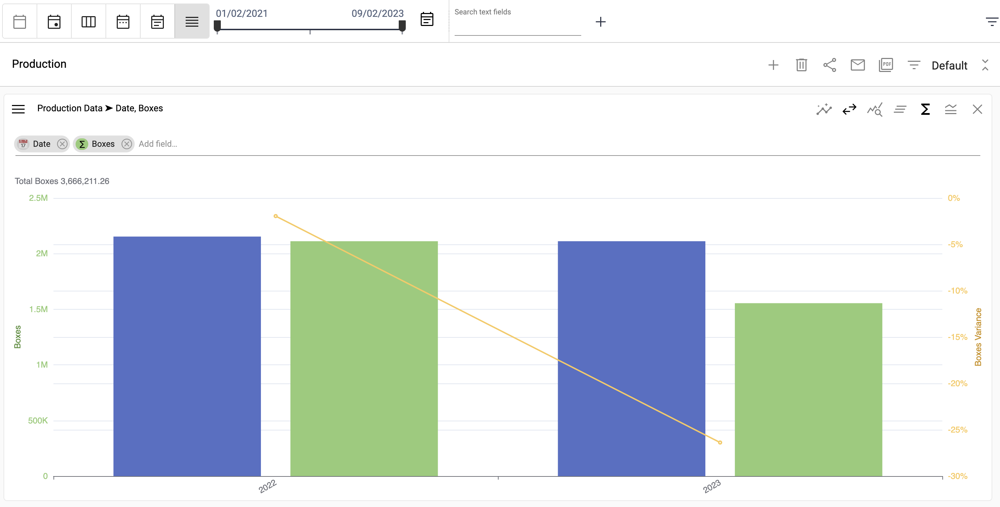
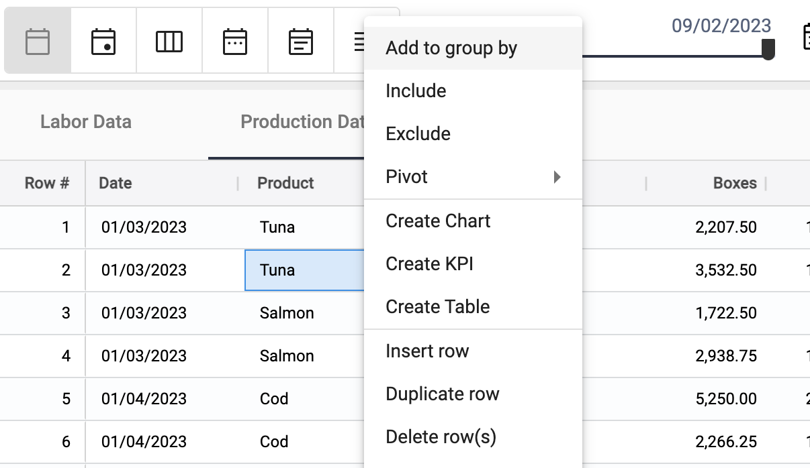
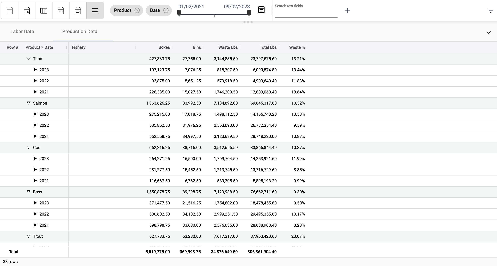
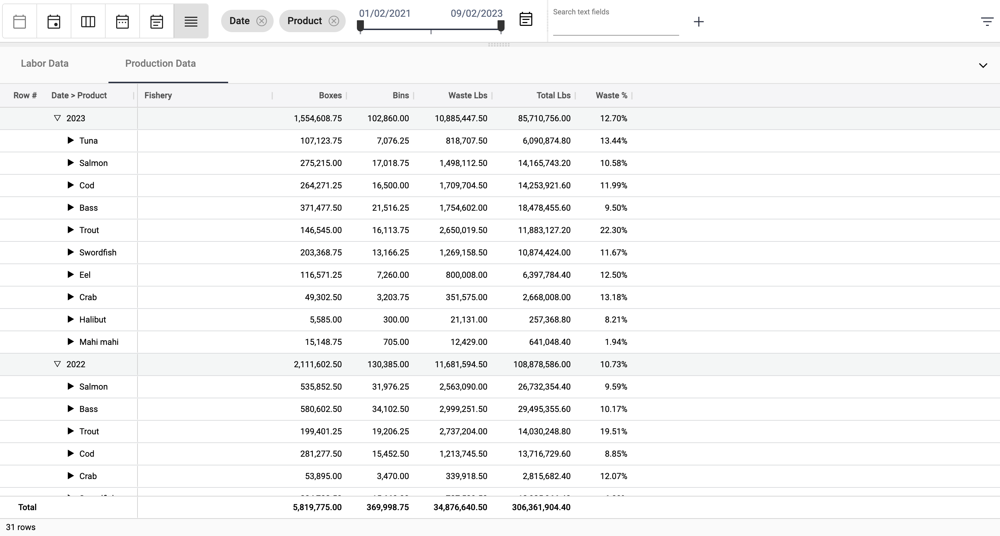
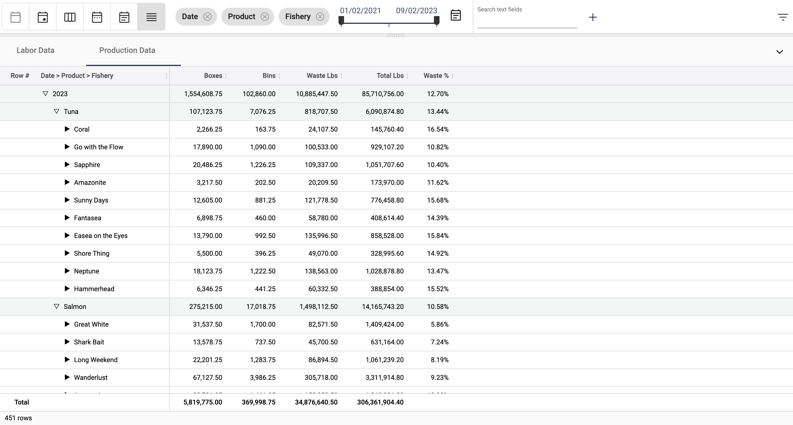

## Roll up data
<!-- [Video Tutorial](https://youtu.be/Ii5EgyG3uNQ?feature=shared) -->

Explore data by rolling up (e.g. grouping data together by date) or filtering (e.g. including or excluding dates).

### Roll up by date

Rolling up by date applies to dashboards and collections simultaneously. Select the **Day**, **Week**, **Month**, **Quarter**, or **Year** roll up button at the top of the screen.

</img>

No rollup

</img>

Daily

</img>

Weekly

</img>

Monthly

</img>

Quarterly

</img>

Yearly

</img>

### Roll up by category

1.  Right click on the field to roll up and select **Add to group by**.

</img>

2.  Multiple groups can be added to roll up.

</img>

3.  You can change the roll up hierarchy by changing the order of the pills at the top of the screen.

</img>

4.  There is no limit to the number of fields that can be added to a hierarchy.

</img>

